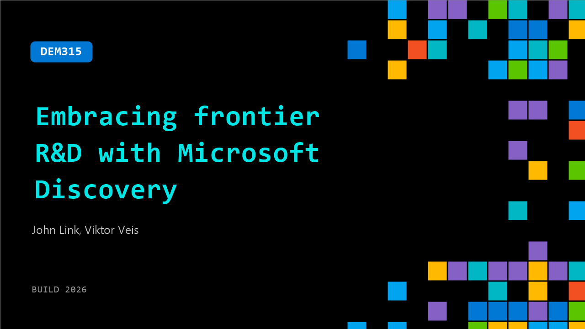

# DEM315: Embracing frontier R&D with Microsoft Discovery

**Session code:** DEM315  
**Date:** Wednesday, June 3, 2026 / 10:00 AM - 10:25 AM PDT (Duration 25 minutes)  
**Watch on-demand:** <https://build.microsoft.com/en-US/sessions/DEM315>

---

## Speakers

- **John Link** - Partner Product Manager, Microsoft
- **Viktor Veis** - Principal Software Engineering Manager, Microsoft

## About the session

Microsoft Discovery is bringing Agentic Discovery to life.  Much as agentic software engineering is not just vibe coding, Agentic Discovery is not just equipping researchers with AI tools.  Agentic Discovery is a new operating model where autonomous teams of AI agents - guided by human expertise - execute entire cycles of the scientific method, from hypothesis formation to experimentation and reasoning.  Learn how Microsoft Discovery is making this vision reality today.

## AI summary

**Introduction and Context:** The session opens with John Link introducing himself as a Partner Product Manager for Microsoft Discovery, welcoming the audience and outlining the agenda 00:00:14–00:00:35. He explains that the talk will focus first on why the Microsoft Discovery platform is significant, followed by a live demonstration by Victor. John sets the stage by describing Microsoft Discovery as a technology aimed at revolutionizing R&D across diverse fields such as chemistry, materials science, biotechnology, and physics, all powered by AI-driven approaches to accelerate scientific breakthroughs 00:00:39–00:00:48.

**AI Inflection and Frontier R&D:** John then elaborates on the broader AI landscape, pointing out that we are at a pivotal moment where AI is evolving from assisting humans to performing tasks autonomously 00:01:00–00:01:39. He notes that this shift doesn’t replace humans but redefines their role to guide and evaluate outcomes. Drawing parallels with software engineering’s transition through GitHub Copilot since 2021, he highlights how agentic models have fundamentally altered developer workflows and productivity. In November 2023, new models like GPT-4.5 and GPT-5.2 introduced advanced AI agency, crossing the threshold where systems could autonomously generate entire solutions—a transformation John predicts is now coming to scientific discovery 00:02:17–00:02:48. He introduces “agentic discovery,” where teams of AI agents continuously run end-to-end scientific loops, guided by expert human intent, marking the beginning of what Microsoft calls “Frontier R&D” 00:03:28–00:03:57.

**Introducing Microsoft Discovery and the New App:** John explains that Microsoft Discovery enables AI-driven scientific processes at scale, where thousands or even millions of hypotheses can be explored in parallel 00:04:23–00:04:45. He recaps prior milestones, noting its introduction at Build as a private preview and its current general availability 00:04:50–00:04:54. To engage more users, Microsoft now offers a complementary lightweight tool, the Microsoft Discovery app, which only requires a GitHub Copilot license and provides an easy entry point into Frontier R&D 00:05:23–00:05:38. John transitions to Victor to demonstrate the app’s core features, including the Discovery Engine and the innovative scientific Bookshelf system.

**Live Demonstration by Victor:** Victor begins his demo by walking through the installation process using the GitHub repository and logging into the local Discovery app 00:06:07–00:06:48. He highlights three main features: the Bookshelf (a graph-based knowledge retrieval system), the Discovery Engine (which automates hypothesis generation and testing), and a scientific interface built on Visual Studio Code 00:07:18–00:07:36. Demonstrating a real project, Victor performs an analysis comparing serverless and container architectures for AI workloads. Using indexed research papers, the system produces structured Jupyter notebooks with cost-performance tradeoffs and hybrid execution recommendations 00:10:06–00:14:00. The app also summarizes findings in executive one-pagers aimed at decision-makers. He then showcases the Discovery Engine’s extended capabilities for autonomous task execution, explaining how agents create, assign, and monitor tasks across iterative experimental loops 00:15:47–00:18:03. This closed-loop system can operate continuously for hours or days, refining insights automatically.

**Real-World Use Cases and Customer Examples:** Returning to the stage, John contextualizes the Discovery Engine with a visual of agents autonomously conducting experiments following scientific procedures 00:20:04–00:20:33. He then shares a practical collaboration with a customer, “Science Co,” whom Microsoft assisted in determining optimal R&D investments. Using business-focused AI agents, Science Co identified heat transfer fluids for semiconductors as a high-potential area 00:21:05–00:21:14. The Discovery platform was used to analyze scientific data, model molecular properties, and propose synthesis pathways, leading to four new candidate materials 00:22:18–00:22:33. These outcomes demonstrate how Discovery accelerates research cycles while preserving reproducibility. John emphasizes the role of autonomous agentic systems in real-world innovation across materials, biology, and energy research.

**Conclusion and Next Steps:** Closing the session, John highlights the broader adoption of Microsoft Discovery by organizations like BHP, Cambridge Consultants, and Silico Trials 00:23:19–00:23:38. He directs viewers to Microsoft Discovery documentation and the GitHub repository for immediate access 00:23:44–00:23:55, encouraging participants to experiment with the platform and provide feedback. The session concludes with gratitude to the audience and an invitation to be part of this evolving ecosystem that converges AI agency, scientific reasoning, and scalable computation to redefine the pace and potential of modern discovery 00:24:05.

## Session tags

- **Session type:** Demo
- **Level:** (200) Intermediate
- **Topic:** Cloud platform & data
- **Tags:** AI, Azure, API, Agents, Azure Kubernetes Service (AKS)​​, GitHub Copilot, Microsoft Foundry, Foundry Agents
- **Location:** Gateway Pavilion, Level 2, Theater B
