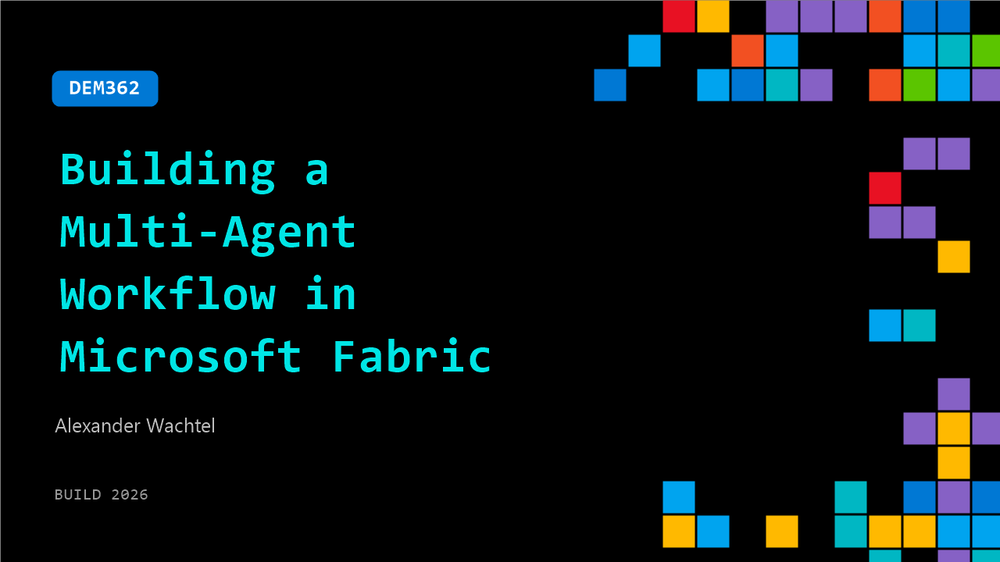

# DEM362: Building a Multi-Agent Workflow in Microsoft Fabric

**Session code:** DEM362  
**Date:** Wednesday, June 3, 2026 / 12:20 PM - 12:45 PM PDT (Duration 25 minutes)  
**Watch on-demand:** <https://build.microsoft.com/en-US/sessions/DEM362>

---

## Speakers

- **Alexander Wachtel** - Microsoft AI MVP, MCT & CEO, ESC Deutschland GmbH

## About the session

Learn how Microsoft Fabric and the 3 IQs, Work IQ, Fabric IQ, and Foundry IQ, enable dynamic, context‑aware multi‑agent workflows. See how semantic models, lakehouses, and pipelines form agent‑ready foundations, and how specialized agents collaborate across planning, retrieval, summarization, and execution. Discover how natural language, automation, and orchestration power real multi‑agent scenarios in Microsoft Fabric.

Seating for this session is first-come, first-served. Add it to your schedule to plan your day and arrive early to secure a spot.

## AI summary

**Introduction and Agenda:** The session begins with a friendly welcome and acknowledgment of limited space before outlining the topics: agents, Microsoft Fabric, and several "IQ" components (00:00:10). The speaker briefly mentions connecting on LinkedIn for follow-up questions and sets the scene for exploring how orchestration works within data pipelines using notebooks and integrating agents across Foundry IQ and Worker Queue (00:01:06). The goal of the presentation is to connect concepts of Fabric IQ, Worker IQ, and Foundry IQ under Microsoft's growing "agent" framework used for enterprise AI and data orchestration.

**Concepts Behind Microsoft IQs:** The next section establishes context around Microsoft’s IQ infrastructure, describing Worker IQ, Fabric IQ, and Foundry IQ as essential layers providing agents with context and knowledge (00:01:16). The speaker recalls earlier chatbot work during a PhD, highlighting limitations of static knowledge bases and failed answers outside predefined scope — a lesson carried forward into today’s dynamic AI architectures. Worker Queue represents everyday Microsoft 365 data like emails, meetings, and files, while Fabric IQ handles organizational business data, such as performance and sales metrics (00:02:40). Foundry IQ, on the other hand, serves as a unified knowledge base combining diverse internal and external sources to support intelligent agents within a trusted environment.

**Team Roles and Historical Challenges:** The speaker introduces the three-person collaboration model within Microsoft Build projects: the agent designer, data engineer, and compliance officer (00:03:07). Each plays a critical role in ensuring functionality, data access, and privacy compliance — especially in markets like Germany, where data governance is strict. A reflection on earlier Azure AI work illustrates why previous solutions failed to gain production trust — users saw them as “black boxes” without transparency. The talk ties this lesson to the importance of enabling compliance oversight in current implementations via Microsoft 365 Copilot and the underlying MCP (Microsoft Copilot Platform) architecture (00:03:59).

**Demonstration: Connecting Agents Through Worker Queue and Foundry:** Around this midpoint, a live demonstration begins showing Worker Queue’s integration with Foundry and Fabric IQ (00:06:06). The speaker illustrates how an AI agent interacts with real user data — such as summarizing emails — through secure approval steps (“human in the loop”) ensuring user consent when connecting to Work Mail. Visual output from Copilot Studio demonstrates initialization of data agents, querying of mails, and the retrieval of contextual summaries (00:10:00). Using multiple connectors like Copilot, Teams, or databases through MCP servers, the demonstration underscores how cross-platform orchestration occurs securely and interactively. The result showcases agents merging Worker Queue and Foundry IQ data to automatically generate summaries and draft communications.

**Fabric Ontologies, Knowledge Graphs, and Semantic Context:** The discussion then transitions into Fabric IQ’s ontology and how it enables agents to understand relationships between data points in graph form instead of traditional SQL lookups (00:13:19). Using examples from enterprise cases such as Swiss Airlines, the speaker explains the bronze-silver-gold data enrichment hierarchy feeding semantic models. Ontologies define nodes and relations — for instance, product-to-store performance data — making it easier for agents to infer context quickly. This interconnected design improves agent responsiveness and contextual reasoning, and can be published to Microsoft 365 Copilot for direct conversational querying and visualization of data, including plotting charts directly within M365 (00:18:23).

**Advanced Implementation and Evaluation:** The closing part focuses on advanced agent integration using SDKs and validation workflows (00:22:00). Developers can configure Fabric data agents, connect them to evaluation notebooks, and run accuracy testing before deployment. The talk emphasizes continuous monitoring through Microsoft Purview, enabling visibility into sensitive data interactions and user behavior within Agent 365 (00:26:52). By combining transparency and governance, agents now operate within a secure, inspectable framework rather than the opaque “black box” systems of the past. The speaker concludes by thanking attendees and encouraging them to explore released notebooks and repositories post-conference (00:27:42).

## Session tags

- **Session type:** Demo
- **Level:** (300) Advanced
- **Topic:** Cloud platform & data
- **Tags:** Microsoft Fabric, Community, CP&D, Data, MVP
- **Location:** Gateway Pavilion, Level 2, Theater B
