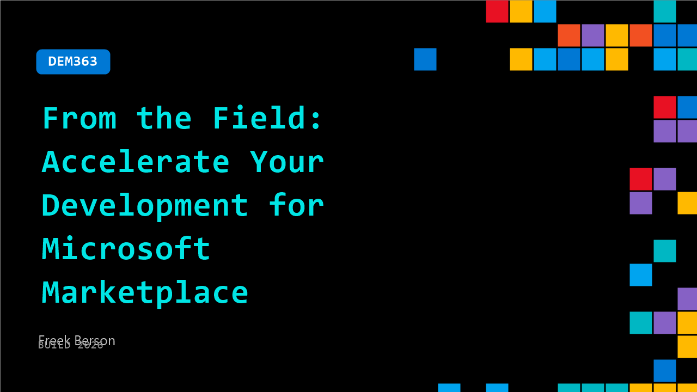

# DEM363: From the Field: Accelerate Your Development for Microsoft Marketplace

**Session code:** DEM363  
**Date:** Wednesday, June 3, 2026 / 1:30 PM - 1:55 PM PDT (Duration 25 minutes)  
**Watch on-demand:** <https://build.microsoft.com/en-US/sessions/DEM363>

---

## Speakers

- **Freek Berson** - Principal Product Manager & Microsoft MVP, Parallels

## About the session

Gain practical insights and proven strategies for your development journey for Microsoft Marketplace. Streamline your solutions' development, packaging, and deployment while ensuring compliance with Microsoft’s requirements. Discover common pitfalls, best practices, and automation techniques to reduce time-to-market. Whether you're new to developing for the Microsoft Marketplace or looking to optimize your approach, this session delivers real-world guidance to help you develop and publish efficiently.

## AI summary

**Introduction and Session Overview:** The video opens with a warm greeting from Craig Berson, a Microsoft MVP based in the Netherlands, who sets an upbeat tone for the session on creating and publishing Azure infrastructure solutions. At 00:00:08, Craig emphasizes that while building Azure solutions with services like GitHub Copilot and automation tools is easy, delivering trusted, scalable deployments through customer-facing channels remains challenging. His goal, introduced around 00:00:42, is to guide viewers through a journey of transforming infrastructure-as-code templates into deployable products in the Microsoft Marketplace, starting from template creation to packaging and publishing.

**Azure Marketplace Benefits and Offer Types:** Craig transitions at 00:01:46 into explaining the benefits of the Marketplace for independent software vendors (ISVs), partners, and consumers. He highlights its role in improving visibility, simplifying reselling, and aligning consumption commitments for Azure customers. By 00:02:36, he introduces the session’s focal point—the Azure Application offer—which lets creators package reusable infrastructure templates with different tiers (silver, gold, platinum) for customer deployment flexibility. Craig explains how offers deploy managed applications and resource groups (00:03:26–00:03:47), connecting telemetry and resources through managed groups for organized and scalable delivery to end users.

**Technical Foundation and Template Workflow:** Starting around 00:04:00, Craig demystifies the technical mechanics of Marketplace offers, describing them essentially as ZIP files containing mandatory components: the ARM template and the Create UI definition. He encourages developers to author their infrastructure using Bicep (00:05:03–00:06:02), taking advantage of Visual Studio Code extensions and the Bicep visualizer for ease of development and visualization. Because the Marketplace only supports ARM templates natively, Craig demonstrates transpiling Bicep into ARM using the "az bicep build" command at 00:06:43, advocating for testing deployments thoroughly before integration (00:07:58). His advice: start with concise, readable Bicep syntax, then convert for Marketplace compatibility to maintain clean code and efficiency.

**UI Design and Template Mapping:** At 00:08:25, Craig dives into building and testing the user interface experience through the Create UI definition file. He introduces the concept of the sandbox environment (00:09:00–00:09:37), which allows developers to design and preview form elements such as tabs, dropdowns, and configuration parameters used during deployment in the Azure portal. Craig demonstrates mapping UI parameters precisely to Bicep/ARM template parameters (00:10:33–00:11:47), stressing exact one-to-one, case-sensitive correspondence. This step ensures the Marketplace deployment interface accurately triggers infrastructure creation defined in code. He concludes this part with packaging guidance—adding both template and UI files into the ZIP—and a pre-upload validation using the ARM TTK Toolkit (00:12:07), which runs 49 tests to verify compliance, security, and syntax adherence before submission.

**Partner Center Configuration and Deployment Result:** Beginning at 00:14:00, Craig walks through publishing via Partner Center, showing how to upload the ZIP, version it correctly, and select deployment modes (incremental vs. complete). He discusses notification URL settings (00:15:28) for monitoring purchases, cancellations, and upgrades and configuring resource group permissions to control publisher and customer access (00:16:02–00:16:34). Craig then demonstrates actual Marketplace deployment results (00:16:48–00:17:27), inspecting managed applications and resource groups populated with Azure assets like VMs, load balancers, and key vaults. He explains nested deployments (00:18:04–00:18:16) that grant ISVs credit for customer-side deployments, rounding out the real-world Marketplace implementation process.

**Summary, Best Practices, and Closing Remarks:** In the final segment (00:18:28–00:19:41), Craig reviews the publishing workflow, reiterating the importance of local testing to cut down on iterative upload failures. His call-to-action encourages attendees to explore the Microsoft Marketplace booth for additional resources and expert discussions (00:19:07). He concludes by sharing GitHub access to all sample code, promoting community engagement on Azure development, and offering giveaways of his Bicep book and event swag to inspire further learning. The talk ends on a motivational note, connecting Marketplace innovation with the spirit of collaboration and streamlined DevOps delivery across the Azure ecosystem.

## Session tags

- **Session type:** Demo
- **Level:** (300) Advanced
- **Topic:** Cloud platform & data
- **Tags:** Azure, Developer, Visual Studio Code, Community, Azure DevOps, VS Code, ISV, MVP
- **Location:** Festival Pavilion, Theater A
