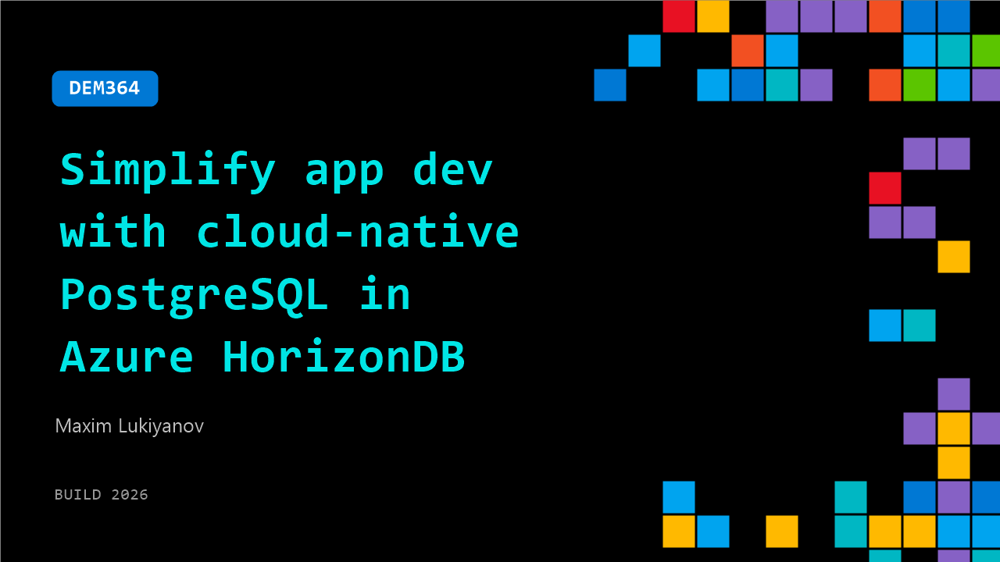

# DEM364: Simplify app dev with cloud-native PostgreSQL in Azure HorizonDB

**Session code:** DEM364  
**Date:** Wednesday, June 3, 2026 / 11:20 AM - 11:45 AM PDT (Duration 25 minutes)  
**Watch on-demand:** <https://build.microsoft.com/en-US/sessions/DEM364>

---

## Speakers

- **Maxim Lukiyanov** - Principal Group Product Manager, Microsoft

## About the session

Enterprise developers creating AI‑driven applications face growing complexity as vector search, models, and retrieval pipelines sprawl across services. In this session, see how Azure HorizonDB streamlines the stack by embedding AI and search directly in the database. Learn to run hybrid vector queries, apply BM25 relevance, call managed AI models from SQL, and prototype agentic workflows—shipping faster with less architectural overhead.

## AI summary

**Introduction and Overview:** The session begins with a warm introduction at 00:00:22, welcoming viewers to a demo titled “Simplify app development with cloud native PostgreSQL in Azure Horizon DB.” The presenter provides context by referencing Satya’s recent announcement about Azure Horizon DB entering public preview 00:00:41. Horizon DB is introduced as a new cloud-optimized PostgreSQL database that connects the open-source engine with scalable storage to achieve high resiliency, larger scale, and improved performance. The speaker highlights that Horizon DB delivers three times higher throughput and vector search speed while supporting up to fifteen read-only replicas for enhanced scalability 00:01:10. Importantly, the demo will focus on how its built-in AI models and pipelines simplify app development by constructing a live example on stage.

**Demo Application Setup:** The demonstration transitions at 00:02:01 to an example project—a “Zava room designer” app intended to automatically suggest furniture that matches a user’s room style based on a photograph. The presenter shows how the app can process an image, identify design features, and recommend compatible furniture 00:02:33. Although the application appears complex, it is deliberately designed to be simple. The following portion of the demo walks through how each component is built incrementally. The first stage, beginning at 00:04:01, demonstrates provisioning a Horizon DB instance directly through the Azure portal and enabling AI features via a simple checkbox that includes model management, vector search, and PG extensions. The setup section concludes with a ready-to-use pre-provisioned instance that already has embedded AI models for immediate experimentation.

**Data Preparation and AI Pipelines:** With the database provisioned, the presenter at 00:06:05 begins preparing product catalog data for AI consumption by generating vector embeddings. The demo shows a SQL-based workflow that inspects the model registry, revealing prepackaged models including an embedding model, chat completion model, and semantic ranker 00:07:10. Next, an AI pipeline is defined entirely in SQL to chunk, embed, and store data directly within Horizon DB. Once executed, the system asynchronously creates vectorized outputs and updates them automatically whenever new catalog entries are added. Verified through the UI at 00:10:12, the encryption of product data into 116 vectors demonstrates Horizon DB’s ability to maintain an up-to-date semantic representation of information, eliminating the need for separate external feature processing services. The end result is a fully vectorized catalog that can be queried using standard SQL syntax to locate relevant items such as "comfortable chairs" 00:12:23.

**Search Enhancement and Semantic Ranking:** Building upon the prepared data, the next segment introduces advanced retrieval methods beginning at 00:14:16. Horizon DB supports hybrid search by combining full-text search (through the new PGFTS extension) with fast vector indexing for extremely efficient query performance. A single hybrid function allows developers to retrieve results that are both semantically and textually relevant. When semantic re-ranking is enabled at 00:17:31, it improves query accuracy using the embedded ranker model to reorder search results by real meaning rather than keyword frequency. The presenter visualizes the underlying query plan at 00:19:05, revealing that hybrid search runs textual and vector queries in parallel, merges ranking lists using a reciprocal rank fusion method, then applies semantic reordering for optimal results. This powerful orchestration demonstrates how sophisticated search intelligence can be achieved directly inside PostgreSQL with minimal configuration.

**Knowledge Graphs and Contextual Intelligence:** The final technical demonstration begins around 00:21:02 by showcasing the creation of a style-based knowledge graph using the Apache AGE extension integrated within Horizon DB. This feature represents relationships between furniture items and styles such as “mid-century modern,” connecting each to corresponding categories like chairs or tables 00:23:01. The visualized graph also models similarities between different styles—such as linking mid-century modern and Bahamian—allowing broader recommendations even when inventories vary. The presenter emphasizes that knowledge graphs store domain-specific logic in graph form while still residing in PostgreSQL, thereby augmenting AI agents with deep contextual understanding of data relationships.

**Conclusion and Recap:** Concluding at 00:24:40, the session reviews how Horizon DB enables developers to integrate AI pipelines, perform real-time hybrid search, and enrich results through semantic ranking and knowledge graphs—all within a single managed PostgreSQL environment. The speaker reiterates that all functionality demonstrated was powered by built-in Azure Horizon DB AI features without external services or complex orchestration. Viewers are encouraged to explore the public code repository containing sample datasets, queries, and scripts 00:25:45. The demo closes by highlighting how Horizon DB drastically simplifies intelligent app development while maintaining enterprise-grade scalability and performance.

## Session tags

- **Session type:** Demo
- **Level:** (300) Advanced
- **Topic:** Cloud platform & data
- **Tags:** CP&D, Data
- **Location:** Gateway Pavilion, Level 2, Theater B
