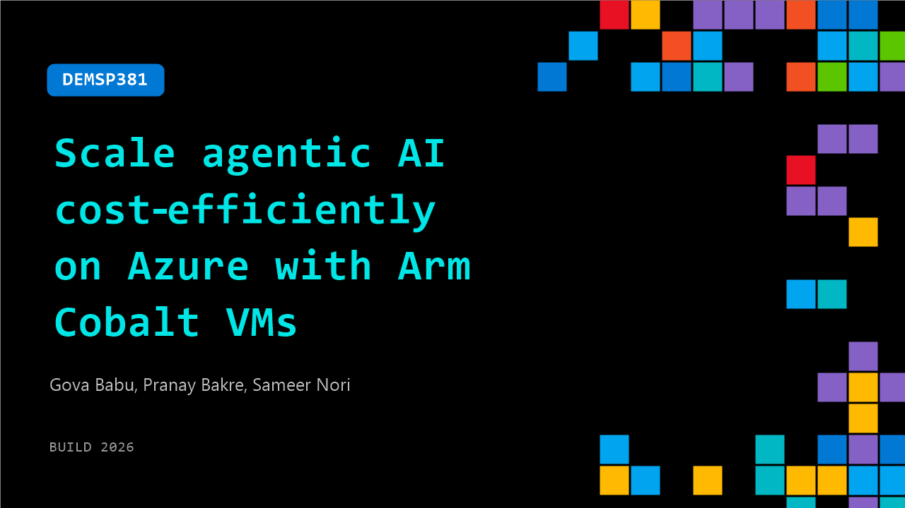

# DEMSP381: Scale agentic AI cost‑efficiently on Azure with Arm Cobalt VMs

**Session code:** DEMSP381  
**Date:** Tuesday, June 2, 2026 / 4:30 PM - 4:55 PM PDT (Duration 25 minutes)  
**Watch on-demand:** <https://build.microsoft.com/en-US/sessions/DEMSP381>

---

## Speakers

- **Gova Babu** - Senior Product Manager, Microsoft
- **Pranay Bakre** - Principal Solutions Engineer, Arm
- **Sameer Nori** - Sr Manager, Cloud AI Ecosystem, Arm

## About the session

As applications evolve into agent-driven systems, inference must scale efficiently. In this session, Arm and Microsoft show you how the latest Azure Cobalt VMs enable cost-effective, CPU-based AI for agentic and cloud-native workloads. In a live AKS demo, you'll learn how to use Azure Cobalt VMs to deploy LLM inferencing and app tiers, with insights on performance, scaling, and real-world design patterns.

Seating for this session is first-come, first-served. Add it to your schedule to plan your day and arrive early to secure a spot.

## AI summary

**Session Introduction and Overview:** The session begins with greetings and acknowledgments for the audience’s patience after some technical difficulties (00:00:00–00:00:04). Samir Nori from ARM introduces himself and outlines the agenda, which includes discussions on partnerships, the ARM software ecosystem, and a demo highlighting how identity workloads can be scaled cost-effectively on Azure Virtual Machines (00:00:07–00:00:31). He explains ARM’s long history in computing and notes their collaboration with Microsoft and Azure, emphasizing their role in powering devices from cloud to edge (00:00:35–00:00:58).

**ARM–Microsoft Partnership and Technology Foundations:** Samir elaborates on the partnership’s two pillars: silicon innovation and software enablement (00:01:01–00:01:18). Under silicon innovation, ARM collaborates with Microsoft hardware teams to develop the Cobalt chip series offering notable improvements in price-performance ratios—Cobalt 200 delivers 50% better performance than Cobalt 100 (00:01:23–00:01:35). On software enablement, there are more than 22 million developers building on ARM, with nearly all CNCF projects supporting ARM architectures, spanning open source, ISV packages, Linux distributions, and cloud-native frameworks such as AIML and SaaS platforms (00:01:39–00:02:06).

**Cobalt 200 Virtual Machines – Performance and Capabilities:** Goa from Microsoft’s ARM product team takes over to discuss the evolution from Cobalt 100 to Cobalt 200 Virtual Machines (00:02:26–00:02:33). He highlights customer adoption successes for Cobalt 100, including Microsoft Teams and Defender, which use ARM-based Azure VMs for robust workloads (00:03:04–00:03:17). Goa announces that Cobalt 200 VMs, built on 3nm ARM architecture and optimized for Microsoft workloads, now ship with Azure Boost and achieve around 50% better per-core performance compared to the previous generation (00:03:35–00:04:12). These VMs support multiple configurations—compute, memory-optimized, and dense storage variants—to cover both enterprise and cloud-native demands (00:04:27–00:05:01).

**Benchmarking and AI Readiness:** Goa shares benchmark results demonstrating that Cobalt 200 consistently exceeds previous generations across industry and Microsoft-specific metrics (00:05:07–00:05:39). He emphasizes that Microsoft’s own products validate these results through direct use of ARM-powered Azure VMs. Goa then shifts focus toward the future—agentic AI workloads—asserting that Cobalt 200 is engineered to efficiently handle AI-driven processes like sandbox creation and complex request loops without compromising cost-performance efficiency (00:06:00–00:06:25). The VMs are now available in preview across eight regions, with more expansion planned upon general availability (00:06:33–00:06:46).

**Demo: Cloud-Native and AI Agent Workflows:** Pranay leads a demonstration showcasing how cloud-native applications can operate seamlessly on Cobalt-powered clusters (00:07:05–00:07:21). He explains how traditional workflows evolve into AI-first and agentic workflows enabled by both Cobalt 100 and 200 VMs, supporting distributed microservices architectures and inference workloads within secure clusters (00:07:58–00:09:02). The demo features a polyglot shopping cart microservice that uses CPU-based inferencing on Cobalt 200 VMs, demonstrating local data processing without reliance on external AI models (00:09:11–00:11:22).

**Conclusion and Engagement Opportunities:** As the demo wraps up, Pranay displays how an AI-driven shopping interface maintains context through local inference, exemplifying secure and efficient CPU-based computation (00:13:40–00:15:09). He highlights upcoming hands-on lab sessions and invites participants to explore ARM Cloud Migration resources, which assist in transitioning workloads to ARM64 with performance analysis and engineering support (00:16:02–00:16:38). The session concludes with appreciation for attendees and encouragement to engage further with the ARM and Microsoft teams for migration and optimization assistance (00:16:39).

## Session tags

- **Session type:** Demo
- **Level:** (200) Intermediate
- **Topic:** Cloud platform & data
- **Tags:** Azure Kubernetes Service (AKS)​​, MCP, AKS
- **Location:** Gateway Pavilion, Level 2, Theater B
