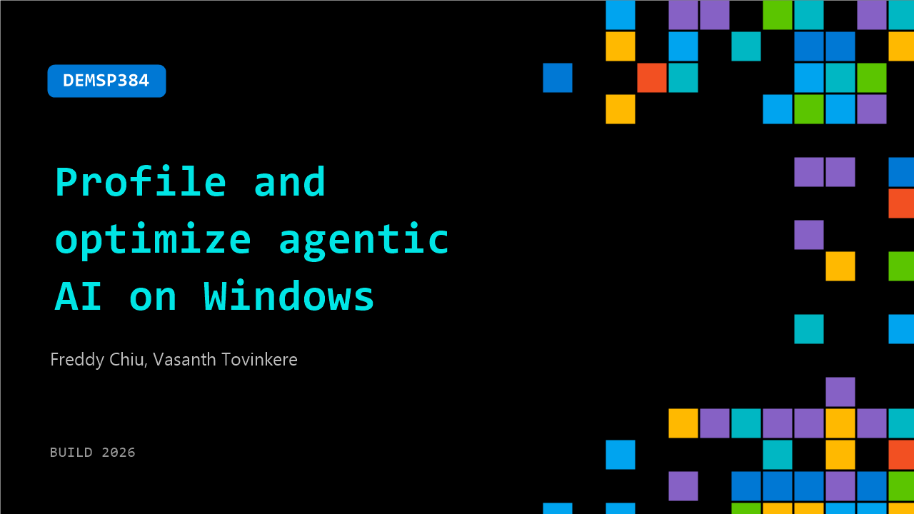

# DEMSP384: Profile and optimize agentic AI on Windows

**Session code:** DEMSP384  
**Date:** Tuesday, June 2, 2026 / 1:00 PM - 1:25 PM PDT (Duration 25 minutes)  
**Watch on-demand:** <https://build.microsoft.com/en-US/sessions/DEMSP384>

---

## Speakers

- **Freddy Chiu** - AI Frameworks Engineer, Intel
- **Vasanth Tovinkere** - Principal Engineer, Intel Corporation

## About the session

Learn how to profile and optimize agentic AI apps on Intel-powered Windows PCs. In this live demo, analyze performance across CPU, GPU, and NPU to identify bottlenecks and improve responsiveness and power efficiency. See how to build performance profiles and apply tuning techniques using Intel Tracing Technology, OpenVINO, and Windows ML.

Seating for this session is first-come, first-served. Add it to your schedule to plan your day and arrive early to secure a spot.

## AI summary

**Introduction and Agenda:** The session opens with Freddy Chu introducing himself as an AI Frameworks Engineer at Intel, joined by Principal Engineer Vasant Tobinkere 00:00:04–00:00:12. They outline the talk’s focus on profiling agentic AI workflows on Windows and explain that the session will explore why profiling is important, demonstrate a practical workflow, show profiling of tools, and conclude with a demo and Q&A 00:00:17–00:00:38. Freddy sets the stage by emphasizing that profiling helps maximize productivity by optimizing prompt iteration speed and efficiency when running large models locally on AI PCs 00:00:39–00:01:19.

**Agentic Workflow Demonstration:** Freddy introduces a sample agentic workflow illustrating how an AI agent designs a 3D wheel model using local computation powered by OpenVINO and the latest Intel Core Ultra architecture 00:01:24–00:02:12. The agent reasons through the prompt, generates code, uses OpenSCAD to render the 3D model, and finally stylizes and summarizes the result for continuity in the conversation 00:02:05–00:02:25. Freddy notes this is representative of typical agentic patterns where AI reasons, plans, executes, and remembers interactions. The segue to profiling is introduced by posing the challenge of measuring performance to optimize such multi-step, multimodal workflows 00:02:55–00:03:06.

**Profiling Methodology and Unified Telemetry:** Vasant begins explaining how to capture and correlate the right telemetry data to make optimization decisions 00:03:10–00:03:26. He differentiates between structured, low-overhead platform telemetry (CPU, GPU, NPU, power metrics) and unstructured, higher-overhead application-level telemetry. The talk introduces Intel’s Unified Telemetry framework, which aligns diverse hardware and software data streams into a common time domain for accurate correlation 00:05:13–00:05:21. Vasant discusses its integration with ITT (Instrumentation and Tracing Technology) APIs across Intel’s software stack, enabling developers to observe performance metrics from the hardware driver through the AI middleware to application layers 00:06:00–00:07:19.

**Optimization through Hardware Utilization:** Returning to Freddy, the presentation demonstrates profiling results of the 3D modeling workflow, comparing baseline (GPU-only) versus optimized scenarios where workloads are offloaded to the NPU 00:07:40–00:10:00. Offloading stylization and summarization tasks to the NPU allows overlapping computation and response generation, reducing latency and power consumption. The speakers explain how this parallelization improves user experience and extends battery life while maintaining performance efficiency 00:10:01–00:11:00. They further emphasize tuning tool calling and inference profiling as key levers for optimizing increasingly complex agentic workflows.

**Tracing, Instrumentation, and Deep Profiling:** Vasant provides deeper insight into how tracing adds structure to unstructured software telemetry, demonstrating how OpenVINO organizes trace data by phases to analyze inference performance 00:12:01–00:14:20. Unified telemetry combines ITT-based software tracing with hardware telemetry into synchronized, time-aligned JSON outputs 00:14:43–00:15:12. Developers can instrument their software using ITT APIs to insert lightweight markers that enable transparent data collection once Unified Telemetry is attached 00:15:44–00:16:17. These insights make it possible to identify bottlenecks such as model compilation overheads and opportunities to precompile or shift workloads across heterogeneous compute engines.

**Demo, Results, and Conclusion:** Freddy’s live demo shows an AI agent profiling Windows ML and ONNX models across multiple device configurations (GPU vs. NPU, FP16 vs. INT8) to generate latency, power, and energy efficiency comparisons 00:17:25–00:23:55. The results reveal trade-offs between speed and power consumption, allowing informed workload deployment strategies. Wrapping up 00:24:26–00:25:24, the presenters encourage developers to integrate tracing and Unified Telemetry into agentic pipelines to quantify performance, guide optimization, and leverage tools like OpenVINO, ITTAPI, and Windows ML CLI for deeper insights. The talk concludes with an invitation to further discuss Unified Telemetry at Intel’s booth and an evening networking event 00:25:29–00:25:54.

## Session tags

- **Session type:** Demo
- **Level:** (300) Advanced
- **Topic:** Cloud platform & data
- **Tags:** AI, Automation, Azure, Security, Compute, Platform, Security in SQL, On-prem Migration, Cloud Migration Factory, Analytics, Developer, Local AI, Linux, Windows, Windows Developer, Data, Deployment Pipelines, Scaling, App Developers, AppTrust, Platform Security, Secure App Development, User Privacy, Attack Surface Reduction, Cross-device, Open Ecosystem, Agentic Security, Developer Technologies
- **Location:** Festival Pavilion, Theater A
