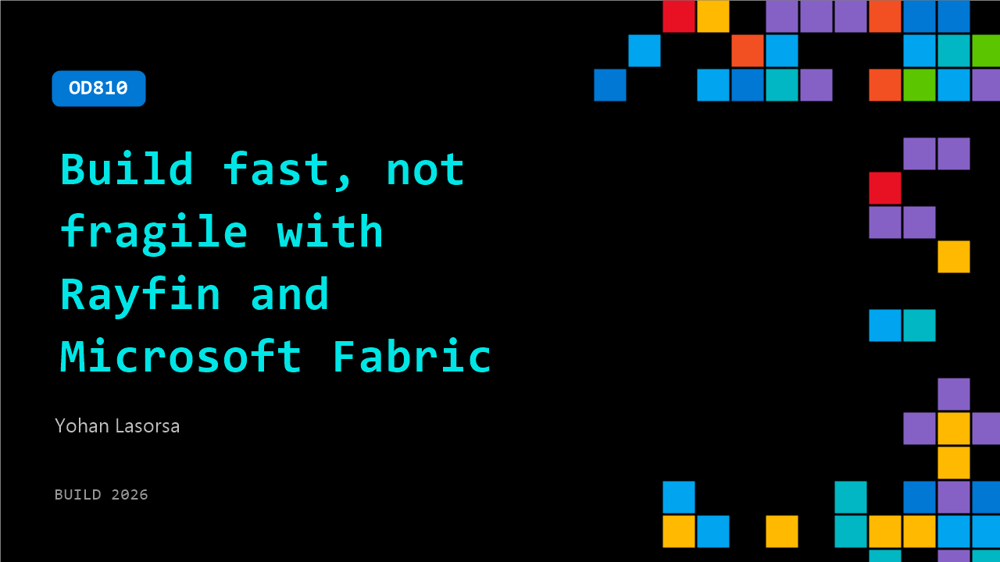

# OD810: Build fast, not fragile with Rayfin and Microsoft Fabric

**Session code:** OD810  
**Watch on-demand:** <https://build.microsoft.com/en-US/sessions/OD810>

---

## Speakers

- **Yohan Lasorsa** - Principal Developer Advocate, Microsoft

## About the session

Ship new apps in minutes without hand-rolling auth, data, and hosting. In this session, see how RayFin on Microsoft Fabric gives developers and coding agents a code-first backend with typesafe schemas, APIs, functions, storage, and app hosting. We'll walk through going from idea to working app, with Fabric-native data ready for governance, analytics, and AI from day one.

## AI summary

**Introduction and Developer Challenge:** The session opens with Yohan Lasorsa welcoming viewers and introducing the main theme — how to safely push AI-assisted, or "vibe-coded," applications to production 00:00:03–00:00:12. Lasorsa frames the discussion by noting how coding agents have dramatically improved in the past year, accelerating app development to unprecedented speeds. However, he stresses that while prototyping is now faster than ever, treating the first working demo as a production-ready foundation is a critical mistake 00:00:41–00:00:47. Many organizations fall into the trap of prematurely deploying these prototypes, which often leads to outages and data breaches. Lasorsa cites surveys showing that up to 90% of AI-generated prototypes never reach production, emphasizing that while speed has evolved, production standards such as security, governance, compliance, and scalability remain constant 00:01:22–00:02:01.

**Introducing Rayfin and Session Roadmap:** The talk transitions to the introduction of Rayfin — a managed backend-as-a-service built on Microsoft Fabric, designed to bridge the gap between prototype and production 00:02:48–00:03:03. Unlike similar platforms, Rayfin is Fabric-native and enterprise-ready, offering managed databases, authentication, and real-time hosting with compliance and integration baked in. Lasorsa highlights that Rayfin was created with coding agents in mind to ensure AI-generated applications can instantly take advantage of enterprise-grade security and data governance 00:03:40. He outlines the session agenda: a series of live demos showing how to create an app with Rayfin, manage authentication and data integrity, deploy it to production, and build an intelligent analytics dashboard 00:04:01–00:04:34.

**Building the “Contoso Chef” App:** Using VS Code, Lasorsa demonstrates creating a new project with Rayfin CLI and setting up a recipe-sharing app called “Contoso Chef” 00:04:45–00:06:02. The app idea stems from his family’s Italian cooking traditions — preserving private and public recipes digitally, with strong access control. The demo shows how Copilot CLI uses Rayfin skills to scaffold the project, generate a working schema, and connect to Microsoft Fabric as its backend 00:07:00–00:10:00. When running the app locally, Rayfin automatically generates secured APIs, authentication via Fabric OAuth, and type-safe data models for entities like Recipe and Like. This section illustrates how coding agents can focus on implementing features rather than reinventing architecture or database logic 00:12:03–00:14:15.

**Testing Access Control and Data Governance:** In the next demonstration, Lasorsa verifies that Rayfin enforces privacy and access rules correctly by checking whether private recipes remain inaccessible to unauthenticated users 00:16:33–00:17:30. He tests multiple visibility settings — private, unlisted, and public — and confirms that Rayfin’s policy-driven backend enforces these distinctions automatically. Inspecting the entity’s read policies demonstrates that only authenticated users who own a recipe can modify or view private content 00:20:01. To illustrate flexible extensibility, Lasorsa adds a new “Comment” entity using Copilot, then applies Rayfin’s migration command to evolve the schema safely without losing data 00:22:01–00:24:26. The resulting app supports secure comment creation and deletion rules, reinforcing that schema evolution and fine-grained data security are fundamental advantages of the Rayfin platform.

**From Prototype to Production:** After showing the MVP working locally, Lasorsa reveals that production deployment has been silently achieved through the same “Rayfin app” command 00:28:01–00:28:36. He opens the live Fabric workspace to show the deployed backend and database and demonstrates that the app now runs publicly and fully managed. He stresses that developers shouldn’t fear the transition from dev to production because Rayfin ensures consistency from day one 00:29:03. This integrated approach eliminates the typical “rewrite gap” between prototypes and finished enterprise deployments. Lasorsa then introduces Rayfin’s Analytics App Templates, showing how apps can immediately produce dashboards that visualize live data in Fabric 00:30:10–00:31:56.

**Conclusion and Key Takeaways:** The session concludes by summarizing the core message: the fastest path from idea to production begins with the right foundation 00:32:27. Coding agents accelerate development, but sustainable success requires built-in identity, security, governance, and data capabilities. When apps are Fabric-native through platforms like Rayfin, developers gain instant access to analytics and AI-driven insights without friction between systems. Lasorsa closes by encouraging developers to explore the Rayfin documentation for more in-depth learning, reiterating his central mantra: build fast, but build on a foundation that will take you all the way to production 00:33:14–00:33:38.

## Session tags

- **Session type:** Pre-recorded
- **Level:** (200) Intermediate
- **Topic:** Cloud platform & data
- **Tags:** Microsoft Fabric, CP&D, Data
