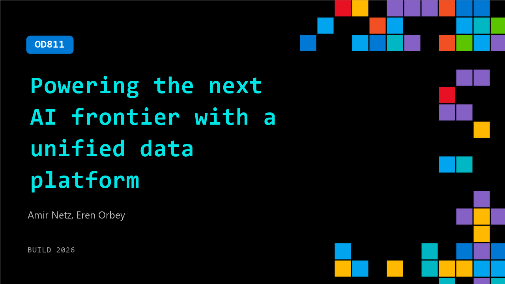

# OD811: Powering the next AI frontier with a unified data platform

**Session code:** OD811  
**Watch on-demand:** <https://build.microsoft.com/en-US/sessions/OD811>

---

## Speakers

- **Amir Netz** - Technical Fellow, Microsoft
- **Eren Orbey** - Senior Product Manager, Microsoft

## About the session

AI agents are becoming part of the workforce, working side by side with employees. The challenge is making them as trusted and productive as people by giving them the same knowledge, context, and real‑time business understanding. In this session, explore the latest Microsoft Fabric capabilities making this possible, including Fabric IQ, and see how developers can build, ship, and scale AI apps on Fabric’s unified data foundation.

## AI summary

**Introduction and Fabric Overview:** At 00:00:03, Amir Netz, CTO of Microsoft Fabric, introduces himself and explains how Microsoft Fabric was launched just over two years ago as a unified end-to-end data platform combining operational databases, SQL, data integration, analytics, data warehousing, and real-time intelligence into one ecosystem. He highlights key components like OneLake for unified data storage and Copilot as an integral capability spanning the stack. The adoption metrics are remarkable — Fabric is used by 35,000 customers, serving over 90% of Fortune 500 companies, and generating $2 billion in annual recurring revenue, growing 60% year-over-year. As he shifts focus at 00:01:39, Amir notes the rise of AI “agents” entering workplaces and poses a crucial question: how to make these agents as trustworthy and productive as human employees.

**Introducing Microsoft IQ and Fabric IQ:** From 00:02:19 onward, Amir outlines Microsoft’s answer — giving agents organizational context and knowledge comparable to employees. He introduces Microsoft IQ, comprising Work IQ, Foundry IQ, and Fabric IQ. Work IQ understands individuals and their work styles; Foundry IQ curates institutional knowledge; and Fabric IQ provides real-time business context. At 00:04:27, Amir explains that building Fabric IQ involves four steps: unifying data, harmonizing and processing it, curating semantic knowledge, and empowering AI agents. The first step centers on OneLake, Fabric’s secure open data foundation where all enterprise data is consolidated without duplication. By 00:07:09, he announces new data connectors for SAP, Oracle, SharePoint, OneDrive, and previews for AWS Glue and Azure Monitor, reinforcing a “zero-ETL” approach for complete data unification.

**Performance, Agent Skills, and AI Functions:** Starting at 00:08:08, Amir unveils GPU-accelerated query performance in the Fabric Data Warehouse, achieving up to 8x to 100x improvements under concurrent workloads — a breakthrough showcased in multiple demos. A technical walkthrough at 00:10:24 shows how enabling “query acceleration” boosts insight retrieval speed dramatically. Later, Amir introduces “agent skills for Fabric” (00:12:01), extending Fabric’s capabilities so AI agents can develop complete data solutions, ranging from ingestion to reporting. In a demonstration, Fabric’s CLI and GitHub Copilot skillfully generate ingestion pipelines, notebooks, scheduling pools, and even Power BI reports with near-instant startup times. This agent-driven approach shifts Fabric development from manual configuration to natural language-driven automation.

**Semantics, Ontologies, and Planning in Fabric:** At 00:17:20, the focus moves to creating business semantics so AI understands organizational context. Amir describes semantic models — the core of Power BI analytics — as the bridge between business language and stored data. He introduces ontologies (00:18:58) to extend semantics beyond static metrics to encompass dynamic business processes, roles, policies, and actions. These ontologies model not only past and present states but also “should happen” scenarios, forming the foundation of operational intelligence. This naturally leads to the announcement of the general availability of “Planning in Fabric” at 00:22:00. The planning module lets organizations create forecasts, budgets, and scenarios natively within Fabric, fully integrated with OneLake and semantic models. A detailed demo illustrates how users manipulate assumptions interactively, lock scenarios, and collaborate with team members while maintaining complete data lineage and auditability.

**Apps, Rayfin SDK, and Operational Agents:** Beginning at 00:26:25, Amir introduces “Apps in Fabric,” allowing enterprises to build production-grade, data-connected applications through the new Rayfin SDK. The SDK scaffolds backends automatically, wiring authentication, SQL databases, and UI components with one command. Demos show Rayfin generating full delivery apps and extending into “agent-driven BI apps” (00:31:00) that integrate operational and analytical workflows. Finally, the narration transitions at 00:33:05 to “operations agents,” now generally available. Unlike chatbots, these agents monitor live signals, perform autonomous actions, and learn continuously. Through a hands-on example, an agent trained to reduce customer churn demonstrates natural language setup, semantic alignment through ontologies, integration with Microsoft Teams, and iterative learning via root-cause analysis — showing how virtual coworkers act proactively within business processes.

**Conclusion and Vision:** In the closing section at 00:37:12, Amir recaps the journey from data unification in OneLake through GPU-accelerated analytics, semantic modeling, planning, application development, and finally to autonomous agents. All these innovations, he emphasizes, are powered by Fabric IQ — the foundation that empowers both human employees and AI agents to operate with shared intelligence and context. As Microsoft expands Microsoft IQ across Work IQ, Foundry IQ, and Fabric IQ, Amir envisions a workforce of millions of intelligent agents collaborating productively alongside humans. He concludes by inviting viewers to explore these innovations and “have a great conference,” marking the session’s inspirational close at 00:38:11.

## Session tags

- **Session type:** Pre-recorded
- **Level:** (200) Intermediate
- **Topic:** Cloud platform & data
- **Tags:** Linux, Microsoft Fabric, CP&D, Data
