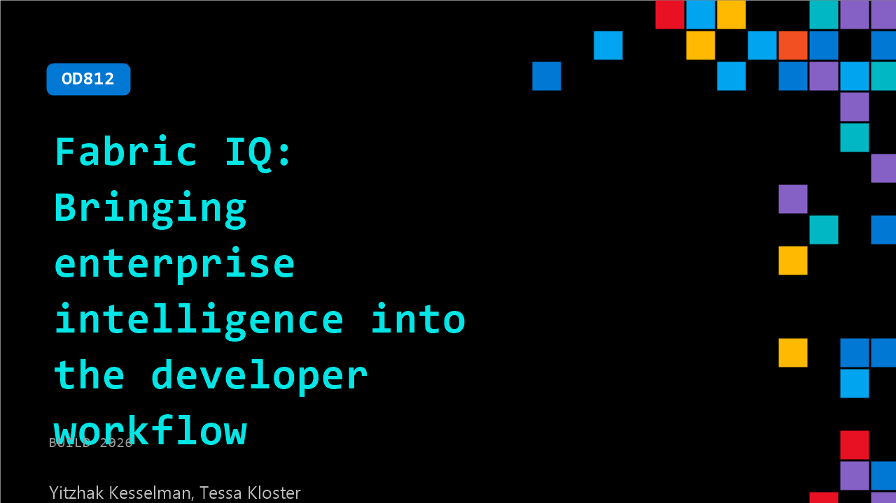

# OD812: Fabric IQ: Bringing enterprise intelligence into the developer workflow

**Session code:** OD812  
**Watch on-demand:** <https://build.microsoft.com/en-US/sessions/OD812>

---

## Speakers

- **Yitzhak Kesselman** - CVP, FABRIC TEAM, Microsoft
- **Tessa Kloster** - Partner Director Product Management, Microsoft

## About the session

Join this session to learn how Microsoft Fabric IQ helps developers build AI-powered data apps and agents on a secure, governed semantic foundation. Fabric IQ reuses existing semantic models, connects to live data, and captures shared business logic to unify data, meaning, and action across systems. See how a shared ontology reduces brittle integrations and gives agents durable business context using MCP, GitHub Copilot, and Ontology APIs and SDKs.

## AI summary

_No AI summary available._

## Session tags

- **Session type:** Pre-recorded
- **Level:** (200) Intermediate
- **Topic:** Cloud platform & data
- **Tags:** Microsoft Fabric, CP&D, Data
