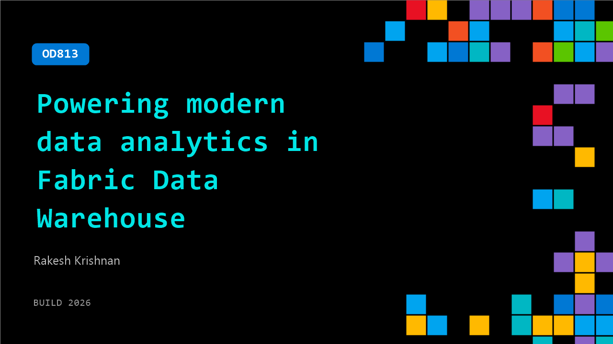

# OD813: Powering modern data analytics in Fabric Data Warehouse

**Session code:** OD813  
**Watch on-demand:** <https://build.microsoft.com/en-US/sessions/OD813>

---

## Speakers

- **Rakesh Krishnan** - Principal Product Manager, Microsoft

## About the session

Developers are building interactive, AI‑driven analytics workflows, but the data layer often can’t keep up. Dashboards stall, pipelines miss SLAs, and agentic analytics break when queries are slow. In this session, learn about how a new engine in Fabric Data Warehouse delivers a faster, more predictable foundation accelerating reporting, pipelines, and agentic experiences without re‑architecting your stack.

## AI summary

_No AI summary available._

## Session tags

- **Session type:** Pre-recorded
- **Level:** (200) Intermediate
- **Topic:** Cloud platform & data
- **Tags:** Microsoft Fabric, CP&D, Data
