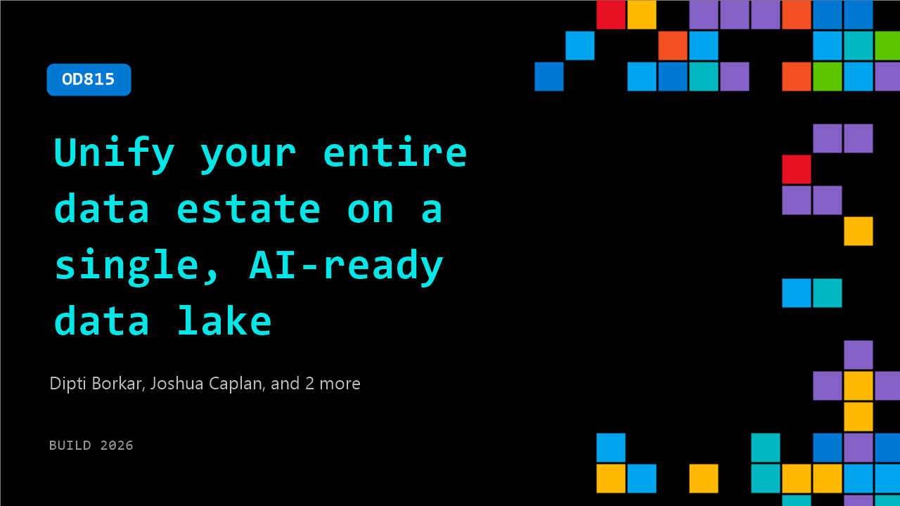

# OD815: Unify your entire data estate on a single, AI-ready data lake

**Session code:** OD815  
**Watch on-demand:** <https://build.microsoft.com/en-US/sessions/OD815>

---

## Speakers

- **Dipti Borkar** - Vice President & GM, Microsoft
- **Joshua Caplan** - Partner Director of Product Management, Microsoft
- **Miquella de Boer** - Principal PM Lead, Microsoft
- **Wee hyong Tok** - Partner Director, Product Management, Microsoft

## About the session

Every AI initiative starts with the same fundamental challenge: understanding where your data lives and how to bring it together. Microsoft OneLake solves this by unifying data across clouds, on-premises environments, and third-party platforms into a single logical data lake without unnecessary ETL, fragmentation, or duplication. Join this session to explore new OneLake sources, see how OneLake now supports data projects outside of Fabric, and how OneLake integrates with Foundry for AI projects.

## AI summary

_No AI summary available._

## Session tags

- **Session type:** Pre-recorded
- **Level:** (200) Intermediate
- **Topic:** Cloud platform & data
- **Tags:** Microsoft Fabric, CP&D, Data
