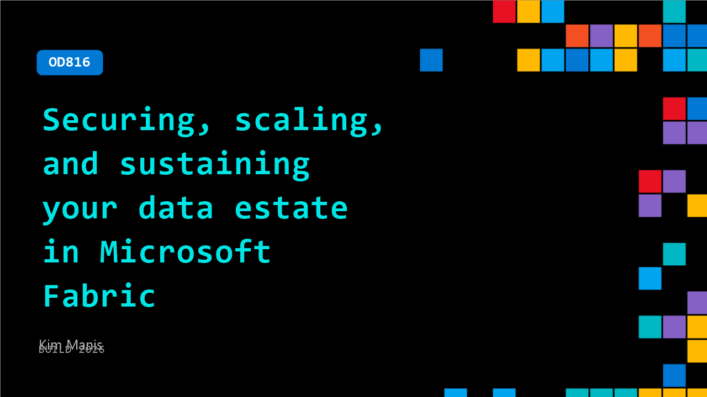

# OD816: Securing, scaling, and sustaining your data estate in Microsoft Fabric

**Session code:** OD816  
**Watch on-demand:** <https://build.microsoft.com/en-US/sessions/OD816>

---

## Speakers

- **Kim Manis** - CVP, FABRIC PM, Microsoft

## About the session

As GenAI adoption accelerates, developers and admins alike need control over governance, capacity, and security. In this session, we’ll walk through how Fabric helps you monitor your workloads, enforce governance policies, and manage capacity and access with precision. We’ll also show how developers can access their data and governance from the tools they use everyday through Fabric MCP, Agent Skills in Fabric, the Fabric CLI.

## AI summary

_No AI summary available._

## Session tags

- **Session type:** Pre-recorded
- **Level:** (200) Intermediate
- **Topic:** Cloud platform & data
- **Tags:** Microsoft Fabric, CP&D, Data
