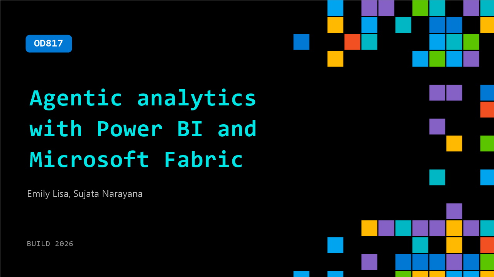

# OD817: Agentic analytics with Power BI and Microsoft Fabric

**Session code:** OD817  
**Watch on-demand:** <https://build.microsoft.com/en-US/sessions/OD817>

---

## Speakers

- **Emily Lisa** - Principal Group Product Manager, Microsoft
- **Sujata Narayana** - Principal GPM, Microsoft

## About the session

AI-powered agents are reshaping how we build analytics solutions. Agentic analytics not only helps accelerate development cycles but also helps make it easier to apply best practices and standards across your analytics projects. In this session you'll see the latest innovation when it comes to agentic development with Power BI and Microsoft Fabric. You'll also see educational demos how to best leverage AI agents to build end-to-end enterprise-grade data experiences.

## AI summary

_No AI summary available._

## Session tags

- **Session type:** Pre-recorded
- **Level:** (200) Intermediate
- **Topic:** Cloud platform & data
- **Tags:** Microsoft Fabric, CP&D, Data
