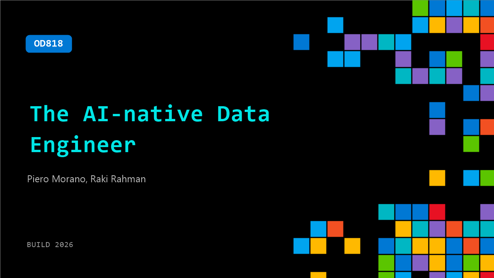

# OD818: The AI-native Data Engineer

**Session code:** OD818  
**Watch on-demand:** <https://build.microsoft.com/en-US/sessions/OD818>

---

## Speakers

- **Piero Morano** - Principal PM Manager, Microsoft
- **Raki Rahman** - Principal Software Engineer, Microsoft

## About the session

This session explores how AI is transforming data engineering. Discover how agentic Copilot across Fabric Web, VS Code, and CLI removes coding barriers, automates repetitive tasks, and lets engineers focus on optimizing data stacks to unlock faster insights. We’ll also cover the latest Fabric releases and how they accelerate the path from idea to production.

## AI summary

_No AI summary available._

## Session tags

- **Session type:** Pre-recorded
- **Level:** (200) Intermediate
- **Topic:** Cloud platform & data
- **Tags:** Microsoft Fabric, CP&D, Data
