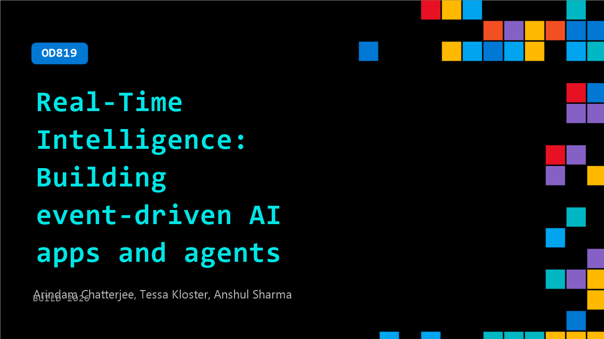

# OD819: Real-Time Intelligence: Building event-driven AI apps and agents

**Session code:** OD819  
**Watch on-demand:** <https://build.microsoft.com/en-US/sessions/OD819>

---

## Speakers

- **Arindam Chatterjee** - Principal Product Manager, Microsoft
- **Tessa Kloster** - Partner Director Product Management, Microsoft
- **Anshul Sharma** - Principal Product Manager, Microsoft

## About the session

Join this session to see how Microsoft Fabric Real‑Time Intelligence helps developers build event‑driven AI apps and autonomous agents that respond to live data in seconds. Real‑Time Intelligence unifies streaming ingestion, real‑time analytics, and actioning in a single governed experience—enabling teams to move seamlessly from signal to insight to action without complex pipelines.

## AI summary

_No AI summary available._

## Session tags

- **Session type:** Pre-recorded
- **Level:** (200) Intermediate
- **Topic:** Cloud platform & data
- **Tags:** Microsoft Fabric, CP&D, Data
