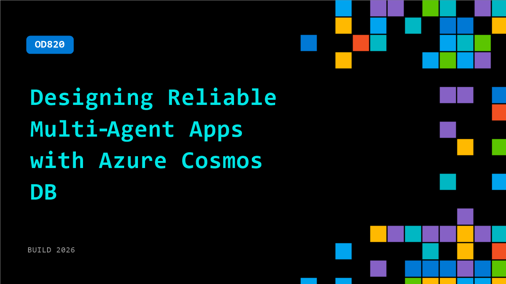

# OD820: Designing Reliable Multi‑Agent Apps with Azure Cosmos DB

**Session code:** OD820  
**Watch on-demand:** <https://build.microsoft.com/en-US/sessions/OD820>

---

## Speakers

_Not listed._

## About the session

AI agents are easy to prototype and hard to ship. Learn how to build a multi‑agent, multi‑tenant app that stays fast and reliable in production. See how Azure Cosmos DB powers agent memory, retrieval, and coordination using document processing, vector and full‑text search, and semantic reranking to deliver low‑latency responses at scale.

## AI summary

_No AI summary available._

## Session tags

- **Session type:** Pre-recorded
- **Level:** (300) Advanced
- **Topic:** Cloud platform & data
- **Tags:** CosmosDB, Azure Cosmos DB, CP&D
