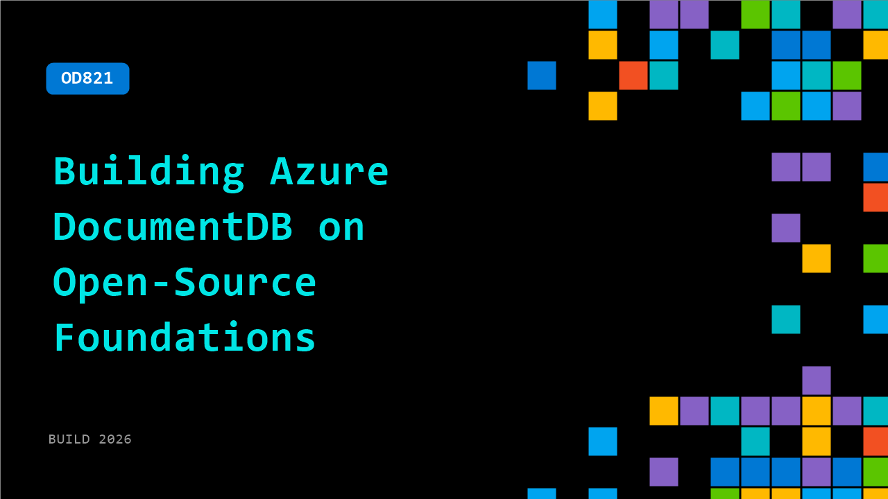

# OD821: Building Azure DocumentDB on Open-Source Foundations

**Session code:** OD821  
**Watch on-demand:** <https://build.microsoft.com/en-US/sessions/OD821>

---

## Speakers

_Not listed._

## About the session

How do you turn a high-performance open-source database engine into a globally distributed, fully managed cloud service? In this session, we go under the hood of Azure DocumentDB (prev. Azure Cosmos DB for MongoDB vCore) and explore how it is powered by the open-source DocumentDB engine. You'll learn how Microsoft built a multi-tenant cloud architecture around this core, including service orchestration, elastic scaling, workload isolation, and API compatibility.

## AI summary

_No AI summary available._

## Session tags

- **Session type:** Pre-recorded
- **Level:** (300) Advanced
- **Topic:** Cloud platform & data
- **Tags:** CosmosDB, Azure Cosmos DB, CP&D
