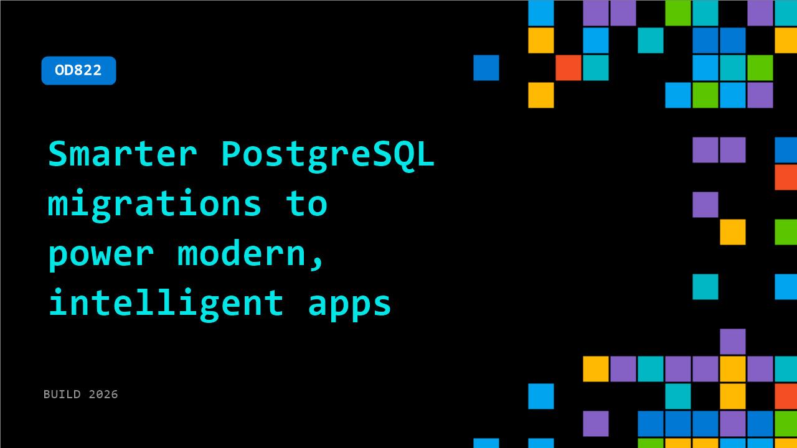

# OD822: Smarter PostgreSQL migrations to power modern, intelligent apps

**Session code:** OD822  
**Watch on-demand:** <https://build.microsoft.com/en-US/sessions/OD822>

---

## Speakers

_Not listed._

## About the session

Building intelligent apps takes more than moving data. High-performing teams migrate early, standardize on open source, and start using their data to power real intelligence. In this session, see how teams migrate terabytes to Azure Database for PostgreSQL using AI-assisted and integrated tools that reduce risk and downtime then unlock performance, security, and AI-ready capabilities on Azure to ship smarter solutions, from AI-driven platforms to multi-tenant apps.

## AI summary

_No AI summary available._

## Session tags

- **Session type:** Pre-recorded
- **Level:** (300) Advanced
- **Topic:** Cloud platform & data
- **Tags:** Azure Database for PostgreSQL, CP&D
