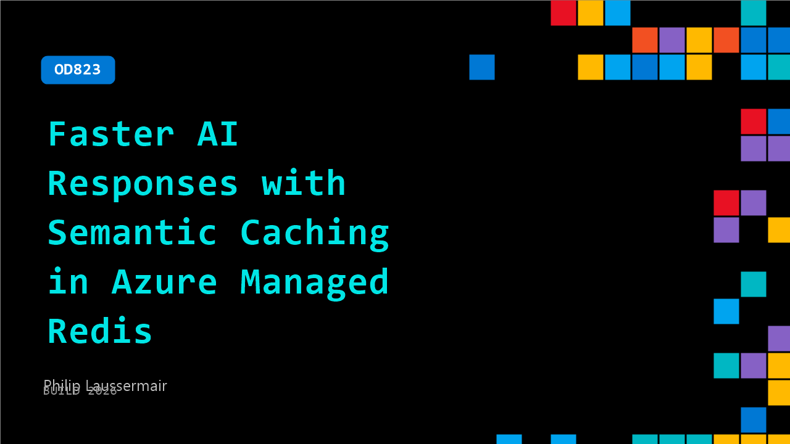

# OD823: Faster AI Responses with Semantic Caching in Azure Managed Redis

**Session code:** OD823  
**Watch on-demand:** <https://build.microsoft.com/en-US/sessions/OD823>

---

## Speakers

- **Philip Laussermair** - Solutions Architect, Microsoft

## About the session

AI apps are only as efficient as how they handle repeated intent. In this demo, see how semantic caching with Azure Managed Redis identifies similar requests and serves responses instantly—without reprocessing tokens. Compare a standard LLM workflow to a cached experience in real time, and learn how vector similarity search reduces latency, cuts token usage, and lowers cost for scalable AI apps.

## AI summary

_No AI summary available._

## Session tags

- **Session type:** Pre-recorded
- **Level:** (200) Intermediate
- **Topic:** Cloud platform & data
- **Tags:** Azure SQL, CP&D, Data
