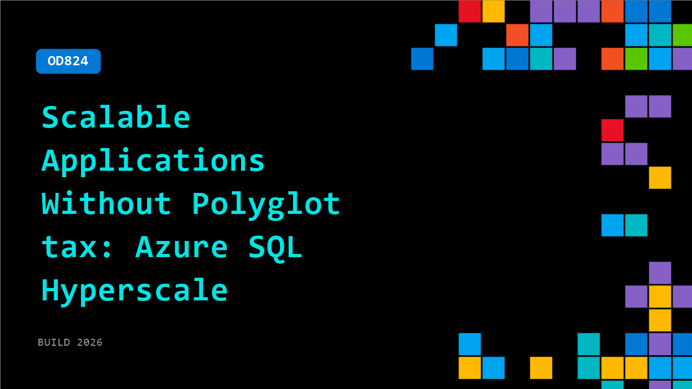

# OD824: Scalable Applications Without Polyglot tax: Azure SQL Hyperscale

**Session code:** OD824  
**Watch on-demand:** <https://build.microsoft.com/en-US/sessions/OD824>

---

## Speakers

_Not listed._

## About the session

Modern application architectures have drifted toward polyglot persistence, adding complexity, data movement, and operational overhead. Azure SQL Database Hyperscale takes a different approach: a single, multi model system that brings relational, transactional, and emerging workloads together within SQL. Learn how Hyperscale redefines performance, elasticity, and operations. See why consolidating on a single, multi-model SQL platform is the simpler, more scalable path for modern applications

## AI summary

**Introduction and the Problem of Polyglot Tax:** The talk begins with Aditya, a product manager from Azure SQL, greeting the audience and setting the stage for a discussion on building scalable applications without the “polyglot tax” 00:00:03–00:00:17. He explains that polyglot tax refers to the cost—both technical and operational—of using multiple specialized databases within an application. As developers move from quick prototypes to production-scale systems, they often add vector databases for semantic search, graph databases for relationships, and analytics engines to extract insights. However, each additional database introduces complexity, data synchronization issues, and potential points of failure. Aditya stresses that this architectural tax manifests as maintenance overhead, network latency, multiple security systems, and cognitive load on developers 00:01:00–00:03:00. The core message is that Microsoft SQL can eliminate these inefficiencies by integrating all necessary capabilities within one engine.

**Demonstrating Polyglot Complexity with a Fraud Detection Example:** To illustrate the challenge, Aditya describes how a team might build a real-time fraud detection system 00:02:10–00:03:40. Such a system often requires separate databases: relational for transaction history, JSON/document stores for device fingerprints, graph databases for customer connections, vector stores for similarity matching, and analytic databases for statistical baselines. He highlights the ensuing problems—data consistency issues, synchronization lags, increased latency, and the costly need to maintain different backups and security policies. This polyglot setup multiplies both operational costs and developer burden, while also leading to unreliable outcomes for AI and agent-based systems that draw on inconsistent data. The goal, Aditya emphasizes, is to consolidate these workloads into Microsoft SQL to avoid these inefficiencies and improve system reliability 00:04:00–00:05:10.

**Microsoft SQL Core Engine Capabilities – JSON, Graph, and Vector Integration:** Transitioning into “Act 1,” Aditya outlines how the Microsoft SQL Core Engine itself helps avoid polyglot tax. He introduces native JSON data types and JSON indexing, which allow flexible document-style storage directly within SQL tables 00:06:00–00:07:30. Unlike earlier implementations, this is a pre-parsed binary type that enhances performance and compresses data by 30–50%. SQL now supports indexing at specific JSON paths for faster lookups, rivaling leading document databases. He continues by describing inbuilt graph processing support that enables relationship modeling and pattern matching natively within the SQL query optimizer 00:08:10–00:09:00. Aditya then details vector data support—a newer addition allowing vector storage and approximate nearest-neighbor searches via Microsoft’s DiskANN index, derived from Microsoft Research 00:09:20–00:10:55. With these integrations—JSON, Graph, Vector, and clustered columnstore for analytics—Microsoft SQL can now handle transactional, analytical, and AI-driven workloads in a single ACID-compliant engine.

**Unified Querying and Transaction Boundaries:** Aditya demonstrates how these integrated features converge in practice 00:12:00–00:14:00. For example, a developer can join relational order data, JSON device fingerprints, vector similarity results, and graph relationships across a single stored procedure—executed under one consistent transaction scope. This eliminates the risk of partial writes or inconsistencies that plague heterogeneous systems. He notes that such ACID guarantees are particularly critical for agents and AI-driven processes that require determinism and rollback safety 00:14:00–00:15:00. With all storage and querying consolidated, Microsoft SQL ensures a single source of truth across multiple data modalities while reducing developer effort to one query language and tooling environment.

**Azure SQL Hyperscale – Architecture, Scalability, and Reliability:** In “Act 2,” the discussion shifts to the Azure SQL Hyperscale service, which extends this core engine into a scalable cloud architecture 00:15:10–00:18:00. Aditya calls it the “Peace of Mind” database because it virtually eliminates capacity worries—storage automatically scales up to 128 TB, with separate dedicated services for logging, page management, and backups. Built-in snapshot-based backups avoid compute overhead, increasing efficiency and reducing downtime. Hyperscale also introduces named replicas for read scalability—each with independent cache and compute resources—allowing developers to separate OLTP traffic from analytical or agentic workloads. The platform inherently supports high availability, geo-replication, and serverless scaling that adapts compute power according to load 00:19:00–00:21:00. Additionally, built-in features such as Always Encrypted, dynamic data masking, and tamper-evident ledger functions enhance data security, while integration with the Data API Builder and Microsoft Copilot (MCP server) enables natural language interaction with SQL data.

**Conclusion – Economics and Strategic Takeaways:** Aditya concludes by emphasizing the economic and architectural advantages of adopting Microsoft SQL and Azure SQL Hyperscale 00:21:31–00:23:20. By avoiding specialized polyglot systems, organizations eliminate redundant data pipelines, reduce compute and storage costs, and streamline developer operations under a single licensing-free model. Hyperscale’s capability to dynamically scale compute and storage minimizes over-provisioning while achieving up to 68% better performance than comparable systems. Aditya closes with a pragmatic note: while some extreme workloads may still need specialized databases, for the majority of applications Microsoft SQL delivers a unified, scalable, secure, and cost-effective foundation 00:23:40–00:24:19. He ends by encouraging developers to “avoid the polyglot tax, ship with confidence, scale efficiently, and sleep peacefully at night.”

## Session tags

- **Session type:** Pre-recorded
- **Level:** (200) Intermediate
- **Topic:** Cloud platform & data
- **Tags:** Azure SQL Hyperscale, CP&D, Data
