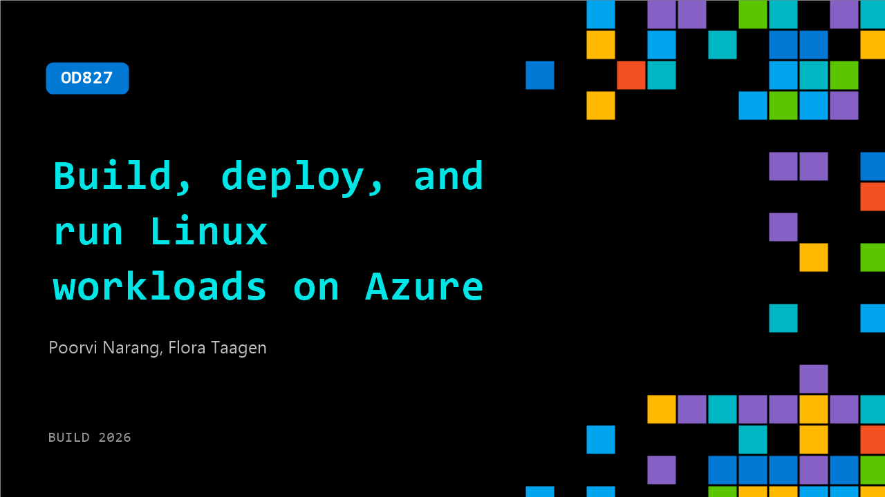

# OD827: Build, deploy, and run Linux workloads on Azure

**Session code:** OD827  
**Watch on-demand:** <https://build.microsoft.com/en-US/sessions/OD827>

---

## Speakers

- **Poorvi Narang** - Senior Program Manager, Microsoft
- **Flora Taagen** - Product Manager, Microsoft

## About the session

Explore how Azure empowers Linux and open‑source developers with streamlined, secure by default, cloud‑native services designed for fast startup, reduced operational overhead, and consistency across VMs and container workloads. Discover the latest Azure Linux capabilities. See live deployments, security defaults in action, and consistent workload execution from development through production across Azure VMs and AKS.

## AI summary

_No AI summary available._

## Session tags

- **Session type:** Pre-recorded
- **Level:** (300) Advanced
- **Topic:** Cloud platform & data
