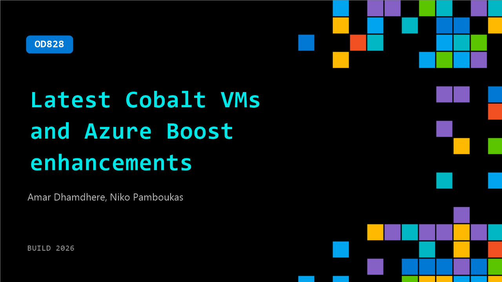

# OD828: Latest Cobalt VMs and Azure Boost enhancements​

**Session code:** OD828  
**Watch on-demand:** <https://build.microsoft.com/en-US/sessions/OD828>

---

## Speakers

- **Amar Dhamdhere** - Principal PdM Manager, Microsoft
- **Niko Pamboukas** - Principal Program Manager Lead, Microsoft

## About the session

Learn about the latest Cobalt VMs, the use cases they support, and how they compare to our previous generation Arm based VMs. Learn how these VMs are designed for cloud-native, scale-out applications using Linux, AKS, and other open-source software. Then explore recent performance and feature enhancements for Azure Boost, as well as recently announced general compute and confidential computing VMs that rely on Azure Boost. Learn how they can support your most latency sensitive applications.​

## AI summary

**Introduction and Overview of Azure Cobalt:** The video begins with Amar Dhamdhere introducing himself as a Project Manager from the Azure Compute VM Sizes Team and sets the context by describing Azure’s commitment to optimized virtual machine (VM) performance (00:00:07). He explains the significance of the Cobalt line of CPUs—Microsoft’s first in-house silicon designed specifically for the cloud. Dhamdhere highlights how Cobalt 100 revolutionized performance per cost metrics and its influence in reshaping cloud workload optimization. The agenda includes understanding customer adoption and performance gains of Cobalt 100, an introduction to Cobalt 200, performance benchmarks, VM lineup details, and deployment scenarios (00:00:53).

**Performance Success of Cobalt 100 and Customer Adoption:** Amar reflects on the 2024 general availability of Azure Cobalt 100, emphasizing it as Microsoft’s first Arm-powered CPU custom-built for the cloud (00:01:42). He shares metrics that demonstrate up to 2x .NET performance improvements, up to 20% cost reductions, and up to 45% better real-world workload performance compared to previous generations (00:02:01). Cobalt 100’s efficiency led to reduced core demand and lower carbon footprints. Major internal services like Teams, Cosmos DB, Azure SQL, and Microsoft Defender have standardized on it, underscoring its reliability. Customer adoption significance is discussed across industries—developers using Windows on Arm, containerization pipelines, and AI agent workloads—all benefiting from high performance and agility (00:03:47).

**Launch and Capabilities of Cobalt 200:** Building on Cobalt 100’s success, Amar introduces Cobalt 200 as Azure’s new leading performance CPU with up to 50% performance uplift (00:05:08). The architecture refines design for efficiency and scales better for modern workloads such as microservices, distributed data systems, and AI engine orchestration. Benchmarks reveal consistent gains across industry-standard, Microsoft-internal, and real product workloads—all confirming per-core performance improvements. Cobalt 200’s VM families cover general, memory-optimized, and specialized workloads leveraging Azure Boost for energy efficiency (00:06:41). The presentation emphasizes its alignment with agentic AI, with faster agent sandbox initialization, higher concurrency, and lower latency translating directly into value for developers and customers (00:08:17).

**Expanded VM Families, Tools, and Deployment Flexibility:** Amar details the new Cobalt 200 VM portfolios supporting developers with DPS, EPS, and new high-memory MP and storage-focused LP series (00:11:07). Each model is optimized for specific use cases, from microservices and web applications to large-scale analytics and caching. Cobalt 200 runs up to 70 GB/s storage throughput and supports up to 7 TB of local NVMe storage. It accommodates Linux and Windows variants and maintains full Azure feature parity, ensuring seamless migration from x86 instances. The new region rollout begins with the US and Sweden, with global availability expanding thereafter (00:14:13). Developers are guided toward documentation, technical blogs, and migration resources to begin adopting Cobalt 200 VMs efficiently (00:15:02).

**Azure Boost Technology and RDMA Demonstration:** Niko Pamboukas from the Azure Boost Team introduces the next-generation Azure Boost platform (00:15:20). Azure Boost offloads traditional hypervisor tasks to specialized hardware to enhance IOPS, reduce maintenance overhead, and achieve up to 400 Gbps network throughput and 1M IOPS storage performance (00:17:04). Pamboukas focuses on Guest RDMA, which allows direct memory-to-memory data transfers, bypassing typical CPU and OS layers. A demo comparing TCP vs RDMA during distributed AI inference using large LLM workloads shows up to 2.2x throughput, 3x faster time-to-first-token, and 25% token efficiency improvements (00:23:18). He concludes with an invitation to the 2026 preview program for RDMA-enabled Azure Boost.

**Intel, AMD VM Announcements and Azure Compute Security Innovations:** The final segments feature Amar detailing new Intel and AMD general compute VMs powered by Azure Boost and next-gen CPUs (00:24:35). Intel DSV7 and ESV7 series offer up to 15% performance gains with 400 Gbps networking and 20 GB/s remote storage throughput. AMD’s V7 family achieves up to 35% CPU performance and 80–130% gains on specific workloads using the latest EPYC Turin processors (00:28:35). Vikas Bhatia then covers Azure’s compute security stack—trusted launch, confidential VMs using AMD SEV-SNP and Intel TDX, live migration for secure workloads, and Azure Integrated HSM (00:30:31). These hardware-enforced protections ensure encryption of data in use, uphold isolation between tenants and the cloud provider, and deliver verifiable, compliant, end-to-end protection. The session concludes with resources for developers to deepen expertise in confidential computing and secure workload deployment on Azure (00:39:02).

## Session tags

- **Session type:** Pre-recorded
- **Topic:** Cloud platform & data
