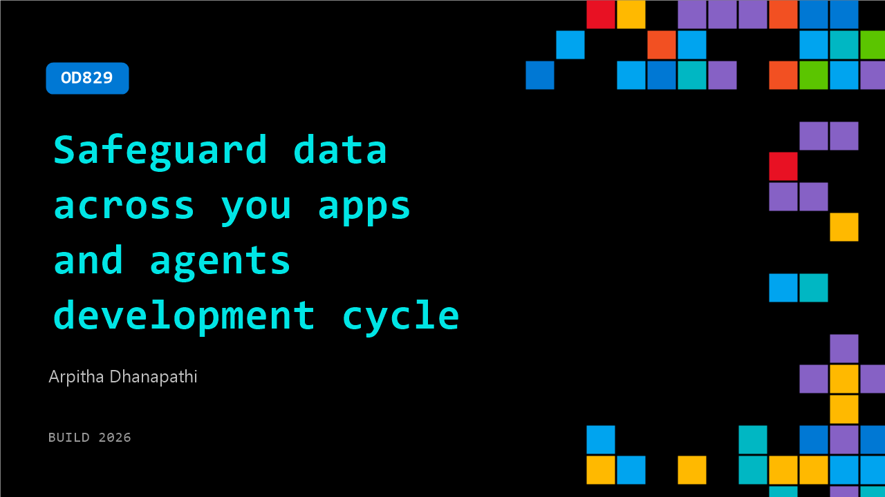

# OD829: Safeguard data across you apps and agents development cycle

**Session code:** OD829  
**Watch on-demand:** <https://build.microsoft.com/en-US/sessions/OD829>

---

## Speakers

- **Arpitha Dhanapathi** - Principal Product Manager, Microsoft

## About the session

Developers ship fast—but AI apps can overshare data and create compliance risks. Learn why data security and compliance must be built in from day one, and how to align with enterprise policies without reinventing controls. We’ll walk through common leakage paths, key guardrails, and how integrating app and agent development with Microsoft Purview can help your team move from prototype to production with confidence.

## AI summary

_No AI summary available._

## Session tags

- **Session type:** Pre-recorded
- **Level:** (200) Intermediate
- **Topic:** Cloud platform & data
- **Tags:** Security
