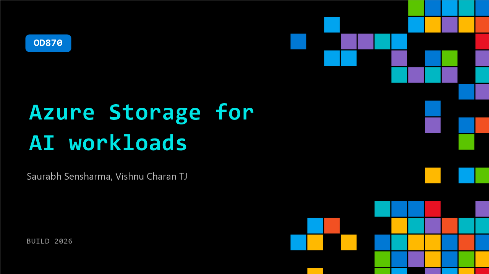

# OD870: Azure Storage for AI workloads​

**Session code:** OD870  
**Watch on-demand:** <https://build.microsoft.com/en-US/sessions/OD870>

---

## Speakers

- **Saurabh Sensharma** - Principal Product Manager, Azure Storage, Microsoft
- **Vishnu Charan TJ** - Principal Product Manager, Azure Storage, Microsoft

## About the session

Learn how Azure Storage powers AI inference at scale. This session explores how to securely bring enterprise data to AI models, accelerate AI workloads with high-performance storage, and reduce GPU idle time through faster model loading and optimized data access. See how Azure Storage integrates with Microsoft and open-source AI frameworks to improve performance, lower costs, and enable scalable agent-based applications.

## AI summary

_No AI summary available._

## Session tags

- **Session type:** Pre-recorded
- **Topic:** Cloud platform & data
