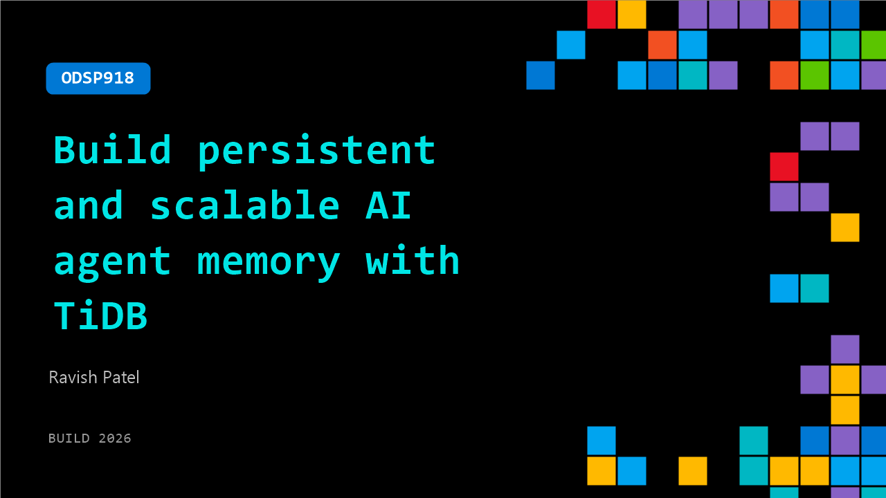

# ODSP918: Build persistent and scalable AI agent memory with TiDB

**Session code:** ODSP918  
**Watch on-demand:** <https://build.microsoft.com/en-US/sessions/ODSP918>

---

## Speakers

- **Ravish Patel** - Solutions Engineer, TiDB

## About the session

AI agents need different data infrastructure than humans—and they forget everything between sessions. See how TiDB is built for agentic workloads, combining vector search, BM25, and SQL in a unified table to manage agent memory at scale. Learn how hybrid retrieval with RRF, Azure OpenAI embeddings, and ACID transactions enables reliable, scalable agent systems you can deploy in Azure environments.

## AI summary

**Introduction and Problem Context:** The video begins with Ravish Patel introducing himself as a solutions engineer at PingCAP working on TiDB (00:00:03). He outlines that the talk will cover building agent memory for AI systems using only SQL, with a demo in the middle (00:00:12). To set the foundation, he explains how agent workloads differ from traditional applications. Agents have bursty traffic, massive concurrency, and a continuous need for context recall (00:00:28). These patterns make traditional database designs inefficient and costly when scaling AI agents that need to maintain their own states and memory.

**Challenges with Current Multi-Database Architectures:** Patel illustrates how most teams currently solve agent memory by combining three databases—a transactional one for chat history, a vector database for semantic recall, and a search engine for keyword lookups—connected via complex ETL jobs (00:01:33). He details the operational pitfalls of this setup: stale data due to indexing delays, read-after-write inconsistencies (00:03:20), partial writes during multi-step operations, and extreme connection fan-out problems as agents scale (00:04:32). These issues often surface only under real production loads, making them hard to catch during early development (00:05:00).

**Introducing TiDB and Its Key Capabilities:** To address this, Patel introduces TiDB, a distributed SQL database that scales horizontally with no manual sharding (00:05:15). It is MySQL-compatible, supports transactional, analytical, and vector capabilities within a single system, and is already in production with customers like Pinterest and Dify (00:05:58). TiDB simplifies agent memory architectures by unifying relational data, vector storage, and full-text search in one engine (00:06:13). Features such as agent state tracking, semantic recall with vector indexes, full-text multilingual search, automatic embeddings via SQL functions, and hybrid retrieval provide all the memory tools needed for AI agents without external pipelines (00:06:29).

**Performance and Scalability Advantages:** Before the demo, Patel highlights architectural benefits: TiDB supports “scale to zero” for idle agents, so users pay only for active workloads (00:07:43). It can spawn isolated database branches for individual agents in milliseconds and offers resource control to prevent runaway workloads from disrupting others (00:08:02). Its separation of compute and storage allows near-instant scaling during traffic spikes, making it highly adaptable to the unpredictable load patterns of AI systems (00:08:29).

**Demonstration: Building and Querying Agent Memory:** In the demo (00:08:43), Patel shows the creation of a single TiDB table with user, content, timestamp, and an embedding vector column that automatically generates embeddings using Azure OpenAI upon insert (00:09:09). He inserts five records—covering user data like “Jazz” and “Tokyo Flight”—and demonstrates semantic search (00:10:55), full-text keyword matching (00:11:22), and hybrid search combining both approaches via reciprocal rank fusion (00:12:04). He concludes the technical demo by running an ACID transaction across two tables—memories and user facts—showing consistent updates across both in a single commit (00:13:16).

**Customer Success Stories and Closing:** Patel wraps up by sharing real-world results from companies deploying TiDB at scale. Manus runs over 1.5 million agent databases, Dify consolidated half a million containers into one TiDB system, and Pinterest achieved over 1.3 million queries per second using a unified data engine (00:14:19). He recaps key benefits—automatic embeddings, unified query capabilities, hybrid search, resource isolation, and scale-to-zero performance (00:15:26). Finally, he directs viewers to TiDB.com to launch a free cluster in 30 seconds and explore the Python SDK, agentic patterns, and GitHub integrations (00:16:04). The video closes with a call to simplify AI development: “Stop running three databases when you only need one” (00:17:01).

## Session tags

- **Session type:** Pre-recorded
- **Level:** (300) Advanced
- **Topic:** Cloud platform & data
- **Tags:** AI, Azure, Storage, Vector Embeddings, Agents, Developer, Scaling, DevTools, Open Ecosystem, Dev Tools
