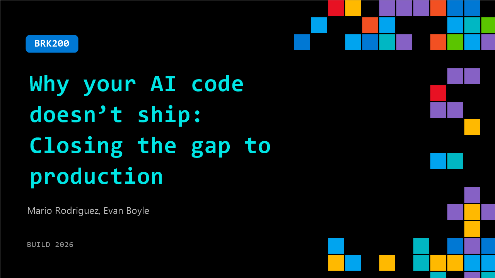

# BRK200: Why your AI code doesn’t ship: Closing the gap to production

**Session code:** BRK200  
**Date:** Tuesday, June 2, 2026 / 12:30 PM - 1:15 PM PDT (Duration 45 minutes)  
**Watch on-demand:** <https://build.microsoft.com/en-US/sessions/BRK200>

---

## Speakers

- **Mario Rodriguez** - Chief Product Officer, GitHub
- **Evan Boyle** - Principal Manager - Software Engineering, GitHub

## About the session

AI isn't just autocompleting your code anymore — it's writing plans, shipping PRs, fixing pipelines, and patching prod. In this demo-heavy session, we'll show AI agents working across the entire dev lifecycle: planning, coding, CI/CD, and live operations. You'll see how to move faster, keep agents on a leash, and build systems that fix themselves.

Seating for this session is first-come, first-served. Add it to your schedule to plan your day and arrive early to secure a spot.

## AI summary

**Opening and Vision for Agents:** Mario Rodriguez begins by welcoming the audience to Build 2026 and introducing himself as the leader of product at GitHub (00:00:01–00:00:13). He sets a tone of enthusiasm for developer creativity and declares that the session will be about "demos, not memos." He outlines a key shift occurring in the software world: the entry of AI agents into the workforce (00:01:05). Unlike older automation systems requiring constant supervision, modern agents allow for "macro-delegation and micro-steering," where developers set goals instead of micromanaging steps. This change redefines workflows, merges the traditional software development lifecycle with product development, and emphasizes collaboration between humans and agents. Mario asserts that velocity and creativity will drastically increase as developers focus on judgment and imagination with agents supporting execution.

**Defining the Agent-Native System:** Mario transitions into GitHub’s evolution toward becoming an “agent-native engineering system” (00:05:51). He lays out the platform’s foundational pillars: multiple work surfaces (IDEs, command line, GitHub Copilot app), secure runtimes both local and cloud-based, automation for predictable scale, quality verification systems, continuous learning memory, and enterprise-grade trust. By uniting these, GitHub is building an API- and UX-first platform built for human-agent collaboration. The goal is to help developers delegate confidently while maintaining high code quality and safety. Before concluding his segment, Mario invites Evan Boyle to the stage (00:07:17)—the co-creator of the Copilot CLI, SDK, and new Copilot app—to demonstrate these concepts in practice.

**Demonstrating the GitHub Copilot App and Canvases:** Evan introduces the GitHub Copilot app not as another task manager but as a focus tool for finishing work rather than multiplying it (00:07:40). Through live demos, he shows how engineers can batch issues, launch agentic sessions, and delegate debugging or feature work directly from the interface. Evan demonstrates “canvases”—interactive, customizable panels the agent can manipulate and even create dynamically (00:12:00). He builds and launches a “whiteboard canvas” that allows real-time drawing and publishing to a GitHub gist within minutes. The feature enables deep team-customized workflows, with canvases also integrated from partners like Miro. It showcases a shift from static tools to living, extensible surfaces driven bi-directionally by agents and users.

**Expanding into Cloud, Chronicle, and Agent Merge:** Evan moves on to illustrate new layers built into the Copilot ecosystem. “Copilot Cloud,” powered by GitHub Sandboxes, allows developers to offload live sessions to secure micro-VMs (00:21:12)—letting agents continue tasks while developers disconnect. “Chronicle” acts as a unified, private memory system tracking every coding session, bug fix, and prompt across devices. It can summarize work for daily standups using simple commands like “/chronicle standup” to generate structured updates automatically (00:24:44). Finally, Evan unveils “Agent Merge,” which autonomously manages pull requests, reacts to feedback, resolves conflicts, and merges code once tests pass (00:26:07). This automation closes the loop between writing, reviewing, and delivering production-ready results, shifting the focus back to valuable outcomes rather than activity noise.

**Automation, Quality, and Security Reviews:** Returning to the stage together, Mario and Evan emphasize automation as essential for both speed and trustworthiness. Evan presents “Morning Briefs”—personal automations summarizing the day’s critical issues or in-flight PRs each morning (00:33:00). He follows with a “cloud automation” that attempts to reproduce new bugs automatically and comment back with reproducible test cases to accelerate fixes (00:35:01). They then demonstrate quality control through multi-agent and multi-model code and security reviews that use several large models such as Gemini, GPT, and Claude working in parallel (00:41:01). Integrated “Rubber Duck” critique sessions ensure output validation before human attention is required, producing high-confidence results with minimal redundancy or error risk.

**Conclusion and Vision Forward:** In closing, Mario reiterates that GitHub’s next phase is about moving from AI assistance to true human-agent collaboration (00:43:38). The platform’s new “agent-native engineering system” spans code generation, automation, runtime safety, memory continuity, and enterprise-grade orchestration. By partnering with technologies like Sonar, Miro, Endor, and LaunchDarkly, GitHub ensures security and scalability across every development stage. The presenters end with the whiteboard canvas functioning perfectly and celebrate it live (00:30:00), illustrating how imagination can become real through agents. The session closes with an invitation to developers everywhere to embrace this vision—building software alongside intelligent partners that extend human focus, creativity, and impact.

## Session tags

- **Session type:** Breakout
- **Level:** (300) Advanced
- **Topic:** Developer tools & frameworks
- **Tags:** Agents, Developer, GitHub Copilot, GitHub, Deployment Pipelines, GitHub Copilot CLI, DevTools, Developer Technologies, Agentic SDLC
- **Location:** Gateway Pavilion, Level 1, Cowell Theater
