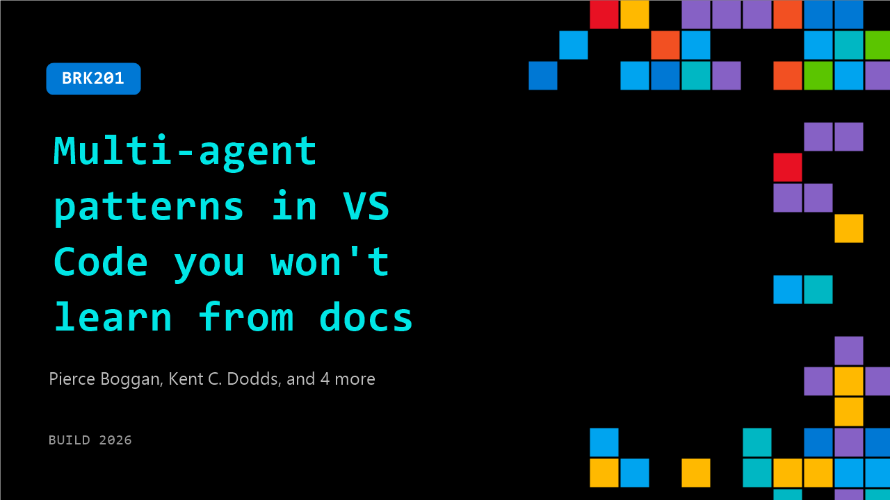

# BRK201: Multi-agent patterns in VS Code you won't learn from docs

**Session code:** BRK201  
**Date:** Wednesday, June 3, 2026 / 11:30 AM - 12:15 PM PDT (Duration 45 minutes)  
**Watch on-demand:** <https://build.microsoft.com/en-US/sessions/BRK201>

---

## Speakers

- **Pierce Boggan** - VS Code, Microsoft
- **Kent C. Dodds** - Software Engineer and Educator, EpicProduct.engineer
- **Burke Holland** - Distinguished Vibe Coder, GitHub
- **Julia Kasper** - Product Manager, Microsoft
- **Harald Kirschner** - Principal PM, Microsoft
- **Chris Reddington** - Sr Program Manager, DevRel, GitHub

## About the session

Building with one agent is familiar. Orchestrating a fleet of them in parallel across local, background, and cloud surfaces is where it gets real. You'll see the decisions that matter, how to decompose work across agents, when to fork vs. delegate, and how to verify quality when agents outnumber you. Leave with patterns for multi-agent workflows you can apply to your own codebase tomorrow.

Seating for this session is first-come, first-served. Add it to your schedule to plan your day and arrive early to secure a spot.

## AI summary

**Introduction and Setup:** The session opens with greetings and energy building activities as the hosts welcome the audience 00:00:00. The event is presented as a live coding competition focused on exploring multi-agent patterns within Visual Studio Code 00:00:04. Co-host Kent C. Dodds introduces himself as a JavaScript educator emphasizing product thinking and how AI has changed the development landscape compared to the previous year's competition, which featured simple projects like Frogger 00:02:05. The hosts underscore AI’s rapid evolution, setting the stage for this year’s real-world challenge — building a cloud-based collaborative markdown editor 00:03:46.

**Contestants and Tools Overview:** The competition’s participants are introduced along with the tools they will use 00:03:52. Julia from the VS Code team works with the local agent feature in VS Code 00:04:00, Chris from the UK codes via the Copilot CLI 00:04:08, Pierce employs the new GitHub Copilot app, and Harold tests the new agent app for multi-agent functions. The hosts clarify that each contestant’s environment represents a different facet of agent development. Meanwhile, Kent and the main host explain they will build a voting web app in parallel to allow the audience to vote live for winners 00:05:51.

**Building the Voting Application:** The hosts begin the technical demo by launching a GitHub Codespace environment to create their voting application safely 00:05:52. They discuss how agents operate effectively when given full permissions (“Yolo mode”) but must be sandboxed securely within cloud environments for safety 00:06:05. The duo brainstorm the product requirements — a one-page site where users can vote, see results update in real time, and display a winner 00:07:25. Kent guides the design toward simplicity with vanilla JavaScript, HTML, and CSS for speed. They experiment with adding QR code functionality for mobile participation and handle library-loading issues while refining the code to create a working QR access point for real-time voting 00:13:14.

**Competition Progress and Demonstrations:** The scene shifts back to the contestants as the hosts check on each person’s progress. Julia implements GPT 5.5 in VS Code to scaffold her markdown application, emphasizing high reasoning and front-end improvements 00:16:05. Chris uses an orchestrated multi-agent approach with GPT and Codecs to divide planning and implementation tasks for real-time collaboration 00:17:19. Pierce performs experimentation inside the Copilot app with markdown rendering, emojis, and AI-driven text generation 00:31:40. Harold showcases a multi-agent approach involving research agents and design exploration, producing prototypes that simulate collaborative editing with commenting and version control features 00:20:39.

**Voting Integration and Advancing Features:** Kent and the host successfully debug and deploy the voting app for public access via QR code 00:21:19. They discuss persistence mechanisms using JSON files, event-driven updates, and the eventual integration of WebSockets to synchronize votes across users 00:25:23. Additional design iterations are executed rapidly using multiple agents to generate UI mock-ups, informed by the host’s custom “poster board aesthetic” design system 00:35:20. They compare approaches to parallelizing design generation and show iterative styling output within their agent-driven workspace 00:36:13.

**Final Presentations and Conclusion:** As time winds down, each contestant presents their final work. Julia’s split-screen markdown editor features live collaboration, username customization, and emoji-based vibes 00:41:47. Chris’s version introduces a sidebar, multi-file management, and GitHub-themed styling through Primer library components 00:42:22. Pierce adds playful user interaction via emoji reactions and comments 00:43:29, while Harold integrates advanced agent-based prototypes combining design, architecture analysis, and planning histories into a sophisticated collaborative environment 00:44:21. When voting concludes via the live app, Harold emerges as the winner 00:45:59. The closing remarks emphasize the difficulty of live coding, appreciation for the participants, and encourage attendees to join upcoming Copilot and multi-agent sessions, thanking everyone for attending 00:46:13.

## Session tags

- **Session type:** Breakout
- **Level:** (300) Advanced
- **Topic:** Developer tools & frameworks
- **Tags:** Developer, GitHub Copilot, GitHub, Visual Studio Code, VS Code, GitHub Copilot CLI, DevTools
- **Location:** Festival Pavilion, Breakout 1
