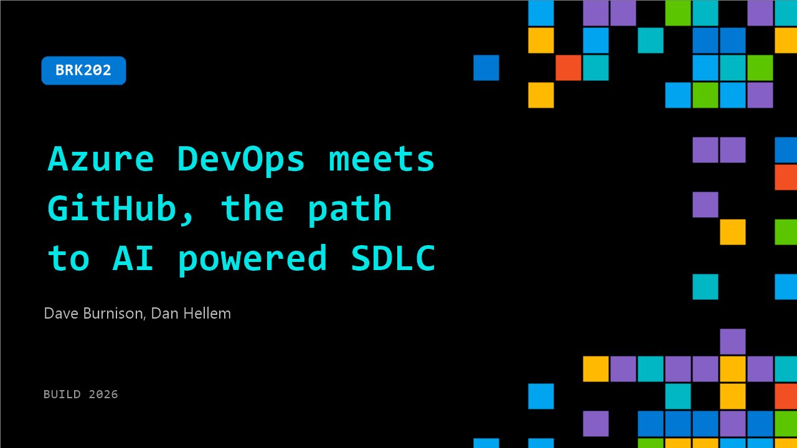

# BRK202: Azure DevOps meets GitHub, the path to AI powered SDLC

**Session code:** BRK202  
**Date:** Wednesday, June 3, 2026 / 1:30 PM - 2:15 PM PDT (Duration 45 minutes)  
**Watch on-demand:** <https://build.microsoft.com/en-US/sessions/BRK202>

---

## Speakers

- **Dave Burnison** - Sr. DevOps Advocate, GitHub
- **Dan Hellem** - Azure DevOps Product Manager, Microsoft

## About the session

Azure DevOps and GitHub are better together—and the integration keeps getting smarter. In this demo-heavy session, you’ll see how hybrid patterns that connect GitHub with Azure Boards and Azure Pipelines enable Agentic DevOps. See the all of the newest AI-powered capabilities in Azure DevOps. Plus, hear how Microsoft's engineering teams adopted this approach and what they gained.

Seating for this session is first-come, first-served. Add it to your schedule to plan your day and arrive early to secure a spot.

## AI summary

**Introductions and Session Overview:** The presentation opens with greetings and light humor to re-engage the audience after lunch 00:00:02–00:00:11. Dave Burnison introduces himself as a Senior DevOps Advocate at GitHub, formerly part of the Microsoft Azure DevOps team, followed by co-presenter Dan Hellem, a project manager for Azure DevOps tools such as Repos, Boards, Wiki, and AI features 00:00:14–00:00:38. They explain the session focus: bridging Azure DevOps and GitHub toward “agentic AI,” highlighting integrations that allow teams—from startups to enterprises—to choose workflows suited to their needs 00:00:45–00:02:21. The setup positions GitHub for new projects and Azure DevOps for complex, customized systems, with AI enhancements linking both platforms.

**Copilot Integration and Demonstrations:** Dave transitions into live demos showing how GitHub Copilot integrates with Azure DevOps through the MCP (multi-control plane) server configuration 00:03:09–00:05:07. He demonstrates connecting GitHub and Azure boards to the Copilot app to retrieve project items, automate queries, and directly interact with DevOps data—such as user stories and pipeline statuses. This enables even non-developer project managers to take advantage of AI assistance 00:05:13–00:08:09. He then shows how Wiki content defining standards for work items can be used to train Copilot agents, creating reusable templates for refining user stories, automatically assigning and generating pull requests 00:08:12–00:09:04. This demonstration illustrates the first steps toward autonomous code and task refinement within Azure and GitHub ecosystems.

**AI-Powered Workflows and Security Integrations:** Building on the agent setup, the demo transitions to showing how refined backlog work items and AI agents interact to generate and review code 00:10:00–00:12:15. Copilot automates improvements and security validations using GitHub Advanced Security tools like CodeQL, maintaining secure coding practices while agents complete coding tasks automatically. The presenters demonstrate GitHub security campaigns, where alerts and vulnerabilities are pulled into Azure Boards as tracked user stories linked directly to campaigns 00:12:22–00:15:21. This closing part of Dave’s demo emphasizes the unified monitoring and AI auto-fix capabilities that extend automation from development to security compliance tracking.

**Azure DevOps Enhancements and Migration Tools:** Dan takes over at 00:17:29 to discuss new updates in Azure DevOps. He details improvements to the MCP servers—local and remote—explaining their compatibility and ongoing refinement for agent creation inside Copilot Studio 00:18:00–00:19:00. The session expands into migration strategies: Microsoft is launching “Enterprise Live Migrator,” a preview tool allowing seamless repo migration from Azure DevOps to GitHub with minimal downtime 00:22:18–00:27:23. Dan provides CLI and UX walkthroughs showing validation, synchronization, and cutover processes, emphasizing zero-data loss transitions and automated pipeline linkages. For users staying on Azure DevOps, Microsoft continues investments in AI integrations and introduces GitHub Copilot code reviews for Azure Repos billed via Azure subscriptions 00:28:07–00:33:27.

**Billing, Auto Fix, and Future AI Features:** The presentation dives deeper into billing insights for Copilot AI credit use under Azure subscriptions, showing cost management dashboards by resource and organization 00:34:35–00:35:19. Dan then unveils Copilot Auto Fix for GitHub Advanced Security 00:36:00–00:37:40, which allows dynamic background pipeline processing to automatically generate secure code updates and pull requests using CodeQL scans. He mentions growing support for broader alert types and integration with future security campaign auto-fix capabilities 00:37:41–00:39:00. Technical preview sign-ups for all new AI-driven tools and migrations are discussed, outlining gradual rollout plans for enterprises enrolling in these enhancements 00:38:01–00:39:35.

**Conclusion and Resource Highlights:** The final section highlights Microsoft’s internal adoption of GitHub integrations as part of its own modernization strategy 00:39:43–00:40:36. Dave and Dan wrap up by pointing to key resources such as documentation, demo repositories, and the comprehensive blog post summarizing newly released features, sign-up links, and preview programs 00:40:00–00:41:48. Dave briefly showcases an example where Copilot creates sprint schedules from prompts inside Azure Boards, demonstrating AI’s usefulness for automating project configurations 00:42:21–00:43:31. The session closes with gratitude to the audience and an invitation to continue discussions during the “Ship and Tell” pavilion gathering at 3:00 PM 00:44:06–00:44:20.

## Session tags

- **Session type:** Breakout
- **Level:** (300) Advanced
- **Topic:** Developer tools & frameworks
- **Tags:** Developer, GitHub Advanced Security, GitHub Copilot, GitHub, Azure DevOps, Deployment Pipelines, GitHub Actions, GitHub Enterprise, GitHub Copilot CLI, DevTools, Agentic SDLC
- **Location:** Gateway Pavilion, Level 1, Cowell Theater
