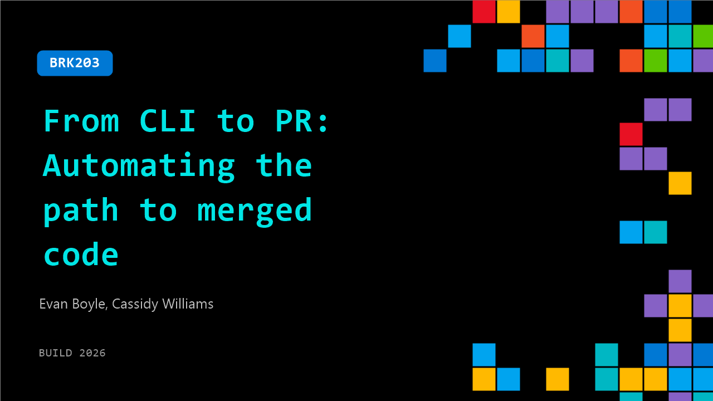

# BRK203: From CLI to PR: Automating the path to merged code

**Session code:** BRK203  
**Date:** Wednesday, June 3, 2026 / 9:00 AM - 9:45 AM PDT (Duration 45 minutes)  
**Watch on-demand:** <https://build.microsoft.com/en-US/sessions/BRK203>

---

## Speakers

- **Evan Boyle** - Principal Manager - Software Engineering, GitHub
- **Cassidy Williams** - Senior Director, Developer Advocacy, GitHub

## About the session

Everyone talks about agents, but the real challenge is applying them to daily sprints. Moving beyond chat, we'll show how GitHub Copilot functions as an agentic partner in your workflow by live-coding a full cycle—from planning in the terminal to delegating work to the cloud and automating PR reviews. No high-level abstractions here. Just technical mechanics: context management, advanced features with Copilot CLI, and the patterns that make agentic workflows actually stick.

Seating for this session is first-come, first-served. Add it to your schedule to plan your day and arrive early to secure a spot.

## AI summary

**Introduction and Overview:** The session opens with Cassidy Williams and Evan Boyle greeting the audience and setting the stage for a discussion about the GitHub Command Line Interface (CLI) 00:00:00–00:00:17. Cassidy, from GitHub’s Developer Advocacy team, and Evan, an engineering manager for the CLI team, explain that their talk will focus on modern code workflows, particularly how to use the CLI to migrate and merge code efficiently. They reference GitHub’s scale, noting the staggering statistic of hundreds of millions of commits occurring weekly 00:01:03. The hosts emphasize the challenge not only of writing and committing code but also of ensuring it lands effectively through merges, reviews, and automation. Setting this context prepares the audience for a deep dive into how the CLI integrates with GitHub Copilot and AI-driven developer tools.

**AI Tools and the Power of the CLI:** After introducing the broader landscape, Cassidy highlights the ascendancy of AI development tools, situating GitHub Copilot as central to this productivity transformation 00:02:01. The CLI is described as a “headless” powerhouse—a core engine that underlies the GitHub Copilot app, SDKs, and third-party integrations. Evan expands on its modern features, including code generation, automations, and slash commands that allow users to swap between AI models like Anthropic’s Claude, OpenAI’s GPT, and Google’s Gemini via simple terminal interactions 00:03:00. Skill integration within the CLI allows developers to add specialized capabilities, such as accessibility checks or automated visual difference screenshots in pull requests 00:03:25. This segment underscores how the CLI evolves alongside rapid AI model improvements and can be tailored to individual project needs. Built-in agents, from general-purpose ones to dedicated review agents, enhance code quality—Evan even mentions that GitHub’s Copilot review agent is currently the third-largest contributor to the company’s codebase 00:04:19.

**Modes and Features for Planning, Reviewing, and Testing:** The speakers then move into an in-depth explanation of key CLI modes—particularly “plan mode,” which allows developers to map out complex feature implementations collaboratively with AI assistance 00:04:42. Plan mode helps build a blueprint complete with tasks, questions, and validation steps. Evan explains that this preparatory stage often takes a significant portion of his workflow, enabling high-confidence one-shot implementations through specification-driven processes 00:05:28. Examples like “slash review,” “slash new,” and “slash PR” are highlighted—commands that spawn agents, create new sessions, and manage pull requests. The recently added “auto-fix” capability can resolve CI failures automatically 00:08:15. Cassidy demonstrates “slash fleet,” which runs multiple agents or models in parallel for testing or planning efficiency, and “slash research,” leveraging GitHub’s Blackbird engine to conduct code-aware searches across open source and private repos with citation support 00:09:50. The “experimental” mode is portrayed as a space for early adopters to test upcoming features such as voice mode, which enables spoken interaction directly in the terminal 00:10:50. Together, these innovations represent an AI-assisted coding ecosystem attuned to both research and real-time collaboration.

**New Interfaces, SDKs, and Integrations:** The presentation transitions to demonstrations of tangible user experiences, such as the new terminal user interface (TUI), which brings a visually organized, tabbed environment into the command line 00:13:43. Cassidy also announces the CLI’s integration with JetBrains IDEs, allowing developers to harness Copilot agents without leaving their editors 00:14:24. The GitHub Copilot SDK—built on top of the CLI—is introduced as a foundation for creating custom agent-driven applications across browsers, office software, or chat systems. The presenters share creative examples: a browser shopping bot capable of autonomous navigation and a PowerPoint generator that compiles meeting decks automatically from a user’s weekly CLI activities 00:15:47. These cases amplify GitHub’s vision of embedding agentic workflows wherever developers want them. Cassidy and Evan further highlight community creativity—from gamified interfaces to pixel art shells—all leveraging the same SDK layer in languages like Go, Node, Rust, and Python 00:17:39.

**Live Coding Demonstration with Audience Participation:** In a live build session, the duo invite attendees to contribute ideas through GitHub issues on a shared repository (evanboyle/build2026-cli-live) 00:18:01. They walk through the CLI’s TUI to select issues interactively, using voice mode to query the system. Demonstrations include enabling “YOLO mode,” which grants full execution permissions for autonomous operation 00:21:07, and switching between plan and implementation as they prototype a playful idea called “Always-on-top Octocat.” As audience questions surface, they elaborate on integrating workflow tools like SpecKit with plan mode and clarify that voice mode uses local models for privacy 00:25:13. They later use “rubber duck” features to cross-evaluate AI outputs between multiple model families for accuracy. The demo concludes with building and iterating through local agents using plan, fleet, and review, helping the audience envision how different features synchronize within one developer loop 00:35:47.

**Advanced Questions, Scaling, and Conclusion:** The final segment addresses technical audience questions on model management, token budgeting, and working with legacy or large-scale codebases 00:41:13. Evan explains that in massive projects such as Office or Windows (tens of millions of lines), GitHub is building local indexing and vector-search capabilities into the CLI for efficiency 00:42:39. He emphasizes testing-centric development, noting that nearly 70% of CLI and app code is composed of tests to ensure reliable AI-driven refactoring. Cassidy and Evan close by summarizing how GitHub Copilot’s CLI functions as a foundation for scalable, agent-based development—bridging planning, execution, and automation under one system. They invite viewers to explore further through GitHub’s free “Copilot CLI for Beginners” course and continue experimenting with new features 00:46:38. The session concludes with thanks and encouragement to adopt the CLI as part of developers’ everyday AI workflows 00:46:47.

## Session tags

- **Session type:** Breakout
- **Level:** (400) Expert
- **Topic:** Developer tools & frameworks
- **Tags:** Agents, Developer, GitHub Copilot, GitHub, GitHub Actions, GitHub Copilot CLI, DevTools, Agentic SDLC
- **Location:** Gateway Pavilion, Level 1, Cowell Theater
