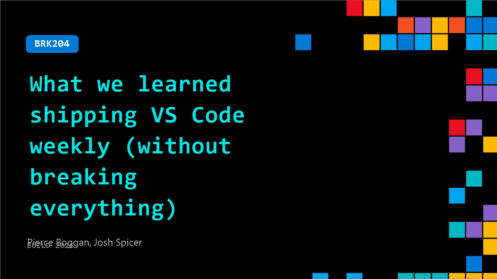

# BRK204: What we learned shipping VS Code weekly (without breaking everything)

**Session code:** BRK204  
**Date:** Wednesday, June 3, 2026 / 10:15 AM - 11:00 AM PDT (Duration 45 minutes)  
**Watch on-demand:** <https://build.microsoft.com/en-US/sessions/BRK204>

---

## Speakers

- **Pierce Boggan** - VS Code, Microsoft
- **Josh Spicer** - SENIOR SOFTWARE ENGINEER, VS Code

## About the session

Shipping faster sounds great until test gaps, review bottlenecks, and triage backlog scale with it. The VS Code team hit all of that going from monthly to weekly releases, and agents made it work. This session breaks down the real patterns: agent sessions before meetings, conversations that become PRs instead of specs, automated triage across one of GitHub's largest repos, and harnesses that keep quality high when 100+ commits land daily. Concrete workflows you can take back to your team.

Seating for this session is first-come, first-served. Add it to your schedule to plan your day and arrive early to secure a spot.

## AI summary

**Introduction and Context:** The session opens with Pierce from the Visual Studio Code team welcoming the audience and explaining that the talk focuses on lessons learned while moving VS Code from monthly to weekly releases (00:00:00–00:00:10). Rather than announcing a new product, the goal is to share how the team’s engineering systems and processes evolved to handle AI-driven development. Pierce and Josh introduce themselves and describe how incorporating AI into VS Code required fundamental changes not only in the product but also in planning, release cadence, and internal tooling. They emphasize that shifting release patterns and workflows was necessary to keep up with the accelerating innovation in AI (00:00:43–00:01:00).

**AI Adoption and Product Evolution:** Pierce explains how the team progressed from integrating AI for individual code completions to developing full AI "agents" within VS Code (00:01:11–00:02:00). He shows data showing how the “code survival metric”—the percentage of AI-generated code actually accepted into commits—grew from 55% to over 85% within a year (00:02:18–00:03:02). These metrics underline both the improved quality of AI outputs and the compounding pace of development. Yet, the increased activity also led to about three times more logged issues and open pull requests. As a result, the engineering processes needed to balance faster iteration with product stability. To keep up with rapid AI model iterations and competitive release pressure, the team shifted from monthly to weekly releases starting in February (00:04:37–00:06:10), allowing for smaller, safer updates and faster user feedback.

**Developer Inner Loop and Tooling Demos:** Josh demonstrates how internal development workflows have transformed with AI assistance (00:06:35–00:07:00). He introduces tools that automate component testing, visual regressions, and validation directly in pull requests. For instance, the “component browser” allows engineers and agents to inspect isolated UI components, detect design issues, and validate changes through screenshots—reducing local build overhead and accelerating development (00:08:00–00:10:10). These workflows integrate seamlessly with GitHub, enabling contributors to submit and verify changes even without full local setups. The team also uses AI tools to support prototyping features quickly, replacing lengthy written specs with interactive, live-coded prototypes inside VS Code (00:13:00–00:14:10). This enables tighter PM-engineer collaboration and keeps pace with weekly releases. Josh also details performance-checking “skills,” like chat performance benchmarking, ensuring that AI-driven improvements do not compromise speed or reliability (00:15:10–00:17:40).

**Model Integration, Evaluation, and Experimentation:** Pierce discusses the complexity behind deploying new AI models through the Copilot API and how prompt design is meticulously refined via evaluation pipelines (00:20:00–00:22:00). Each model launch involves multi-disciplinary collaboration and iterative prompt testing using both offline benchmarks and live A/B experiments. The internal system, “VSC Bench,” continuously evaluates models on criteria like resolution rate and token efficiency, balancing quality and cost (00:23:23–00:24:30). These evaluations allow them to tune reasoning effort and responsiveness, ensuring users experience stable and optimized AI behavior. This continuous experimentation loop—offline, online, and post-launch—drives meaningful improvements in the product more rapidly than traditional release testing cycles ever could.

**AI-enabled Engineering System and Self-Healing Pipelines:** Josh then showcases the team’s AI-powered engineering infrastructure, designed to handle the high volume of community issues and commits in an open-source environment (00:25:50–00:27:00). The system uses agents to auto-triage GitHub issues, predict ownership assignments, detect duplicates, and even generate potential fixes based on telemetry and error logs. An “errors agent” scans for regressions and proposes patches autonomously (00:34:52–00:36:40). By embedding intelligence into build monitoring and incremental rollout tools, VS Code can now deploy updates safely to millions of users while quickly freezing or reverting faulty releases (00:38:07–00:39:10). This self-healing CI/CD system allows a small 40-person team to maintain product stability across global user bases without scaling headcount.

**Team Collaboration and Adaptive Planning:** Concluding the talk, Pierce shares how team collaboration evolved alongside engineering systems (00:40:33–00:44:00). Long-term roadmaps have given way to dynamic “work streams”—temporary, goal-focused groups formed to tackle specific initiatives like new AI model integrations or documentation updates. Each stream has an accountable lead, enabling fast, decentralized decision-making. By meeting daily or asynchronously, the team maintains alignment across multiple efforts despite compressed weekly production cycles. Pierce closes by encouraging other teams adopting AI to not only focus on integration but also to reimagine how their processes and culture function when success with AI demands far greater operational agility (00:44:33–00:45:00).

## Session tags

- **Session type:** Breakout
- **Level:** (400) Expert
- **Topic:** Developer tools & frameworks
- **Tags:** Developer, GitHub Copilot, GitHub, Visual Studio Code, GitHub Actions, VS Code, GitHub Copilot CLI, DevTools
- **Location:** Festival Pavilion, Breakout 1
