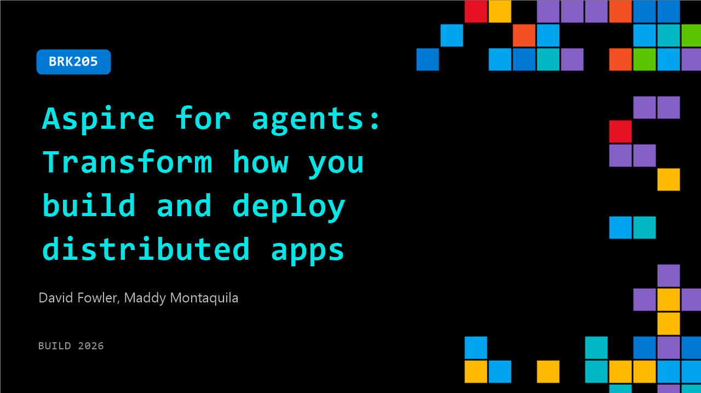

# BRK205: Aspire for agents: Transform how you build and deploy distributed apps

**Session code:** BRK205  
**Date:** Wednesday, June 3, 2026 / 2:45 PM - 3:30 PM PDT (Duration 45 minutes)  
**Watch on-demand:** <https://build.microsoft.com/en-US/sessions/BRK205>

---

## Speakers

- **David Fowler** - Distinguished Engineer, Microsoft
- **Maddy Montaquila** - Principal PM, Aspire, Microsoft

## About the session

Aspire is an open-source cloud and agent-ready developer toolchain transforming how you build, run, and deploy observable, production-ready distributed apps. Its code centric approach streamlines orchestration of your apps and agents, provides observability for systems in any programming language, and supports deployment locally or to your cloud of choice. Come meet the new Aspire.

Seating for this session is first-come, first-served. Add it to your schedule to plan your day and arrive early to secure a spot.

## AI summary

**Introduction and Purpose of the Session:** The session opens with a lively introduction (00:00:02–00:00:18), where the presenters welcome attendees to the “Aspire for Agents” demo focused on transforming how distributed apps are built and deployed. After ensuring everyone can hear and has access to headsets, they clarify what constitutes a distributed application—emphasizing that even a simple website with a database qualifies. The presenters introduce themselves and outline the session’s structure: a fast-paced 45-minute demonstration primarily focused on live code, supported by easily shareable slides for reference. They encourage audience participation both during and after the session at their booth for further discussion.

**What Aspire Is and Why It Matters:** Beginning at 00:01:11, the speakers define Aspire as a tool designed to simplify the process of composing, debugging, and deploying distributed systems. They highlight the common pain point of moving from “it works on my machine” to containerized, cloud, or Kubernetes environments where behavior shifts dramatically. Aspire’s one-line summary, introduced at 00:03:04, describes it as an “agent-ready, code-first tool to compose, debug, and deploy any distributed app.” They explain Aspire’s modular nature—comprising a CLI, an app host for defining orchestration logic, preconfigured integrations for common technologies, and a dashboard for visibility. By focusing on the local developer experience and seamlessly extending to deployment, Aspire aims to eliminate configuration drift between development and production environments.

**The Aspire Dashboard and Integration with Agents:** From 00:06:40 onward, the presentation explores the Aspire dashboard and how it streamlines development workflows. Using open telemetry (“otel”) support, Aspire enables real-time insights into logs, traces, and performance metrics across complex systems. The presenters demonstrate how the dashboard can serve as a stand-alone telemetry viewer or as an onboarding tool for new developers, acting as a “Trojan horse” for broader Aspire adoption. They emphasize the product’s evolution to optimize both human and AI coding agent workflows, illustrating how agents can query logs or performance data directly through Aspire’s CLI commands. The design ensures parity between what human developers and coding agents can access, making debugging and collaboration easier in modern multi-agent coding environments.

**Live Demo: Building and Managing a Distributed App:** At 00:10:18, the speakers begin a live demonstration of Aspire’s CLI capabilities. They show installation via Winget or Homebrew and proceed to use `Aspire start` to launch their demo application. This “calendar booking” app includes a web front end, an API layer, and an autonomous background agent. As they run Aspire, it automatically detects dependencies, sets environment variables, allocates ports to avoid conflicts, and starts related processes such as Postgres containers. Through the dashboard, they execute administrative commands like clearing or generating calendars directly within the interface. These dynamic commands highlight how Aspire’s app host configuration can define both runtime resources and administrative controls without manual shell commands or external scripts. The presenters then show how all these components—API, database, and agent—communicate securely while maintaining developer visibility through telemetry and logs.

**Advanced Configuration, Deployment, and Cloud Integration:** The latter part of the demo (00:28:00–00:44:00) dives deeper into customization, environment variables, and deployment automation. Using “app host” definitions in C# or TypeScript, Aspire enables developers to define relationships among services—like web apps referencing API endpoints—without hardcoding ports or URLs. The presenters demonstrate adding support for Microsoft Foundry (a hosted agent platform) and illustrate automatic Azure integration, where Aspire provisions cloud resources, sets permissions, and injects secure configuration values. Aspire’s model ensures sensitive credentials are stored safely in user profiles rather than `.env` files to prevent leaks. They also showcase deployment using `Aspire deploy`, which translates the defined model into container app environments and compatible infrastructure-as-code templates like Bicep or YAML. This workflow allows developers to seamlessly move from local development to production-grade cloud orchestration in a consistent, repeatable way.

**Conclusion, Resources, and Community:** As the session concludes at 00:45:00, the presenters direct attendees to the latest updates at Aspire.dev and invite them to join the community Discord and weekly livestreams. They reaffirm Aspire’s value as a tool that simplifies distributed development, empowers AI agents, and standardizes the path from prototype to deployed system. The talk ends on a personal note, with mentions of real engineers becoming so accustomed to Aspire that they refuse to work without it. The team encourages everyone to experiment with the provided sample code, share feedback, and explore how Aspire can enhance productivity in both human- and agent-driven development environments.

## Session tags

- **Session type:** Breakout
- **Level:** (200) Intermediate
- **Topic:** Developer tools & frameworks
- **Tags:** Azure, Agents, Developer, OSS, DevTools, Agentic SDLC, Aspire
- **Location:** Festival Pavilion, Breakout 3
