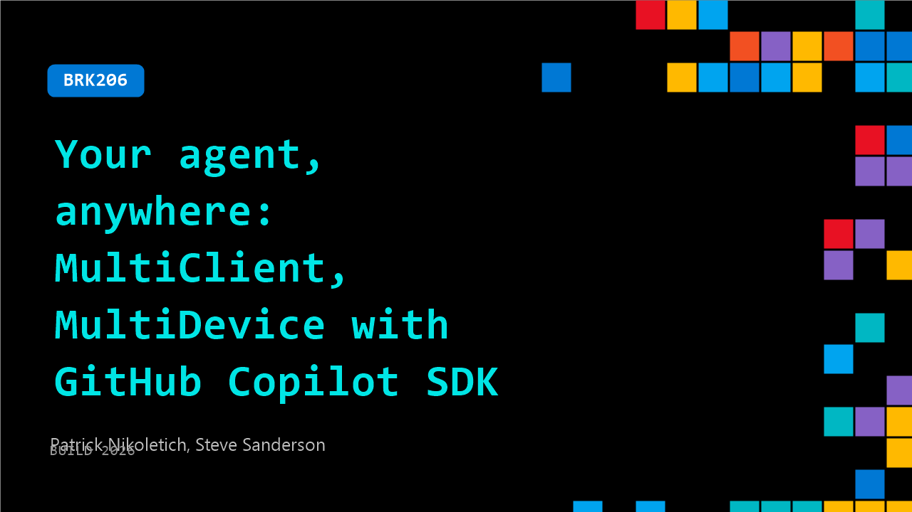

# BRK206: Your agent, anywhere: MultiClient, MultiDevice with GitHub Copilot SDK

**Session code:** BRK206  
**Date:** Tuesday, June 2, 2026 / 2:30 PM - 3:15 PM PDT (Duration 45 minutes)  
**Watch on-demand:** <https://build.microsoft.com/en-US/sessions/BRK206>

---

## Speakers

- **Patrick Nikoletich** - Distinguished Product Manager, Microsoft
- **Steve Sanderson** - Principal Developer, Microsoft

## About the session

Agents are powerful on your machine, but what happens when you need them everywhere else? In this session, we'll show how GitHub Copilot SDK lets you build an agent, embed it in an app, and take it with you across devices and into the cloud. You'll see how to go from a local agent to one you can access on your phone, move between machines, and run across multiple clients. If you've been working with agents locally and wondering what the next step looks like, this is it.

Seating for this session is first-come, first-served. Add it to your schedule to plan your day and arrive early to secure a spot.

## AI summary

_No AI summary available._

## Session tags

- **Session type:** Breakout
- **Level:** (300) Advanced
- **Topic:** Developer tools & frameworks
- **Tags:** API, Agents, Developer, GitHub Copilot, GitHub, GitHub Copilot CLI, DevTools, Agentic SDLC
- **Location:** Festival Pavilion, Breakout 1
