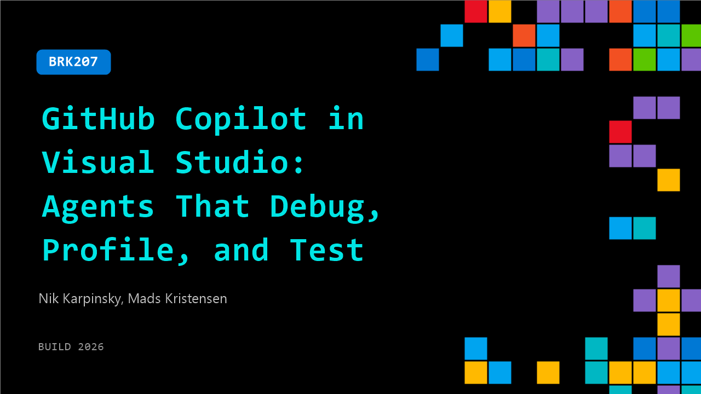

# BRK207: GitHub Copilot in Visual Studio: Agents That Debug, Profile, and Test

**Session code:** BRK207  
**Date:** Wednesday, June 3, 2026 / 4:00 PM - 4:45 PM PDT (Duration 45 minutes)  
**Watch on-demand:** <https://build.microsoft.com/en-US/sessions/BRK207>

---

## Speakers

- **Nik Karpinsky** - Principal Software Engineer, Microsoft
- **Mads Kristensen** - Principal Product Manager, Microsoft

## About the session

Every IDE has agentic code generation now, but Visual Studio goes further with built-in agents that tackle what code generation can't. In this demo-heavy session, you'll see agents root-cause bugs using live runtime behavior, pinpoint performance bottlenecks and recommend targeted fixes, and build test coverage to catch regressions before they ship. These aren't just code-writing agents. They help enterprise C#, .NET, and C++ developers improve code quality with expert-level diagnostics.

Seating for this session is first-come, first-served. Add it to your schedule to plan your day and arrive early to secure a spot.

## AI summary

**Introduction and Context:** The session (00:00:00–00:00:40) opens with an introduction by Matt and Nick from the Visual Studio team, welcoming attendees to one of the final episodes of their series and focusing specifically on Copilot integration in Visual Studio. They explain that Visual Studio remains the primary IDE for professional C# and C++ developers on Windows, emphasizing its continued importance in an age of AI-assisted or "agentic" development. The speakers contextualize Visual Studio as an environment tailored for maintaining code quality, governance, accessibility, and compliance, crucial for business-grade software where code is an asset to be maintained long-term rather than a disposable artifact (00:01:50–00:03:30). They clarify that while tools like VS Code serve developers in other languages, Visual Studio focuses deeply on the professional workflows unique to enterprise teams.

**First Demo: Debugging with Copilot:** In the first demonstration (00:03:55–00:16:00), Nick presents how Copilot assists with real-world debugging inside the Diagnostics Hub, which powers Visual Studio’s built-in profiler. Working within a complex, multi-language codebase, he recreates and investigates an internal telemetry bug — an "index out of range" error in the hybrid dictionary component. Through Copilot’s integration with MCP services and Azure DevOps, he can directly fetch bug data, generate targeted unit tests, and iteratively refine them within the IDE while maintaining manual oversight. This approach demonstrates both AI efficiency and developer control, allowing the agent to propose changes, test for failure conditions, and then generate fixes while the human guides decision points. Their exchange highlights test-driven development made practical by Copilot, illustrating how traditional debugging and AI collaboration can coexist in large-scale software environments.

**Second Demo: Profiling and Performance Optimization:** The next major segment (00:16:30–00:31:00) showcases Visual Studio’s new profiler agent experience. Nick introduces the VS Test Performance Collector package, which automatically collects profiling traces during unit tests and identifies performance bottlenecks. Demonstrating on the Visual Studio profiler’s own codebase, he runs a test on the “decode large file” function, where Copilot analyzes collected trace data to recommend concrete optimizations, such as buffering reads to reduce binary reader overhead. After implementing and rerunning the test with profiling, performance improves from roughly 3.8 seconds to 2 seconds — nearly doubling speed. The presenters emphasize that this workflow integrates performance analysis directly into a developer’s test loop, eliminating the need for manual post-hoc profiling and making optimization a routine part of development. The segment closes with examples of how these tools have benefited not only Visual Studio but also other Microsoft products, such as Azure App Service and the Roslyn compiler (00:31:00–00:32:50).

**Upcoming Features and Roadmap:** In the later part of the talk (00:33:00–00:41:00), Matt outlines several upcoming Visual Studio and Copilot capabilities. These include automatic app modernization tools that can convert legacy .NET web forms into modern Blazor applications, enhanced agent skill discovery that tailors AI context to specific project types (such as WinForms or Azure), and optimizations for build speeds by detecting errors before recompilation. Another forthcoming innovation is AI-driven merge conflict resolution, easing one of the most stressful developer experiences. They also disclose that Visual Studio’s core Copilot integration will migrate to the shared GitHub Copilot CLI SDK, synchronizing feature sets and release timing with VS Code and other tools. This architectural upgrade ensures that all products draw from the same foundation while maintaining Visual Studio–specific optimizations in debugging, benchmarking, and build integration.

**Advanced Integration and Open Model Support:** The session wraps by revealing that Visual Studio will soon support any AI model regardless of location — whether cloud-hosted, on-premises, or run locally (00:41:00–00:42:40). This capability is particularly impactful for enterprises with strict security and privacy requirements, as it allows them to restrict developers to approved local or vendor-specific models while still leveraging Visual Studio’s agentic workflow. The presenters reiterate Visual Studio’s mission as a “pro developer” environment designed for enterprise scalability and governance. They close with encouragement to try the upcoming Insider builds of Visual Studio 2026, highlighting the broad innovation pipeline extending through the summer and inviting developers to test new features first-hand.

## Session tags

- **Session type:** Breakout
- **Level:** (300) Advanced
- **Topic:** Developer tools & frameworks
- **Tags:** Developer, GitHub Copilot, GitHub, GitHub Copilot CLI, Visual Studio, DevTools
- **Location:** Festival Pavilion, Breakout 1
