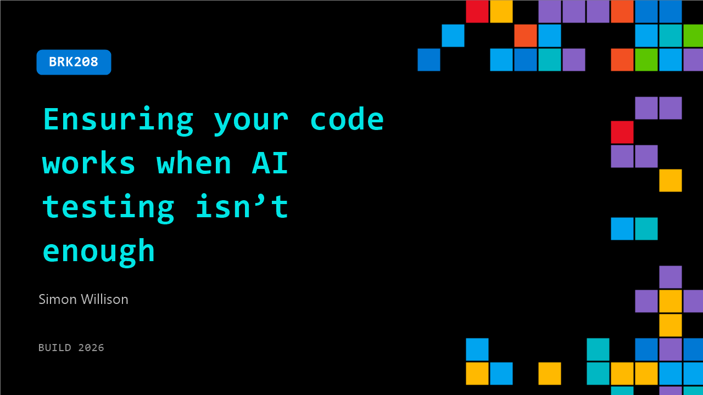

# BRK208: Ensuring your code works when AI testing isn’t enough

**Session code:** BRK208  
**Date:** Wednesday, June 3, 2026 / 11:30 AM - 12:15 PM PDT (Duration 45 minutes)  
**Watch on-demand:** <https://build.microsoft.com/en-US/sessions/BRK208>

---

## Speakers

- **Simon Willison** - AI researcher & Creator, Datasette

## About the session

Technical talk about building AI systems that scale for humans and machines, ensuring reliable code, and scalable systems.

Seating for this session is first-come, first-served. Add it to your schedule to plan your day and arrive early to secure a spot.

## AI summary

**Introduction and Evolution of Agentic Engineering:** The talk opens with Simon Willison introducing himself and outlining the theme of “verification patterns for agentic engineering” 00:00:08. He recounts his early experiences using LLMs like GPT‑3 for coding tasks as far back as 2022, describing how what began as “vibe coding” has transitioned into a structured discipline 00:00:40. Simon reflects on the emergence of “agentic engineering” — a professionalized form of software creation with autonomous code‑writing and testing agents — marking a shift that reached maturity after the “November inflection point” of 2025, when new coding‑focused LLMs made agent collaboration practical 00:03:00.

**The Rise of Verification and the Software Factory Concept:** As the field matured, Simon stresses the importance of balancing speed and quality. He compares modern code productivity to traditional output levels, noting that while developers can now generate hundreds of lines of tested code per day, ensuring reliability remains the challenge 00:04:11. To illustrate the risks and innovations, he discusses examples like StrongDM’s “dark factory” — a system where software is produced, tested, and validated entirely by autonomous agents, following rules such as “code must not be written or reviewed by humans” 00:08:04. He highlights their use of scenario testing and “digital twin” environments that replicate APIs like Slack and Okta, allowing massive automated verification without rate limits 00:09:19.

**Practical Verification Patterns and Code Review Methods:** Moving into replicable strategies, Simon presents pragmatic techniques to bring verification discipline to smaller projects. He introduces “active refactoring,” a pattern where the developer aggressively edits and clarifies AI‑generated code instead of performing passive reviews 00:11:48. This approach, impossible in human collaboration, works well with agents since “you can’t be rude to an agent.” He also explores fast validation loops through continuous integration, test automation, and agentic test generation. By prioritizing high‑stakes code (for example, authentication flows) for manual inspection while automating low‑risk sections, developers can maintain speed without losing conceptual integrity 00:13:14.

**Prototyping, Documentation, and Continuous Deployment:** Simon explains that prototyping — once time‑consuming — is now near‑free thanks to agents that can instantly generate functional proofs of concept 00:15:14. He describes building his own agent prototypes and using them later as verified components for production systems. The newly emergent practice of “agentic documentation,” where LLMs generate concise and accurate code documentation, helps ensure long‑term trustworthiness by continuously checking diffs to keep docs up to date 00:17:00. He also emphasizes continuous deployment and preview environments as vital verification tools that allow engineers to explore live changes safely and improve collaboration 00:20:10.

**Verification Resilience, Sandboxing, and Error Elimination:** Later sections delve into isolation strategies to reduce the “blast radius” of software errors. Simon discusses practical sandboxing tools — such as CSP headers, isolated iframes, and WebAssembly (WASI) runtimes — that can safely execute untrusted code 00:22:20. He recounts experiments where agents stress‑tested these sandboxes to validate their security boundaries 00:23:43. He also champions a zero‑tolerance stance toward flaky tests, demonstrating how agents can now replicate complex CI environments and debug instability faster than humans 00:25:25. Through these methods, automated systems gain reliability comparable to large, multi‑layered industry QA pipelines, but scaled down for personal and small‑team workflows.

**Concluding Reflections and Audience Discussion:** In the closing discussion, Simon situates agentic engineering as both a technological and cultural evolution in software practice. He asserts that the same methods once viewed as enterprise luxuries — automated testing, continuous deployment, structured documentation — now serve as daily tools for individual developers because of agent acceleration 00:27:21. Drawing on historical texts like “The Mythical Man‑Month,” he notes that the principles of conceptual integrity and disciplined design apply more than ever. During Q&A 00:29:24–00:44:50, he discusses language choice, regulatory concerns, code readability, and the importance of preserving agent transcripts for transparency. He concludes by urging developers to treat agentic systems as “verification machines” — tools to build better software faster, with higher quality and maintainability than before, ensuring that automation enhances, rather than replaces, engineering craftsmanship.

## Session tags

- **Session type:** Breakout
- **Level:** (300) Advanced
- **Topic:** Developer tools & frameworks
- **Tags:** Agents, Developer, GitHub Copilot, GitHub, App Mod, OSS, GitHub Copilot CLI, DevTools
- **Location:** Building B, Level 3, BATS Improv
