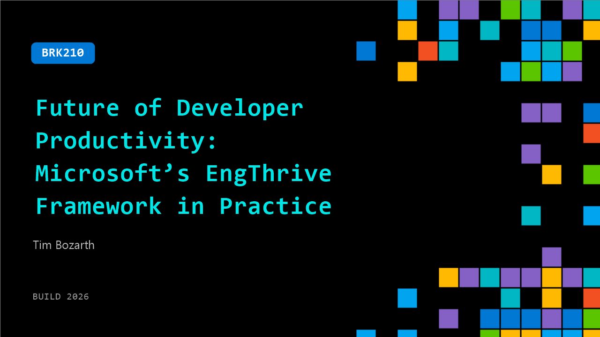

# BRK210: Future of Developer Productivity: Microsoft’s EngThrive Framework in Practice

**Session code:** BRK210  
**Date:** Wednesday, June 3, 2026 / 4:00 PM - 4:45 PM PDT (Duration 45 minutes)  
**Watch on-demand:** <https://build.microsoft.com/en-US/sessions/BRK210>

---

## Speakers

- **Tim Bozarth** - CVP CoreAI, Microsoft

## About the session

AI is transforming how we write code, but the teams shipping fastest go beyond tools—they systematically remove bottlenecks in the development process. This session gives you a practical framework to measure and improve developer productivity in the AI era, based on Microsoft’s EngThrive model of Speed, Ease, and Quality. See how to apply each dimension through case studies, including a team that reduced developer toil by 25%. You’ll leave with clear metrics to track, dashboards to build, and actions that work for teams of any size.

## AI summary

**Introduction and Focus:** The talk begins with the speaker welcoming the audience and setting the stage for a discussion on productivity, specifically engineering productivity, in the age of AI (00:00:02–00:00:41). The focus is on how AI can transform the way people work rather than just the products they build. The speaker emphasizes that while AI has two major value propositions—enhancing products and improving human processes—this session concentrates on the latter. They explain the structure of the session, noting that it will include contextual trends in the changing nature of work and a deep dive into Microsoft’s methodology for optimizing productivity, ending with an open Q&A session.

**Modern Productivity and the Role of AI:** The speaker highlights that traditional metrics of software development, such as lines of code or number of pull requests, are obsolete and even harmful if used as measures of individual performance (00:03:15–00:05:00). At Microsoft, longitudinal studies divide developer time into innovation, operations, and organizational responsibilities, revealing that less than 15% of engineers’ work week is spent actively coding (00:04:14–00:05:22). As AI reshapes these distributions, the goal becomes “creating more value faster.” The development lifecycle’s shape is shifting; work previously concentrated on coding and system maintenance is now increasingly automated. Code is turning from an input to an output of AI systems, leading to an identity shift for engineers and new definitions of value creation (00:10:11–00:11:22).

**Microsoft’s Approach with EngeThrive:** The core framework discussed is Microsoft’s “EngeThrive,” which focuses on making it fast and easy to build great work (00:13:01–00:14:00). This philosophy breaks productivity into three measurable pillars: speed, ease, and quality. EngeThrive emphasizes measuring system-level productivity instead of individual output, assessing the responsiveness of environments and workflows rather than personal metrics. The speaker distinguishes between activity metrics—such as token usage or PR counts—and outcome metrics that describe real organizational value. Key outcome metrics include time from idea to customer delivery, the innovation time ratio, and measures of quality like defect escape and resilience (00:19:29–00:20:59). Consistency across company-wide metrics is highlighted as essential to meaningful improvement programs.

**Program Implementation and Continuous Improvement:** To operationalize EngeThrive, Microsoft built a leadership model emphasizing accountability, consistent measurement, and continuous improvement rather than static benchmarking (00:21:43–00:23:21). The framework promotes the identification and removal of bottlenecks in the software development lifecycle while empowering small teams to make measurable changes. Examples include using standard telemetry tools like Viva Insights to measure focus time and adopting dashboards and business rhythms to make metrics actionable. The speaker stresses that the real goal is iterative advancement, ensuring that teams develop a durable culture of improvement supported by data-informed decision-making rather than reactive reactions to arbitrary performance targets (00:23:46–00:25:01).

**Case Studies: Focus Time and Onboarding Speed:** Two case studies demonstrate the framework in action. The first involved improving “focus time”—the uninterrupted blocks available for developers to enter a state of flow. By analyzing Viva Insights data and deploying better meeting discipline and calendar management, Microsoft increased average focus time by 2.1 hours per week per engineer, correlating with a 13% rise in PR velocity and recovery of 55,000 hours of engineering time within eight weeks (00:25:27–00:28:32). The second case study tackled onboarding efficiency, measured by “time to first pull request.” Through an AI onboarding assistant called First Mate, enhanced documentation, and short video exercises, new developers reduced their onboarding duration to under a week (00:32:33–00:35:06). This improvement translated empirically into faster progression to full productivity and better long-term retention—a testament to the power of outcome-driven measurement.

**Conclusion and Q&A Insights:** During the Q&A session (00:37:08–00:47:34), audience questions focused on measuring focus time, dealing with interruptions like meetings and messages, and convincing executives to adopt similar models. The speaker clarified that not all communications disrupt focus, and that revamping meeting culture—with clear agendas and permissions to decline—is key to preserving flow. They added that optimal focus sessions last around 120 minutes and reiterated that activity metrics lose their meaning once incentivized, whereas outcome-based metrics remain durable indicators of progress. The talk closes with a motivating reminder: even small, focused teams can drive organizational transformation by targeting systemic improvements, and AI now provides the means to accelerate meaningful change in engineering productivity.

## Session tags

- **Session type:** Breakout
- **Level:** (200) Intermediate
- **Topic:** Developer tools & frameworks
- **Tags:** Developer, GitHub, DevTools
- **Location:** Gateway Pavilion, Level 1, Cowell Theater
