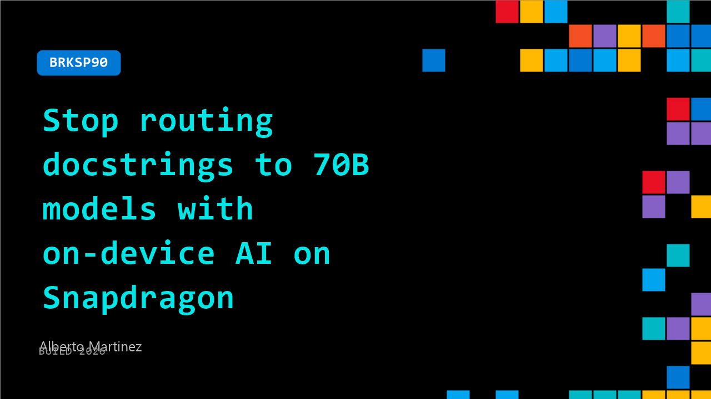

# BRKSP90: Stop routing docstrings to 70B models with on-device AI on Snapdragon

**Session code:** BRKSP90  
**Date:** Wednesday, June 3, 2026 / 1:30 PM - 2:15 PM PDT (Duration 45 minutes)  
**Watch on-demand:** <https://build.microsoft.com/en-US/sessions/BRKSP90>

---

## Speakers

- **Alberto Martinez** - VP Software Strategy, Compute, Qualcomm

## About the session

Your AI coding assistant calls a 70B+ cloud model just to add a docstring. Snapdragon X2 Elite’s 80 TOPS NPU changes that. In this session, build a three-tier inference routing architecture—on‑device (≤13B), on‑prem (14B–34B), and cloud (70B+)—cutting cloud tokens by 67%, latency by 70%, and keeping most code local. Includes routing logic, quantization trade‑offs, and a deployable classifier.

Seating for this session is first-come, first-served. Add it to your schedule to plan your day and arrive early to secure a spot.

## AI summary

**Opening and Introduction:** The speaker, Alberto Martinez, begins the session with a light-hearted acknowledgment of the post-lunch lull among the audience (00:00:01–00:00:18). Introducing himself as the head of software strategy for Qualcomm’s compute business, he explains that his talk will be somewhat improvised, fitting for the creative “improv” venue (00:00:23). He emphasizes one of his core beliefs—predicting the future requires creating it—and frames the session as an exploration of the “mystery” behind agentic AI, orchestration, and token usage in large language models (00:01:25–00:02:05).

**AI Usage and Token Economics:** Martinez transitions into the growing reliance on AI, asking participants to raise their hands if they use AI models for several hours daily (00:02:16). He humorously describes how both professionals and everyday users—like his own wife—are beginning to “run out of tokens,” underscoring how token consumption has become an everyday constraint (00:03:04). With increased agentic activity, token demand will multiply by 10 to 100 times according to Qualcomm’s leadership at Computex (00:04:25). Martinez stresses that token economy is not just a backend cost problem—it affects consumers, power usage, latency, and sustainability (00:05:00).

**Problem Framing and Technical Context:** He provocatively advises developers to “stop routing docstrings to seven-billion parameter models,” suggesting that routine code descriptions don’t require giant systems (00:05:10). Martinez calls this wasteful both economically and energetically. He introduces an internal research analysis showing the math behind token expenditure and suggests a distributed three-tier model for improving efficiency—running some AI tasks locally, some on-prem, and only the most complex in the cloud (00:10:50). The Snapdragon X Elite’s performance metrics are highlighted as enabling local computation with powerful efficiency and memory handling (00:11:25).

**Quantization and Efficiency Gains:** Martinez explains the concept of quantization—converting from floating point to integer arithmetic—to drastically cut power and memory requirements while preserving accuracy (00:12:10). He shows how integer formats can reduce model size and computational cost by 50%, fitting previously oversized models locally without quality loss. Research data demonstrate that 50–70% of computation and cost can be saved by token-efficient routing and quantized execution (00:15:20). Using an example, he notes that $36,000 per developer per month in cloud spending can be cut by thousands when applying distributed task allocation and optimized model selection (00:15:52).

**Demonstration and Practical Example:** To illustrate, he shows a recorded demo previously featured at Computex (00:17:25). A hybrid system divides a web-design prompt into smaller sub-tasks—only the most complex (floating lantern animation) goes to a large cloud model, while others run locally. The generated results are identical, but cloud processing costs four times more tokens (00:20:00). Martinez points out this demonstrates that most AI-generated code—from text to multimedia—is essentially structured programming, and intelligently routing subtasks can yield 50–75% cost reduction for the same quality. This approach not only saves money but eases environmental load, avoiding unnecessary cloud computation (00:23:19).

**Architecture, Classifier Concept, and Closing Q&A:** Expanding the system architecture, Martinez describes a three-tier compute structure where a “classifier” determines which tasks run locally and which escalate to the cloud based on complexity and entropy (00:25:01). This classifier is envisioned as critical intellectual property that can evolve and learn to optimize task routing automatically. He calls on developers to create their own, noting that retroactive self-learning classifiers could transform orchestration efficiency. During Q&A (00:34:55–00:42:15), attendees ask about practical uses across organizations and AI-driven orchestration for video generation. Martinez explains fallback mechanisms—“abort and reclassify or cloud-submit”—paralleling CPU prefetch logic. Concluding, he encourages everyone to analyze their AI logs, track complexity by task, optimize classifiers weekly, and “save the planet along with some polar bears” through smarter local computation (00:33:43–00:42:15).

## Session tags

- **Session type:** Breakout
- **Level:** (200) Intermediate
- **Topic:** Developer tools & frameworks
- **Tags:** AI, .NET, Developer, GitHub, Local AI, Windows, Foundry Agents, Foundry Local, DevTools, Windows Development, Developer Frameworks
- **Location:** Building B, Level 3, BATS Improv
