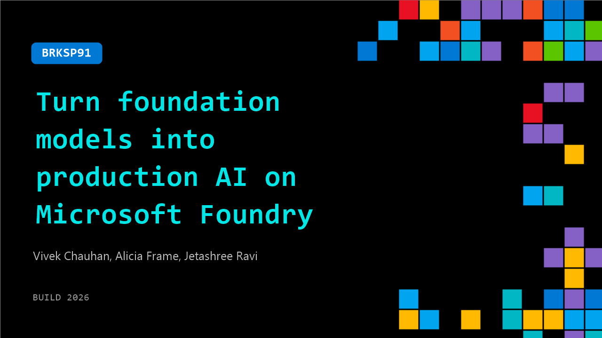

# BRKSP91: Turn foundation models into production AI on Microsoft Foundry

**Session code:** BRKSP91  
**Date:** Wednesday, June 3, 2026 / 11:30 AM - 12:15 PM PDT (Duration 45 minutes)  
**Watch on-demand:** <https://build.microsoft.com/en-US/sessions/BRKSP91>

---

## Speakers

- **Vivek Chauhan** - Product Management, Fireworks AI
- **Alicia Frame** - Principal Product Manager, Microsoft
- **Jetashree Ravi** - Tech Lead Manager, Fireworks AI

## About the session

Move beyond generic foundation models and learn how to build production‑ready, use case‑specific AI with optimized training and inference with Fireworks AI. See how developers integrate Fireworks with Microsoft Foundry to customize models, improve inference performance, and deploy at scale. Through a live demo and real‑world case study, you’ll learn practical patterns for reducing cost, latency, and time‑to‑production in enterprise AI systems.

Seating for this session is first-come, first-served. Add it to your schedule to plan your day and arrive early to secure a spot.

## AI summary

**Session Introduction:** The session opens with Vivek Chauhan greeting participants and checking audio setup (00:00:01). He introduces his co-presenter Jed and a special guest Nico from Harvey AI, outlining that today’s discussion will focus on saving costs and building production-grade inference-optimized AI systems using open source models served via Fireworks AI and deployed on Microsoft Foundry (00:00:16). The introduction sets the tone by emphasizing practical enterprise strategies for leveraging open models, and Vivek then transitions into the main concepts that drive their AI perspective.

**Core AI Principles and Fireworks Overview:** Vivek highlights three core truths about the current AI landscape (00:00:39–00:01:07). First, he notes the narrowing performance gap between open models and closed frontier models, enabling enterprises to switch to open models without losing quality. Second, differentiation now relies on embedding proprietary data and fine-tuning models, not using generic solutions. Third, leading companies continuously optimize their AI stacks using Fireworks, finding efficiency through a “flywheel” of training, evaluation, and redeployment (00:01:46). Vivek describes Fireworks AI’s operations — processing over 30 trillion tokens daily and supporting more than 10,000 enterprises globally. Customers such as Cursor, Uber, and DoorDash leverage Fireworks for custom fine-tuning and inference performance gains (00:02:00). He emphasizes the complexity of inference optimization, where Fireworks’ stack handles CUDA kernels, quantization, adaptive caching, and speculative decoding, freeing clients from heavy infrastructure management.

**Platform Ecosystem and Training Capabilities:** Vivek discusses how Fireworks empowers customers to “own their AI stack” (00:04:12). The platform meets creators at various AI maturity stages, offering tools for non-technical product managers through a “training agent” that automates data preparation, evaluation, and fine-tuning, as well as managed training services for engineers (00:05:08). Advanced users can use the training API for full customization with their own loss functions and reward settings. Vivek underscores the simplicity of one-click deployments, the ability to chain fine-tuned models, and continuous iteration through a training-inference loop — all supported with guaranteed numerical fidelity. This seamless workflow compresses development cycles and allows rapid iteration, which customers report improves productivity and innovation dramatically.

**Demo and Foundry Integration Announcement:** The next section presents practical demos of Fireworks tools and the major announcement of its availability on Microsoft Foundry (00:14:42). Jed explains that Foundry users can now use Fireworks inference via a unified endpoint, contract, and platform journey. Four key customer benefits are cited: performance through GPU-level optimization, rapid model availability on release day, deep control and customizability, and major cost savings compared to closed models (00:17:23). He details deployment modes — serverless “pay-as-you-go,” provisioned throughput for dedicated workloads, and bring-your-own-weights for proprietary models. Live demos illustrate browsing the Foundry catalog, selecting Fireworks models (identified by “FW” prefixes), configuring rate limits, and deploying models or custom weights easily within Azure. Users can integrate these models directly into applications or existing agents using APIs, making the system highly extensible and adaptable to real enterprise needs.

**Customer Examples and Demonstrations:** The presentation then showcases case studies from customers like UI Path, Bolt, and Motif (00:21:07). Each sought better performance and economics through Fireworks integration — achieving higher quality and throughput than competing closed models. The demo walks through steps to upload custom models, set architectures, and deploy instances without restrictions in Foundry (00:24:00). Jed demonstrates how to connect Fireworks models directly into Azure agents, showing simple configuration screens where agents can be linked to open weight or custom models, along with external search tools or custom functions. This section provides visual proof of the integration’s ease-of-use, confirming that enterprises can deploy entire AI pipelines quickly while maintaining flexibility in scaling and model management.

**Harvey AI Collaboration and Conclusion:** The final portion features Nico from Harvey AI, who leads applied research and shares insights into their collaboration with Fireworks and Microsoft (00:27:26). Harvey recently launched the “Legal Agent Benchmark” to evaluate AI agents’ performance on complex legal tasks. Nico describes their hybrid approach combining open models like GLM 5.1 with closed advisor models, creating significant cost reductions and improved accuracy — up to 2.4 times cheaper and 30% better in quality (00:33:26). He underscores why open models matter: domain-specific fine-tuning improves legal precision, offers better latency control, and supports secure, fully auditable deployments. Harvey’s partnership with Fireworks and Foundry accelerates iteration cycles, enabling faster post-training experiments and deployment within Microsoft’s enterprise-grade environment. The session closes by encouraging every enterprise and startup using Azure to explore Fireworks models for building efficient, scalable, and secure AI applications (00:40:11).

## Session tags

- **Session type:** Breakout
- **Level:** (200) Intermediate
- **Topic:** Developer tools & frameworks
- **Tags:** AI, API, Developer, Microsoft Foundry, App Developers, AI Toolkit
- **Location:** Festival Pavilion, Breakout 3
