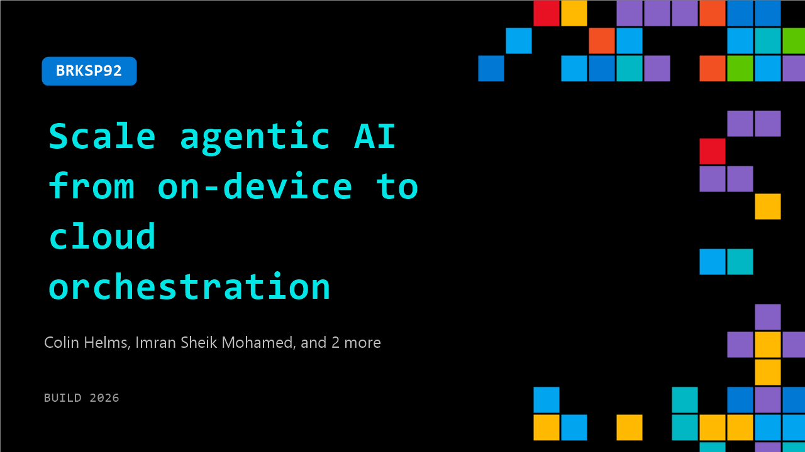

# BRKSP92: Scale agentic AI from on-device to cloud orchestration

**Session code:** BRKSP92  
**Date:** Wednesday, June 3, 2026 / 10:15 AM - 11:00 AM PDT (Duration 45 minutes)  
**Watch on-demand:** <https://build.microsoft.com/en-US/sessions/BRKSP92>

---

## Speakers

- **Colin Helms** - Desktop Client AI Engineer, Intel
- **Imran Sheik Mohamed** - AI Solutions Architect, Intel
- **Karthik Vijayan** - Principal Applied Scientist Manager, Microsoft
- **Jayneel Vora** - Senior Software Engineer, Intel Corporation

## About the session

Modern AI systems span client, edge, and cloud rather than a single model. Explore how agentic AI workloads operate across these environments through three demos: real‑time on‑device agents, distributed inference across edge systems, and enterprise‑scale multi‑agent orchestration on Azure Kubernetes Service with Intel Xeon. Leave with practical guidance on placing inference, reasoning, and orchestration where they make the most sense to balance responsiveness, scale, and efficiency.

Seating for this session is first-come, first-served. Add it to your schedule to plan your day and arrive early to secure a spot.

## AI summary

**Introduction and Overview:** The session opens with host Eddie from Intel confirming audio and welcoming the audience of developers, engineers, and architects 00:00:06. He introduces the theme: AI applications have grown beyond single models to distributed agentic systems that span across client, edge, and cloud infrastructures 00:00:21. The agenda includes three demos illustrating these layers — a client-side AI demo, an edge computing setup, and a cloud-scale orchestration demonstration on Azure 00:00:47.

**Client-Side AI Demonstration:** Eddie introduces J. Neal, who begins by illustrating common AI cost limitations — many developers exceed monthly budgets due to token-based usage costs 00:01:34. Neal presents Intel’s “Ion 1.0 Instant” technology released recently, running on the Panther Lake NPU of the Core Ultra Series 3 00:02:19. He shows a local chat interface where responses such as identifying “the color of the sky” demonstrate the light NPU activity and minimal CPU utilization 00:03:13–00:03:48. This proof highlights near-instant inference with low power consumption and no network dependency. Neal emphasizes the quantization capability of Panther Lake — enabling compact yet powerful models without compromises on speed or intelligence 00:04:22. His demo underlines the importance of local AI execution for edge-sensitive environments like hospitals and aircraft, using OS-level APIs and OpenVINO for seamless NPU scheduling 00:05:29. He concludes inviting attendees to view the reasoning-capability game demo at Intel’s booth 00:06:21.

**Edge Computing and Resource Pooling:** Eddie next introduces Colin to explain resource pooling across AI stacks 00:06:49. Colin presents three Asus NUC Pro mini PCs powered by Intel Core Ultra Series 3 processors and Arc B390 integrated graphics 00:07:10. He explains how memory sharing settings from Intel’s GPU driver enable up to 93% allocation for video RAM, achieving 51 GB of VRAM per device 00:08:41. Using Llama CPP’s RPC, he connects all three devices over Thunderbolt 4 for high-speed 20 Gb/s networking, effectively pooling their resources for approximately 150 GB total VRAM 00:10:12. Colin demonstrates an 180-billion parameter model running locally at 16–18 tokens per second 00:10:45. He highlights cost efficiency — a fully functioning, high-performance AI stack under $7000 capable of running developer-sized workloads without network fees or cloud tokens 00:11:01. The Austin Copilot CLI integration allows pointing Visual Studio code checks to local models, showcasing full offline dev setup 00:12:10. Colin also introduces Microsoft’s MXC execution containers for safe agent sandboxing that enterprise administrators can enforce by policy 00:13:17. A script-run demo displays containerized execution behavior, highlighting secure, isolated workflows 00:14:21. His segment closes by stressing the concept of “free tokens” through local processing, enabling developers cost-free model interaction 00:16:45.

**Cloud and Data Center Demonstration:** The final presenter, Imran, builds upon the previous sessions by showcasing deployment at cloud scale using Azure virtual VMs 00:17:21. He introduces “Agent AI” as an evolved interaction paradigm for large language models, now capable of executing complex action sequences instead of simple chat responses 00:17:46. His demo involves hosting a local 3.635B parameter model on Azure using 96 virtual CPUs and 200 GB of RAM 00:19:08. The system utilizes Intel Xeon 6 CPUs with AMX acceleration for matrix multiplications, enabling efficient transformer inference 00:19:56. He demonstrates integration with OpenClaw running on Kubernetes, showing agents executing GitHub queries and summarizing pull requests through coordinated commands between the LLM and OpenClaw engine 00:22:01. Imran explains auto-scaling behavior — when CPU utilization increases, Kubernetes automatically scales the agent replicas from two instances upward 00:24:21. This dynamic scaling allows multiple agents to act on different personas or roles within the same system, performing simultaneous PR reviews and tasks 00:25:02. He concludes highlighting affordability and performance advantages of hosting private inference on Xeon-powered VMs 00:25:29.

**Conclusion and Q&A:** Eddie returns to close the presentations with a brief Q&A session 00:25:42. Audience members ask about the cost — around $2500 per NUC Pro system or $7000 for the full demo stack — and how workload scheduling occurs across distributed machines 00:26:11. Colin explains that models are sharded across three systems using Llama RPC servers, which handle distributed calls automatically 00:27:00. He notes that OpenVINO support for multi-device execution is under development but already excels on single systems 00:28:10. The session concludes with invitations to visit Intel’s booth for deeper hands-on experiences and thanks to the attendees 00:28:45.

## Session tags

- **Session type:** Breakout
- **Level:** (300) Advanced
- **Topic:** Developer tools & frameworks
- **Tags:** AI, Azure, Copilot, MS Teams, Agents, Developer, Java, Local AI, Agent 365, Foundry Agents, Deployment Pipelines, Windows 365 for Agents, Agents on Windows, App Developers, ISV, AppTrust, Secure App Development, Agent Observability, Cross-device, App Integration, Agentic Security
- **Location:** Festival Pavilion, Breakout 3
