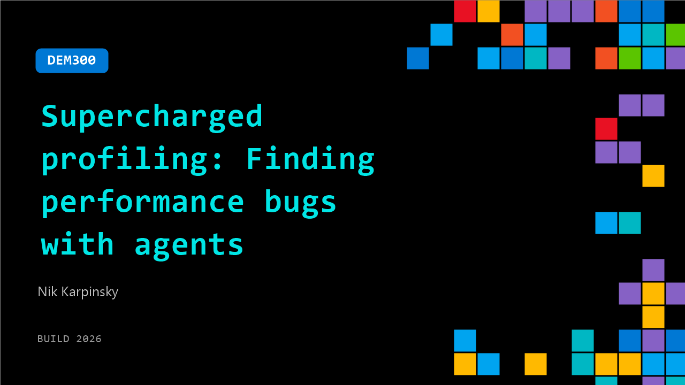

# DEM300: Supercharged profiling: Finding performance bugs with agents

**Session code:** DEM300  
**Date:** Wednesday, June 3, 2026 / 9:30 AM - 9:55 AM PDT (Duration 25 minutes)  
**Watch on-demand:** <https://build.microsoft.com/en-US/sessions/DEM300>

---

## Speakers

- **Nik Karpinsky** - Principal Software Engineer, Microsoft

## About the session

Modern performance problems are harder than ever to diagnose: distributed systems, async code, and massive data make traditional profiling insufficient. In this demo-driven session, watch how Visual Studio combines advanced diagnostics with AI-powered agents to surface bottlenecks, explain root causes, and guide fixes faster than ever. From CPU and memory issues to “it only fails in production” bugs, you’ll see how profiling evolves in an agentic world.

Seating for this session is first-come, first-served. Add it to your schedule to plan your day and arrive early to secure a spot.

## AI summary

**Introduction and Overview:** The session begins with Nick Karpinski, a Microsoft software engineer with over twelve years of experience on Visual Studio, opening the first demo of the morning 00:00:06–00:00:25. He introduces himself and explains his focus on the Visual Studio Profiler, expressing excitement to share how developers can optimize workflows using the profiler in Visual Studio. Before diving into technical content, he engages the audience to gauge their experience levels with .NET, Visual Studio Profiler, and Benchmark.NET 00:00:39–00:01:19. Noting that many attendees are unfamiliar with these tools, he sets the stage for a demo-heavy presentation focused on demonstrating the optimization process in practice.

**Performance Optimization Workflow:** Nick outlines a high-level flowchart for real-world code optimization 00:01:27–00:04:02, describing steps like understanding performance issues, using profiler data to identify bottlenecks, and applying changes iteratively. He stresses the importance of measuring performance with concrete data rather than intuition, recommending developers start by profiling their applications to pinpoint time-consuming areas. Once bottlenecks are known, he introduces Benchmark.NET as a reusable performance testing framework, comparing it to unit tests that validate functionality but focused instead on measuring code efficiency. He encourages developers to adopt the “measure twice, optimize once” principle: collect baseline data, apply code changes, and remeasure to understand impact. Optimizations are treated as iterative experiments, looping through improvements until performance gains plateau or new issues arise.

**Benchmark and Demo Setup:** Transitioning to the live demo, Nick opens the CSV Helper repository—a popular NuGet package—illustrating how to approach optimizing community code 00:04:07–00:07:04. He explains that CSV Helper already includes a Benchmark.NET project for testing read performance, which he previously contributed. He reviews how benchmarks isolate targeted components of code for focused measurement, using memory streams to avoid unrelated IO overhead. After establishing a baseline for reading CSV files, he decides to create a complementary benchmark for writing CSV files 00:07:07–00:09:55. Using Copilot Chat connected to the profiler agent, Nick instructs the system to generate a new benchmark that mirrors the existing read test. Copilot automatically reads the code context, installs necessary integration packages for Benchmark.NET and Visual Studio Profiling, ensuring diagnostics are captured during runtime.

**Profiling, Measurement, and Optimization:** Once the benchmark compiles successfully, Nick runs the “write records” benchmark through Copilot’s profiler integration 00:10:16–00:13:00. The profiler collects performance traces and highlights the main CPU hotspots such as “expression compile” and “should quote” logic. To demonstrate iterative optimization, he focuses on improving the “should quote” method rather than the top CPU consumer, using Copilot to analyze source code lines linked to performance overhead via the profiler’s “go to source” functionality. Copilot suggests combining multiple character checks into a single iteration to reduce redundant scans 00:14:06–00:15:03. After applying this optimization, Nick remeasures benchmark results, noting that while overall runtime remained near 1.4 milliseconds, specific sections showed reduced CPU consumption—from 13% down to 7%. This highlights that measurable data, not assumptions, defines true optimization outcomes.

**Iterative Improvements and Learning:** Nick emphasizes using Copilot and the profiler not only for automation but for guided learning 00:16:02–00:18:32. He demonstrates how engineers can ask Copilot contextual questions to understand why certain optimizations didn’t yield expected results—for instance, learning about .NET JIT quirks affecting method inlining limits. Despite minor gains in the live demo, prior tests achieved meaningful 25% improvements, showing how small incremental changes compound over time. Developers can leverage this workflow to conduct deeper investigations, validate optimization impact, and use AI assistance to interpret complex performance patterns within codebases.

**Conclusion and Q&A Session:** Wrapping up, Nick encourages participants to reproduce similar performance improvements using CSV Helper benchmarks available in the GitHub repository 00:18:33–00:19:39. He points to related resources, including documentation for the profiler agent and a follow-up breakout session at 4:00 PM featuring debugging and unit testing integration within Visual Studio. During audience questions 00:20:01–00:23:08, he explains how Copilot can inject functional tests post-optimization to ensure nothing breaks and how the profiler can interpret traces automatically using top insights that flag known inefficient patterns. These insights may include poor data structure usage or redundant operations, allowing automated guidance toward better performance solutions. Nick closes with appreciation for attendees, reinforcing the combined power of AI-assisted profiling and developer-driven analysis in practical performance engineering.

## Session tags

- **Session type:** Demo
- **Level:** (400) Expert
- **Topic:** Developer tools & frameworks
- **Tags:** Developer, Visual Studio, AI Toolkit, DevTools
- **Location:** Festival Pavilion, Theater A
