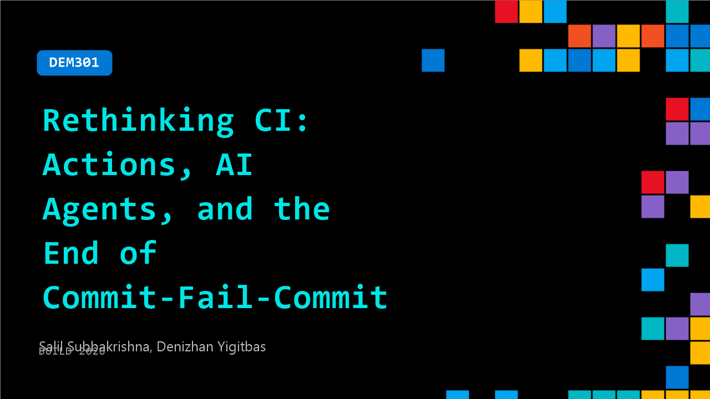

# DEM301: Rethinking CI: Actions, AI Agents, and the End of Commit-Fail-Commit

**Session code:** DEM301  
**Date:** Wednesday, June 3, 2026 / 3:00 PM - 3:25 PM PDT (Duration 25 minutes)  
**Watch on-demand:** <https://build.microsoft.com/en-US/sessions/DEM301>

---

## Speakers

- **Salil Subbakrishna** - Product Manager, GitHub
- **Denizhan Yigitbas** - Senior Product Manager, GitHub

## About the session

Your pipelines automate the predictable. But what about triaging issues, reviewing PRs, responding to incidents, and coordinating across tools? See what's new in GitHub Actions and how it's becoming the execution layer for AI agents across your dev lifecycle. We'll cover agent-triggered workflows, MCP server integration, and automated handoffs that keep humans in the loop — plus how to finally break the 'commit - see CI fail - commit again' loop.

Seating for this session is first-come, first-served. Add it to your schedule to plan your day and arrive early to secure a spot.

## AI summary

**Introduction and Context:** The session opens with Salil and Dennis, both product managers at GitHub, introducing themselves and the theme of the talk: rethinking continuous integration (CI) through GitHub Actions, AI, and agentic workflows 00:00:19. Salil highlights how GitHub Actions usage has exploded from 2.8 million to 850 million jobs per week within a short timespan, due to the adoption of AI and automation 00:00:38. Despite this growth, he acknowledges a recurring user frustration called the "commit-fail-commit" cycle, where developers must repeatedly push changes to fix failed workflows. GitHub aims to break this pattern by introducing two major tools: agent-based workflows and a new Actions Debugger for direct workflow troubleshooting 00:01:47.

**Agentic Workflows and the “CI Doctor” Concept:** Salil explains agentic workflows — AI-infused automations written in Markdown that GitHub compiles into standard Actions YAML files 00:02:13. The demonstration centers on a special agentic workflow called "CI Doctor," designed to automatically analyze failed runs and identify root causes. After showing a typical Python-based CI failure, Salil triggers the CI Doctor workflow, which detects the failure and automatically launches an agent that produces diagnostic information and actionable recommendations 00:03:23. The CI Doctor inspects failure patterns, assesses logs, and creates an issue summary with reasons for the failure and suggested code fixes, such as converting string inputs to integers and adding validation steps 00:08:08. This automation significantly reduces developer intervention and shortens the debugging cycle.

**Creating and Customizing Agentic Workflows:** Salil dives deeper into how these workflows can be defined, compiled, and extended. Developers create `.md` files that describe AI logic, compile them using the GitHub CLI extension command `github aw compile`, and produce a `.lock.yaml` file that GitHub Actions executes 00:06:05. He demonstrates live customization: using GitHub Copilot to modify prompts, add slash commands, and tailor workflows for specific use cases 00:05:35. These workflows can be versioned, shared across repositories, and refined collaboratively, enabling teams to build their own diagnostic or triage agents. GitHub also provides prebuilt templates—for CI analysis, issue triage, and documentation automation—to accelerate adoption and reuse 00:07:45.

**Introducing the Actions Debugger:** After showing how agentic workflows handle automated analysis, Salil transitions to the upcoming Actions Debugger, designed for deeper human-in-the-loop investigation when workflows behave unpredictably 00:10:49. Using a live PR example, he demonstrates connecting the debugger from VS Code to an active GitHub Actions runner through the Debug Adapter Protocol (DAP) 00:14:00. Once connected, the debugger exposes all runtime variables, environment data, and logs in real time. Salil traces an issue where only one file was processed in a PR; by inspecting the `base_sha` and `head_sha` variables directly on the runner, he identifies a logic error in the diff comparison and confirms the fix instantly 00:17:07. This hands-on approach allows developers to explore without repeated commits, turning Actions debugging into an interactive, IDE-level experience.

**Demonstration Outcome and Debugging Advantages:** The debugger session concludes successfully, with Salil pinpointing the root cause of the workflow issue and verifying the corrected logic 00:19:29. He shows how the DAP-based integration supports standard debugging operations—running commands, viewing contexts, and examining variables securely across various clients such as VS Code or Neovim 00:16:35. This approach eliminates the need for “print statement” debugging and allows the same step-by-step tracing familiar in traditional software debugging, now applied directly to CI pipelines. Dennis encapsulates this as a true “debugger for runners,” reinforcing how these innovations transform CI troubleshooting from guesswork into an interactive, efficient process 00:20:05.

**Roadmap, Availability, and Closing Remarks:** The presentation wraps up with announcements on release timelines 00:20:40. Agentic workflows will enter public preview the following week, supported by documentation and quick-start examples for issue management, documentation automation, and multi-repository orchestration. The Actions Debugger, meanwhile, remains an internal project while GitHub focuses on maintaining strong security measures before public release 00:21:20. The speakers encourage the audience to provide feedback through GitHub’s public forums to influence future templates and features. They close by thanking participants and emphasizing GitHub’s commitment to improving developer experience through AI-driven automation and transparent tooling innovations 00:22:19.

## Session tags

- **Session type:** Demo
- **Level:** (400) Expert
- **Topic:** Developer tools & frameworks
- **Tags:** Agents, Developer, GitHub Copilot, GitHub, MCP, GitHub Actions, GitHub Enterprise, OSS, OSS CI/CD Libraries, GitHub Copilot CLI, DevTools, Agentic SDLC
- **Location:** Festival Pavilion, Theater A
