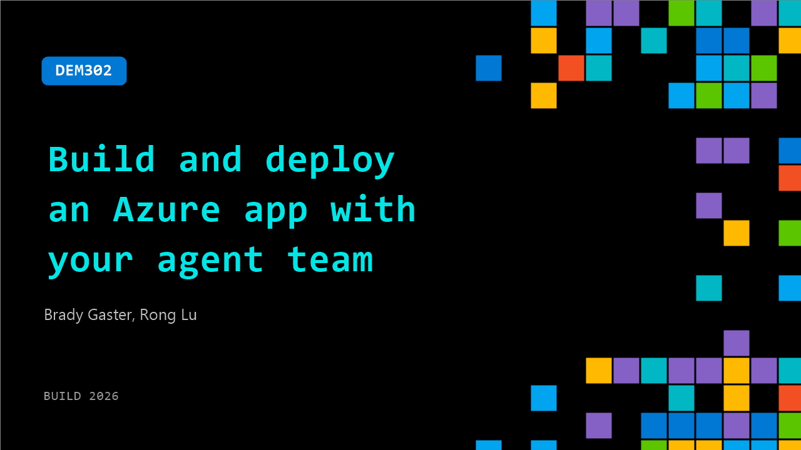

# DEM302: Build and deploy an Azure app with your agent team

**Session code:** DEM302  
**Date:** Tuesday, June 2, 2026 / 5:30 PM - 5:55 PM PDT (Duration 25 minutes)  
**Watch on-demand:** <https://build.microsoft.com/en-US/sessions/DEM302>

---

## Speakers

- **Brady Gaster** - Builder, GitHub
- **Rong Lu** - Principal Product Manager, Microsoft

## About the session

In 25 minutes, we’ll go from a blank repo to a live Azure AI app—built and deployed by a team of GitHub Copilot agents. Watch Copilot plan architecture, generate code, provision Azure, and deploy live using Copilot Agents and Skills. Leave with a blueprint for your agent driven coding workflow for Azure.

Seating for this session is first-come, first-served. Add it to your schedule to plan your day and arrive early to secure a spot.

## AI summary

**Introduction and Setup:** The session begins with brief opening remarks and gratitude for the attendees' patience as the presenters prepare for their final demo of the day 00:00:03. The topic of this demo is building and deploying an Azure App Agent. Brady Gaster, recently working with GitHub, and Ron from Microsoft introduce themselves and outline their goal: to showcase how to construct and deploy a customer insights agent system using Azure and GitHub technologies within a focused, 25‑minute demo window 00:01:09.

**Overview of the Customer Insights Agent:** Ron explains that their demo centers on Zava, an online retailer aiming to understand and act on customer feedback 00:01:19. The agent system analyzes sentiment—positive or negative—and can automatically trigger responses. For instance, when feedback mentions an app crash or damaged delivery, the agent links to customer data in Microsoft Fabric, identifies orders associated with the feedback, and initiates a replacement process 00:03:04. The system is designed to enable multiple agents to collaborate to interpret data and take relevant actions autonomously.

**Building the Multi-Agent Workflow:** Inside Visual Studio Code, Ron walks through how they developed the system with GitHub Copilot and the Microsoft Agent Framework 00:04:42. The first iteration handled simple sentiment analysis, but they expanded into a multi-agent setup consisting of classification, enrichment, triage, and aggregation agents 00:06:08. Copilot helped scaffold the entire code base, orchestrating agents in a single workflow definition. Data enrichment connects the system to Microsoft Fabric—allowing one agent to fetch customer and order information through a Foundry toolbox, which serves as an integrated package of Azure AI Search and Fabric connectors accessed via a unified endpoint 00:08:00.

**Running, Debugging, and Deploying with Foundry:** After setting up locally, Ron demonstrates how the agent runs through the Foundry VS Code extension’s Agent Inspector, a visualization and debugging tool 00:10:25. The visual interface displays workflows in real time and enables inspection of data flowing through each agent. The results include drafts of customer communication and sentiment summaries. To scale testing, Copilot automatically adds integrated evaluations based on prior code context 00:13:09. Once validated, the agent is deployed as a fully hosted Azure Foundry service for monitoring and log streaming directly inside VS Code, letting Copilot review server logs and resolve errors interactively 00:15:00.

**Front-End Deployment with Squad Framework:** Brady takes over to showcase how he extends Ron’s backend agent by integrating a front end using his multi-agent GitHub Copilot tool called “Squad” 00:16:10. Squad creates multiple specialized agents that collaborate efficiently on specific roles instead of competing for tasks 00:18:38. Through CLI operations and predefined Azure MCP tools, he sets up an entire Azure Foundry instance and container environment via simple prompts. Brady explains how Squad automatically corrected deployment endpoints, rewrote infrastructure code using Azure skills and the Foundry SDK, and provisioned both backend and frontend containers 00:21:00. The resulting live application allows users to send feedback from a React interface directly into the Foundry model, securely reusing cloud resources across compute layers 00:23:24.

**Conclusion and Call to Action:** Wrapping up, Brady shows a Squad-generated report that logs everything the system wrote, deployed, and tested, including the tools and skills used 00:25:25. Both presenters highlight the synergy between GitHub Copilot, Azure Foundry, and Squad for building multi-agent systems that operate and document processes autonomously. Attendees are encouraged to explore the Foundry Toolkit for VS Code, Azure MCP tools, GitHub Copilot, and the open-source Squad framework to experiment with agent-based workflows 00:25:50. The session closes with thanks and an invitation for viewers to attend the next day’s demonstrations at 9:00 AM 00:26:03.

## Session tags

- **Session type:** Demo
- **Level:** (200) Intermediate
- **Topic:** Developer tools & frameworks
- **Tags:** Azure, Agents, Developer, GitHub Copilot, GitHub, Deployment Pipelines, GitHub Copilot CLI, DevTools, Skills, Agentic SDLC
- **Location:** Gateway Pavilion, Level 2, Theater C
