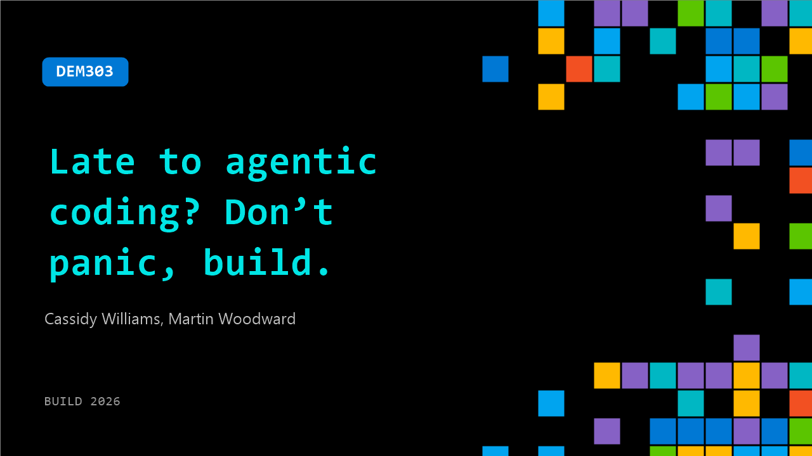

# DEM303: Late to agentic coding? Don’t panic, build.

**Session code:** DEM303  
**Date:** Tuesday, June 2, 2026 / 5:00 PM - 5:25 PM PDT (Duration 25 minutes)  
**Watch on-demand:** <https://build.microsoft.com/en-US/sessions/DEM303>

---

## Speakers

- **Cassidy Williams** - Senior Director, Developer Advocacy, GitHub
- **Martin Woodward** - VP of Developer Relations, Microsoft

## About the session

​Feeling behind on agentic coding? You’re not. In this demo-heavy session, we’ll show how to go from idea to shipped. You’ll see practical patterns for planning tasks, delegating implementation, reviewing AI-generated PRs, and shipping with guardrails. No hype - just real workflows you can apply with your team right away.

Seating for this session is first-come, first-served. Add it to your schedule to plan your day and arrive early to secure a spot.

## AI summary

**Interactive Opening and Session Setup:**
The session begins with Martin Woodward and Cassidy Williams introducing themselves to the audience and encouraging participation 00:00:01–00:00:15. Attendees are invited to scan a QR code or visit a GitHub page to submit project ideas. They emphasize that the event will be hands-on, where they will build live applications using GitHub Copilot and discuss artificial intelligence–assisted coding. A quick survey of the audience reveals how many are using GitHub Copilot in different environments such as VS Code, Visual Studio, command line, and the recently announced GitHub app 00:01:20–00:01:40. After collecting these insights, the presenters navigate to the shared GitHub repository that houses instructions and demonstration resources 00:02:05.

**Demoing the GitHub Copilot App and Gathering Ideas:**
Cassidy demonstrates how the GitHub Copilot app works, showing that it is built on top of the Copilot CLI and SDKs while running the same engine locally 00:03:00. The audience is asked to suggest project ideas, and several fun examples are proposed—such as a whiskey review app, gesture-controlled ping pong, and a side-scrolling platformer game 00:04:09. Each suggestion automatically becomes an issue in their repository through Copilot’s integration, which even respects issue templates configured for idea creation. This demonstrates the intelligence of the app as it populates structured issues like “IDEA: Gesture-controlled game.” The presenters stress that Copilot can understand context, use templates, and perform tasks such as creating or managing issues in real time 00:11:24.

**Industry Context and Developer Insights:**
The conversation shifts toward the rapid adoption of generative and agentic coding 00:05:11. Martin remarks that the pace of change in coding feels faster than the dot‑com boom, with pull requests authored by AI agents increasing dramatically. They highlight that GitHub itself relies on Copilot, which ranks among the top contributors to GitHub’s own codebase. Emphasizing the adoption curve, the hosts compare developers to early adopters and innovators, urging the audience to recognize their influence in shaping best practices while the majority of the industry still lags behind 00:06:54. They note that although 84% of developers at Microsoft reported using some form of AI, most non‑technical professionals have not, creating a distinct opportunity for this audience to lead in experimentation and organizational integration.

**Live Build: Gesture-Controlled Rock‑Paper‑Scissors and Planning Mode:**
Returning to live coding, they use Copilot’s assistant to research and prototype a new build app concept before moving on to implement the selected “Gesture-Controlled Rock‑Paper‑Scissors” game 00:13:31. The presenters explain different operational modes—interactive, plan, and autopilot (“Yolo mode”)—discussing why enterprises typically prefer guided planning for safety and oversight. Cassidy demonstrates “plan mode” with another audience suggestion, a side-scrolling platformer, showing model selection and reasoning levels across GPT and Claude families. They introduce “Rubber Duck,” a validation step where a second model reviews a plan for logic gaps, demonstrating measurable improvements from multi-model collaboration 00:19:05. Meanwhile, in the live test of their earlier game, Copilot builds and runs a browser-based version that successfully responds to face gestures—eliciting laughter and showcasing the tool’s efficiency 00:21:27.

**Advanced CLI Features and Developer Guidance:**
To give developers deeper control, Martin walks through GitHub Copilot CLI commands and configuration 00:23:01. He explains the purpose of “Copilot Instructions” files, which encode a project’s standards and structure, and introduces “Spec Kit” for adding agent-friendly documentation. Cassidy then showcases features like remote control (“remote on”) for monitoring long tasks from a phone and “Chronicle” for automatic summaries, standups, or cost optimization. The “cost tips” feature is highlighted as a way to analyze model efficiency and token usage 00:25:01. Together, these tools demonstrate a growing ecosystem aimed at making generative development predictable, collaborative, and cost‑conscious.

**Closing Thoughts and Call to Action:**
As the session closes, both presenters encourage the audience to continue experimenting with the tools introduced and visit the developer lab areas to collaborate further 00:25:46. Martin emphasizes that the key to mastering agentic coding is hands‑on practice, encouraging attendees to “just give it a go” in their own workflows. Cassidy thanks everyone for engaging, reaffirming that developers in the room are among the first shaping how AI‑assisted development will evolve. They conclude that the combination of Copilot, multi‑model orchestration, and community feedback is setting the foundation for a transformative future in software creation 00:26:04.

## Session tags

- **Session type:** Demo
- **Level:** (300) Advanced
- **Topic:** Developer tools & frameworks
- **Tags:** Agents, Developer, GitHub Copilot, GitHub, GitHub Actions, GitHub Enterprise, GitHub Copilot CLI, DevTools, Agentic SDLC
- **Location:** Gateway Pavilion, Level 2, Theater C
