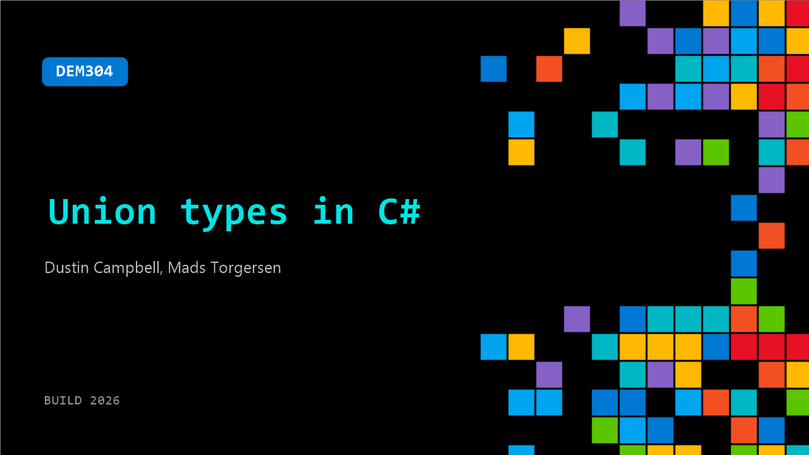

# DEM304: Union types in C#

**Session code:** DEM304  
**Date:** Tuesday, June 2, 2026 / 4:00 PM - 4:25 PM PDT (Duration 25 minutes)  
**Watch on-demand:** <https://build.microsoft.com/en-US/sessions/DEM304>

---

## Speakers

- **Dustin Campbell** - Principal Software Engineer, Microsoft
- **Mads Torgersen** - Principal Architect, Microsoft

## About the session

Union types are coming to C#! Unions model closed sets of data shapes, as commonly seen in e.g. wire protocols. Mads and Dustin explore the clean expression of intent and the confidence and elegance that unions lend to consuming code.

Seating for this session is first-come, first-served. Add it to your schedule to plan your day and arrive early to secure a spot.

## AI summary

**Introduction and Context:** The session opens with Matt Torgersen and Dustin Campbell from the C# team introducing themselves and announcing that they will discuss a single new feature in C# 15 called Union Types 00:00:23. They note that while features like this exist in other languages such as TypeScript and functional languages, the C# team has designed their own "Goldilocks" version—a balanced and practical approach to union types. They mention that C# 15 is releasing in November and that the functionality is already available in preview 00:00:34.

**Motivation and Basic Example:** Transitioning into a demo 00:01:15, the presenters show code modeling animals and pets. Previously, developers would have to treat distinct classes like Dog and Cat as generic objects, losing type safety. For example, a Shark could be mistakenly treated as a Pet, something the compiler could not prevent. With union types, they now define a "union Pet = Dog | Cat | Bird" 00:03:28. This enables the compiler to validate that only those specified types can be pets, offering exhaustiveness checking in switch expressions and preventing unwanted conversions. The demonstration also highlights how implicit conversions and pattern matching work seamlessly with union types 00:05:02.

**Members and Extended Usage:** The team then shows that unions can contain function members such as computed properties 00:07:01. For example, a Pet union can include a property like Description that uses pattern matching to derive textual summaries for each pet type. However, unions are intended to represent the state of their underlying member types and should not introduce additional mutable state. This design encourages treating unions as lightweight, composable abstractions rather than containers of mutable behavior. The presenters emphasize that beyond pets and animals, the same concept can apply to any domain, aligning with real-world software design challenges 00:08:13.

**Practical Scenarios and Generics:** A second demo presents unions in a more realistic programming scenario involving network results 00:08:46. They define a generic Result union composed of two case types: Success and Error. This pattern allows functions to return either a successful result or an error state in a strongly typed way, improving code reliability. When looping over a queue of result values, the switch expression enforces that both cases—success and error—are handled, preventing missing-case bugs. The example demonstrates that unions can be generic, support deconstruction, and provide the same exhaustiveness and implicit conversion guarantees as simpler cases 00:12:04.

**Implementation Details and Customization:** Diving deeper under the hood, Matt and Dustin explain that unions in C# are implemented as structs with an object field storing the underlying value 00:14:18. The feature is built using new attributes such as [Union], and developers can technically define their own unions manually using constructors and the IUnion interface 00:15:06. They outline two main reasons one might customize implementation: achieving higher performance by avoiding boxing allocations, or adapting legacy types that developers previously built to simulate unions. Through these mechanisms, developers gain granular control over type modeling and performance behavior 00:18:12.

**Design Philosophy, Q&A, and Conclusion:** In the concluding portion, the team compares their approach to TypeScript’s structural unions and explains why C# uses nominal, declared unions instead 00:22:26. Because .NET requires runtime type representation, structural unions like in TypeScript are impractical. Instead, C# unions exist both at compile-time and runtime, offering strong typing and runtime inspection capabilities. After nearly five years of design iterations 00:24:27, the team settled on this balanced model that integrates smoothly with C# language semantics. They end by noting that unions are supported in the .NET 11 and Visual Studio preview releases and invite developers to explore the feature and provide feedback in the expert zone after the session 00:25:00.

## Session tags

- **Session type:** Demo
- **Level:** (400) Expert
- **Topic:** Developer tools & frameworks
- **Tags:** Developer, GitHub, DevTools
- **Location:** Gateway Pavilion, Level 2, Theater C
