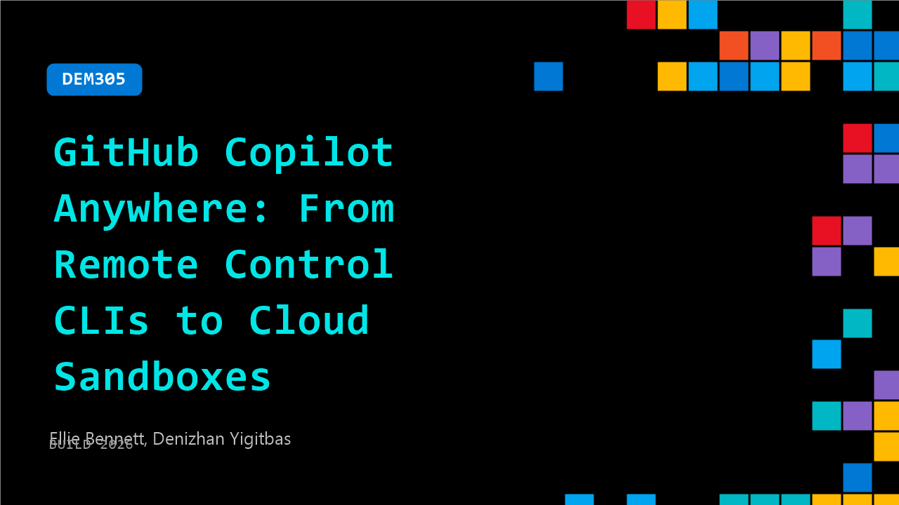

# DEM305: GitHub Copilot Anywhere: From Remote Control CLIs to Cloud Sandboxes

**Session code:** DEM305  
**Date:** Wednesday, June 3, 2026 / 10:30 AM - 10:55 AM PDT (Duration 25 minutes)  
**Watch on-demand:** <https://build.microsoft.com/en-US/sessions/DEM305>

---

## Speakers

- **Ellie Bennett** - Staff Product Manager, GitHub
- **Denizhan Yigitbas** - Senior Product Manager, GitHub

## About the session

Modern development no longer happens in one place. You might start in your terminal, step away, and pick things back up from another device or let work continue in the cloud. This session explores using GitHub Copilot across environments, from local CLI sessions to full cloud execution with Remote Sandboxes. See how Copilot runs commands, iterates on changes, and continues work without losing context, while you stay in control.

Seating for this session is first-come, first-served. Add it to your schedule to plan your day and arrive early to secure a spot.

## AI summary

**Introduction and Setup:** The session opens with welcoming remarks and a brief introduction to the talk titled "GitHub Copilot Anywhere" presented by Ellie and Dennison (00:00:03–00:00:13). After a few microphone checks (00:00:14–00:00:27), Ellie sets the tone by emphasizing the fast pace of innovation and how developer creativity often strikes outside of traditional desk environments, like at airports or in living rooms (00:01:16–00:01:48). This idea naturally introduces the theme of developer flexibility—being able to code anywhere and anytime using GitHub Copilot.

**Remote Control Overview and Demo:** Ellie introduces GitHub Copilot’s new remote control feature, describing how it enables developers to take their local work on the go and interact with it remotely through devices or github.com (00:02:00–00:02:56). A live demo follows featuring a custom World Cup app example where Ellie uses Copilot to improve the app’s UI while detecting bugs like missing host countries (00:04:00–00:06:06). She activates "remote on," generates a live link and QR code, scans it with her phone, and demonstrates real-time synchronization between her CLI and mobile device (00:06:36–00:07:19). Permissions appear on the phone, confirming the remote capabilities. Ellie closes this section with usage tips: enabling remote sessions by default, keeping terminals online, and coordinating enterprise policies (00:08:38–00:09:36).

**Introducing Cloud Sandboxes:** Transitioning from remote control, Dennison expands on the concept of Copilot having its own environment independent of the local machine. He unveils "Cloud Sandbox" for Copilot, now in public preview (00:10:22–00:10:45). In this feature, each Copilot session operates inside a secure, isolated cloud environment, allowing uninterrupted access even if the local machine shuts down (00:11:13–00:11:27). Developers can allocate cloud resources to handle heavy workloads without straining local systems. He demonstrates switching from a regular CLI session to a sandboxed cloud session using a simple "dash dash cloud" command (00:14:06–00:14:38), confirming that once launched, Copilot instances persist online regardless of host activity.

**Cloud Sandbox Demo and Policy Controls:** In a hands-on example, Dennison builds upon the World Cup app by using a sandbox to add a "live broadcasting" feature—showing minute-by-minute game updates for the final (00:12:34–00:13:12). After launching the session in the cloud, he closes his tab to demonstrate persistence; the Copilot interaction continues because it's hosted remotely (00:15:31–00:15:36). Policies governing this environment—like firewall rules and repository scopes—can be managed under settings for Copilot’s cloud agents (00:15:49–00:16:05). Dennison animates the talk by simulating a World Cup final where Turkey triumphs, a playful test of the new broadcasting capabilities (00:17:12–00:18:03).

**Performance, Persistence, and Cost Efficiency:** Dennison explains the inner workings of sandbox persistence and billing: whenever Copilot finishes its tasks, the sandbox’s state and disk snapshot are saved, reducing compute usage to zero until resumed (00:18:19–00:19:01). This design ensures cost efficiency and instant continuity upon reactivation. He summarizes the two working models—remote control sessions for local work requiring the host machine and cloud sandbox sessions granting Copilot full autonomy in isolated environments (00:19:10–00:19:41).

**Chronicle Feature and Conclusion:** Ellie closes the session by introducing "Chronicle," a meta-feature that logs and indexes all user Copilot sessions for insights, tips, and enhancements across platforms like CLI, VS Code, JetBrains, and github.com (00:19:57–00:21:09). By running commands such as "/chronicle tips," developers can access stand-up summaries, cost optimizations, and guidance based on prior usage (00:21:49–00:22:33). The presenters conclude by reaffirming Copilot’s evolving role in empowering developers to choose not only how they work but where and when work happens (00:22:43–00:22:53).

## Session tags

- **Session type:** Demo
- **Level:** (300) Advanced
- **Topic:** Developer tools & frameworks
- **Tags:** Developer, GitHub Copilot, GitHub, GitHub Actions, GitHub Enterprise, GitHub Copilot CLI, DevTools
- **Location:** Gateway Pavilion, Level 2, Theater C
