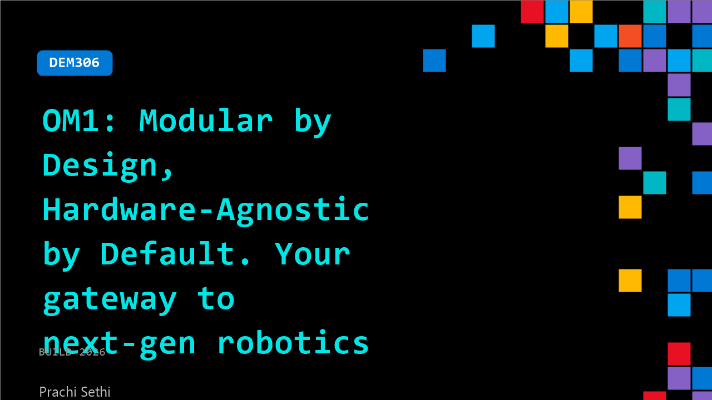

# DEM306: OM1: Modular by Design, Hardware-Agnostic by Default. Your gateway to next-gen robotics

**Session code:** DEM306  
**Date:** Wednesday, June 3, 2026 / 10:00 AM - 10:25 AM PDT (Duration 25 minutes)  
**Watch on-demand:** <https://build.microsoft.com/en-US/sessions/DEM306>

---

## Speakers

- **Prachi Sethi** - Developer Relations Engineer, OpenMind

## About the session

Robots today are powerful but siloed. Each one is locked to its own stack, hardware, and interfaces. OM1 is a modular, hardware-agnostic orchestration layer that bridges any robot with the cognitive infrastructure needed to make it actually useful. In this session, we'll walk through OM1's architecture, show how its modular design allows you to swap or add capabilities, and get started on your laptops. We'll also demo it live on the Unitree Go2 and in a cloud simulator. Bring a laptop if you'd like to follow along!

## AI summary

**Introduction and Agenda Overview:** The presentation begins with a friendly greeting and an introduction to Open Mind and their product, OM1 (00:00:02–00:00:16). The speaker outlines the agenda, which includes walking through OM1’s architecture, setup instructions, contribution guidelines, and a live demonstration involving a robotic dog and the Cloud Axiom platform (00:00:25–00:00:40). OM1, an open-source, hardware-agnostic cognitive layer, connects a wide variety of robots to an AI-driven orchestration infrastructure. It provides social intelligence to robots and currently supports platforms like Unitree, Unitary G1, Limuxtron, and Turtlebot, with flexible deployment across Mac and Ubuntu systems (00:00:42–00:01:20).

**Architecture and Intelligence Features:** The speaker explains the modular design of OM1, where each robot connects through a unified interface regardless of hardware differences in sensors, microphones, GPS, and other components (00:01:24). The system processes environmental inputs and user prompts such as movement or personality instructions that define how a robot behaves or speaks. For instance, the robot “Bytes” recognizes its name and reacts based on language models and personality prompts configured by users (00:01:59–00:02:19). OM1 integrates with large language models (LLMs) to interpret user instructions, enabling robots to perform diverse tasks like speaking, moving, or reporting system metrics. It supports autonomous navigation, SLAM map generation, obstacle avoidance, face detection, and even auto-charging for select units like Unitree Go2 (00:02:30–00:03:01).

**Open Source Collaboration and Cloud Setup:** The project being open source encourages developers to contribute new robot drivers and sensor support through GitHub (00:03:03–00:03:31). The demonstration transitions to a practical guide showing how to clone the repository, install dependencies, and set up API keys via OM1’s cloud portal (00:07:47). It includes defining a robot’s configuration in YAML with details like version, API key, and system prompts that shape the robot’s personality—whether amusing, professional, or supportive (00:10:01). The session also demonstrates integrating microphones, cameras, and audio through Google ASR, visual perception through BLIP or VILA, and LLM processing options that include OpenAI, Gemini, Anthropic, or locally hosted models using Ollama (00:11:13–00:11:33).

**Live Demonstration and Go Migration:** The first demo displays “Bytes” the robotic dog responding to commands while connected to a laptop and cloud simulator (00:12:01). The system runs virtual agents that handle voice and text input through containerized environments, highlighting OM1’s dockerized deployment flexibility. The speaker introduces a Go-language implementation of OM1 that replaces the earlier Python version, improving performance and compatibility with operating systems such as Windows, Linux, and Raspberry Pi setups (00:12:46–00:13:07). The Go migration showcases reduced latency and ease of binary-based deployment, supporting local and remote robot control environments.

**Simulation, Mapping, and Navigation Features:** The cloud simulator allows users to observe live robot streams and control navigation in simulated apartments or warehouses (00:13:30–00:15:00). During the demo, the robot autonomously maps its environment via SLAM and recognizes predefined locations like “kitchen” or “living room.” In navigation mode, verbal commands guide robots to those saved coordinates. Additional interactive modes like greeting or person-following enable robots to detect individuals, approach them, and engage in brief contextual exchanges (00:16:00–00:16:11). The App Store functionality lets developers upload customized robot personalities or tasks, linked through each device’s API key configuration (00:17:02).

**Telepresence Capability and Closing Remarks:** The final portion of the session highlights telepresence, allowing remote video communication through robots for practical scenarios like checking on family members or home spaces (00:17:36–00:18:34). Users can navigate their robots remotely, access live camera feeds, and initiate video calls, enhancing OM1’s value for care and monitoring applications. The demonstration concludes with saving maps, switching between autonomous modes, and exploring remote teleoperation through the simulator. The speaker wraps up by inviting questions and encouraging contributions to the Open Mind ecosystem before ending the demo session (00:20:40).

## Session tags

- **Session type:** Demo
- **Level:** (200) Intermediate
- **Topic:** Developer tools & frameworks
- **Tags:** AI, Agents, GitHub, OSS
- **Location:** Festival Pavilion, Theater A
