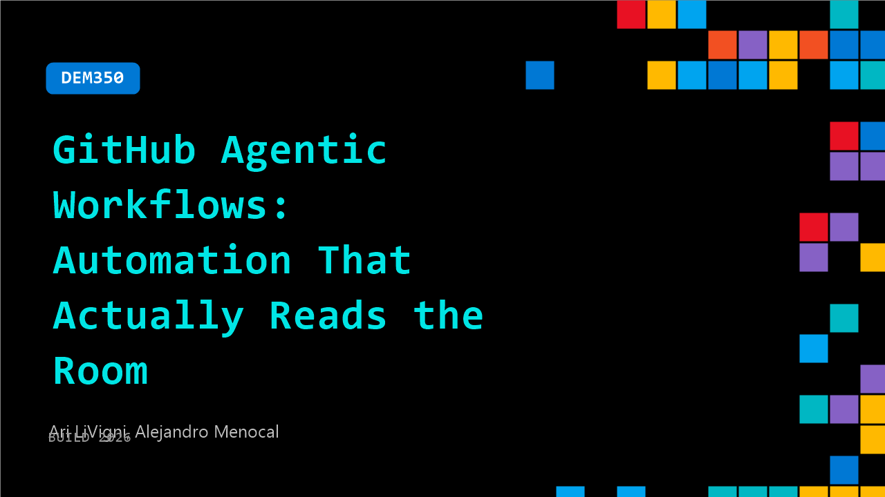

# DEM350: GitHub Agentic Workflows: Automation That Actually Reads the Room

**Session code:** DEM350  
**Date:** Tuesday, June 2, 2026 / 2:40 PM - 3:05 PM PDT (Duration 25 minutes)  
**Watch on-demand:** <https://build.microsoft.com/en-US/sessions/DEM350>

---

## Speakers

- **Ari LiVigni** - Sr. Learning Advocate, GitHub
- **Alejandro Menocal** - Senior Service Delivery Engineer, GitHub

## About the session

GitHub Agentic Workflows let your repo improve itself. With a simple markdown file and one command, GitHub Actions launches an AI agent to triage issues, fix CI failures, update docs, and improve tests, with no complex YAML required. See a live demo from minimal workflow file to a safe, sandboxed pipeline that delivers a ready‑to‑review PR. Your repo on autopilot, with you in control.

Seating for this session is first-come, first-served. Add it to your schedule to plan your day and arrive early to secure a spot.

## AI summary

**Introduction and Overview:** The session opens with greetings from Ari Livigni and Alejandro Menocal, both senior professionals from GitHub, welcoming attendees to Microsoft Build Day One 00:00:02. They introduce their discussion topic—GitHub Agentic Workflows—highlighting how automation powered by AI can dynamically "read the room" and adapt processes intelligently 00:00:22. The presenters emphasize how these workflows simplify traditional developer tasks by allowing workflow definitions in Markdown rather than YAML, with GitHub Copilot assisting in generation and compilation 00:00:33. This shift enables developers to automate continuous integration and delivery (CI/CD) easily, reducing syntax complexity while increasing flexibility in routine project management.

**Capabilities and Ecosystem:** The speakers discuss the benefits of using Agentic Workflows for development automation, such as triaging test failures, generating periodic reports or issues, and streamlining pull requests 00:01:00. They explain how various AI models—Copilot, Claude, CodeX, or Gemini—can dynamically diagnose issues, propose fixes, or update dependencies 00:01:34. Alejandro highlights the ecosystem’s flexibility and mentions the upcoming public preview release planned for the following week, inviting participants to experiment through GitHub’s website and use a new skills exercise to explore workflow capabilities firsthand 00:01:58. This exercise demonstrates how everyday coding tasks can become more efficient thanks to generative automation and multi-model integration.

**Hands-On Skills Exercise Introduction:** The presenters lead into a GitHub Skills exercise, using a demo project centered around a fictitious “Mona” website that aggregates GitHub blog posts, changelogs, and notes into regular updates 00:02:16. The Agentic Workflow in this context is designed to automatically generate pull requests for content refreshes, which can then be peer-reviewed and merged 00:02:35. The exercise introduces participants to repository setup steps, including using GitHub Skills to install the workflows and scaffolding the environment. As seen in the demo, when the agent installs, it produces supporting configuration files—such as the `.agent` definition and the custom “skills” files—under the `.github` directory, illustrating modular and transparent automation 00:03:25.

**Demonstration of Workflow Creation:** The live demo continues with Ari and Alejandro walking through command-line steps to initialize the repository, run commands that create pull requests, merge setup files, and automatically scaffold related code 00:04:11. They explain that this process mimics the GitHub Copilot setup where foundational structures are autogenerated, leaving room for developers to customize and expand based on their CI/CD or automation goals 00:05:07. As the workflow runs, the presenters demonstrate creating a new branch and instructing the AI agent to build automation that keeps the demo website updated with blog and changelog data. The workflow, authored in Markdown, is compiled into YAML “lock” files, which makes them executable as standardized GitHub Actions 00:07:00.

**Customization, Security, and Compilation:** Alejandro elaborates on how agents can be modified for unique needs—such as scheduling updates or customizing triggers within the repository 00:07:29. A key security concept presented is the use of “safe outputs,” ensuring that the agent itself only has read access while actions requiring write permissions (like opening pull requests) are delegated to secure workflow steps 00:08:39. This prevents unauthorized changes, protecting codebases from AI hallucinations or deletions. The presenters then show how the workflow generates front matter and markdown instructions that are compiled into executable logic, forming a secure and human-readable automation layer 00:13:29.

**Conclusion and Next Steps:** The session wraps up with the agents successfully producing an updatable GitHub Info file (00:11:45) and compilation of its YAML lock file (00:16:08). This lock file acts as the actual GitHub Actions workflow that executes regularly or on-demand. Ari emphasizes that Agentic Workflows extend GitHub Actions’ capabilities to a new paradigm, allowing developers to control automation in natural language 00:12:13. The presenters close by inviting attendees to scan a QR code and try the GitHub Skills exercise themselves 00:17:00, promising continuous iteration and improvements to the experience as Agentic Workflows evolve.

## Session tags

- **Session type:** Demo
- **Level:** (200) Intermediate
- **Topic:** Developer tools & frameworks
- **Tags:** AI, Automation, Agents, Developer, GitHub Copilot, GitHub, GitHub Actions, GitHub Enterprise, GitHub Copilot CLI, DevTools, Skills, Agentic SDLC
- **Location:** Gateway Pavilion, Level 2, Theater C
