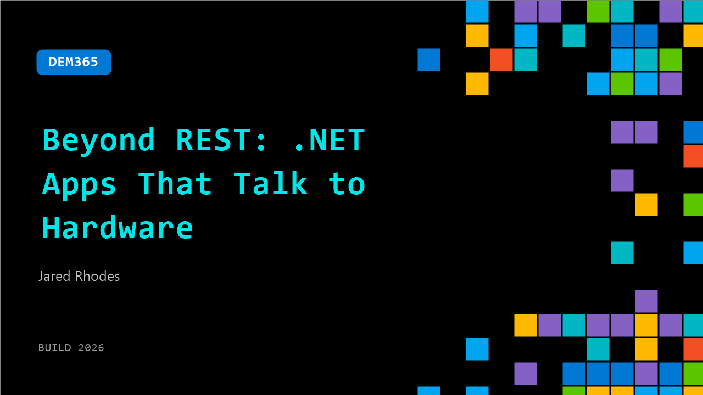

# DEM365: Beyond REST: .NET Apps That Talk to Hardware

**Session code:** DEM365  
**Date:** Wednesday, June 3, 2026 / 4:30 PM - 4:55 PM PDT (Duration 25 minutes)  
**Watch on-demand:** <https://build.microsoft.com/en-US/sessions/DEM365>

---

## Speakers

- **Jared Rhodes** - Principal, Technology Consulting, Epam

## About the session

Most app demos stop at REST APIs. This live demo talks to real hardware. I’ll show a .NET app that discovers a device over BLE, exchanges data over NFC or serial, and turns raw device signals into a usable workflow. You’ll leave with a practical pattern for structuring device services, handling platform differences, and deciding when local connectivity beats the cloud.

Seating for this session is first-come, first-served. Add it to your schedule to plan your day and arrive early to secure a spot.

## AI summary

**Introduction and Session Overview:** The video opens with Jared Rhodes greeting the audience and introducing the session titled "Beyond REST," clarifying humorously that the talk is not about web APIs but rather about integrating .NET development with physical hardware 00:00:00–00:00:18. He explains that the presentation will explore hardware protocols, testing harnesses, and demos showing how .NET applications can connect hardware components in an agentic workflow 00:00:22–00:00:34. Jared also mentions feedback from Microsoft on refining the content and introduces Jason, his colleague whose objective is to learn and rationalize hardware development opportunities to his management 00:00:41–01:06.

**Exploring .NET, MAUI, and Uno Platform for Hardware Interaction:** Jared transitions to discuss his collaboration with developers like James Montemagno and Sam on .NET MAUI and Uno Platform 00:01:06–00:01:25. He emphasizes that .NET MAUI applications can run across Windows, macOS, iOS, and Android, making it ideal for cross-platform hardware integrations 00:01:56–00:02:12. These platforms can leverage sensors such as accelerometers and GPS, which enrich user experiences beyond web capabilities 00:02:22. Jared highlights Uno’s agent-first development tools, which include skills and an MCP server that streamline hardware-based app creation 00:02:40–00:03:02.

**Hardware and Real-World Integration Examples:** The presenter links IoT use cases to practical workflows like secure Bluetooth-based authentication that occurs behind QR code scans 00:03:27–00:03:56. He describes how NFC simplifies joining Wi-Fi networks and exchanging credentials via physical proximity 00:04:24. Hardware-based interactions allow contextual awareness, trust, and identity verification through sensors detecting location and motion, elevating user experiences beyond typical web paradigms 00:04:38–00:05:01. Jared connects this back to the keynote focus on edge computing, explaining that intelligence is moving from the cloud toward on-device inference for efficiency and localized AI responsiveness 00:05:05–00:05:35.

**Developing and Demonstrating a Hardware Test Harness:** Jared describes his custom-built test harness, designed to make agentic coding feasible for hardware verification 00:07:01–00:07:17. Unlike unit tests or mocks, this harness physically connects to devices for real-world testing, prints line-by-line feedback, and allows deployment automation 00:07:45. He shows how it runs via USB and ADB with Android and iOS devices, controlled through Raspberry Pis for distributed testing 00:08:28. Jared then launches a live demo, instructing Copilot to execute an NFC test harness involving two phones connected to his basement system 00:10:11–00:12:10. The demonstration shows real-time interaction between the reader and writer devices, reflecting successful AI-driven orchestration of hardware testing, though he notes occasional packet transmission failures typical of real debugging scenarios.

**Overview of Key Hardware Protocols – Bluetooth, NFC, and USB:** Following the demo, Jared explains three major communication protocols developers can use: Bluetooth Low Energy (BLE), Near Field Communication (NFC), and USB 00:13:00–00:13:56. BLE operates on a service-characteristic model similar to REST APIs, where predefined UUID structures define endpoints for devices such as heart-rate monitors and battery sensors 00:13:43. He breaks down the architecture of services, characteristics, and descriptors—all analogs to API paths, methods, and headers 00:14:17. The NFC section covers reading and writing tag types, peer-to-peer communication, and Apple’s delayed exposure of the technology to third-party developers 00:18:17. Lastly, he introduces the USB binding process—reset, descriptor exchange, configuration, and addressing—and contrasts Android’s openness with Apple's MFi certification requirement for hardware compatibility 00:21:32–00:23:23.

**Conclusion and Key Takeaways:** As the presentation concludes 00:23:35–00:24:57, Jared emphasizes the creative satisfaction of building applications that interact with the physical world. He encourages developers to experiment with hardware integration through .NET agents and test harnesses, underscoring that physical responses—doors unlocking or sensors activating—create a sense of "magic" for users and engineers alike. Viewers are invited to explore his repository for examples of the test harness, continuous integration setups for device-based validation, and references to advanced testing extensions such as FPGA-based simulations in healthcare devices. He closes by thanking attendees and welcoming continued discussion about future agentic workflows and hardware-driven app development.

## Session tags

- **Session type:** Demo
- **Level:** (300) Advanced
- **Topic:** Developer tools & frameworks
- **Tags:** API, Developer, Community, MVP, DevTools
- **Location:** Festival Pavilion, Theater A
