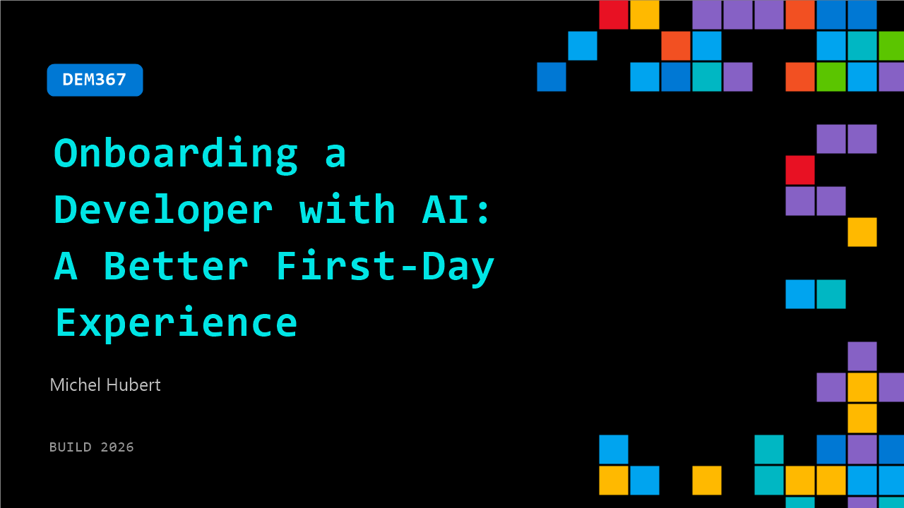

# DEM367: Onboarding a Developer with AI: A Better First-Day Experience

**Session code:** DEM367  
**Date:** Wednesday, June 3, 2026 / 11:50 AM - 12:15 PM PDT (Duration 25 minutes)  
**Watch on-demand:** <https://build.microsoft.com/en-US/sessions/DEM367>

---

## Speakers

- **Michel Hubert** - Associate Director, Avanade - Microsoft MVP / RD

## About the session

Onboarding is one of the most underestimated areas of Developer Experience. This session demonstrates how AI can help a new developer become productive faster by explaining a codebase, surfacing useful context, identifying key components, and supporting a first contribution. The demo shows how AI can reduce frustration and shorten the time to meaningful impact.

Seating for this session is first-come, first-served. Add it to your schedule to plan your day and arrive early to secure a spot.

## AI summary

**Introduction and Context:** At 00:00:05, Michel Riber greets the audience and introduces the central theme—how developer onboarding transforms when supported by AI agents. He clarifies that the session is focused not on HR or administrative onboarding but on the moment a new developer encounters an unfamiliar repository and wonders where to begin. Michel, an MVP of 17 years representing Avanade France, shares statistics at 00:01:04 to establish the problem: it takes 3–9 months for developers to become fully productive, 40% of the first week is spent merely reading code, and one in three questions newcomers have go unasked. He emphasizes that this is not a human resources challenge but a matter of developer experience.

**The Four "Actors" Framework:** Beginning at 00:02:27, Michel introduces a four-part structure representing stages of an AI-enhanced onboarding process: understanding the codebase rapidly, uncovering hidden context, identifying key components and contributors, and shipping a valid first pull request. He explains that the demonstration will follow a fictional developer named Sara through each of these stages, using a real-world open source project as an example. Michel notes the immense challenge Sara faces on day one—more than 2,000 source files spanning five languages and outdated documentation (00:04:00–00:04:40). The objective is for Sara to produce her first PR by the end of the week, an implicit expectation among teams.

**Understanding and Mapping the Codebase:** From 00:05:21 to 00:08:55, the demo shows Sara’s AI agent generating a full architectural comprehension of the repository. She prompts the agent to “give me a tour” of the system—its entry points and data flow—and within minutes receives what would normally require hours of explanation from a tech lead. The AI analyzes code connectivity, recent commits, and boundaries to describe the application structure—from React front-end to Node.js back-end—and highlights active versus legacy components. It even constructs diagrams of classes and dependencies automatically by reading the code, not documentation. Sara now gains a visual, functional understanding of the entire system, including insights into which components have recently changed or remain dormant.

**Surfacing Context and Team Conventions:** Moving to 00:09:03, Michel demonstrates how Sara’s agent extracts historical reasoning behind specific code modules, such as why a file was created and how certain technologies evolved in the project. By parsing pull request descriptions, commits, and issue threads, the AI reconstructs the decision-making timeline—revealing, for instance, the project's migration from PostgreSQL to ClickHouse for performance reasons (00:11:00–00:13:17). The agent then analyzes unwritten team conventions for logging, error handling, and naming by examining live code rather than outdated manuals (00:14:02). Sara now learns not only what the project does but also the “why” behind it and how to adhere to team practices from the first contribution.

**Prioritization and Performing the First PR:** During 00:15:06–00:19:54, the AI helps Sara prioritize key files to study, identify core contributors, and finally tackle an actual issue in the open source project. The agent lists the top relevant files, spots module owners through commit history, and assists in building a plan for code modification. When Sara selects a real issue (ID 58757), the agent reads it, identifies the required changes, provides a strategy without altering code, then implements the fix and runs regression tests. Once validated, it even drafts a pull request summary aligning with the repository’s stylistic conventions. The automation covers technical updates, validation, and documentation synthesis—all in a structured, transparent flow guided by context-aware reasoning.

**Conclusion and Key Takeaways:** Finally, at 00:22:55 Michel concludes that onboarding is no longer a test of patience but of curiosity. With AI as a contextual engine rather than merely a code generator, developer onboarding shifts toward comprehension instead of repetition. He highlights metrics such as “time to first PR” as essential for evaluating AI’s impact and encourages teams to compare pre- and post-AI onboarding speeds. Michel reminds that the agent complements, not replaces, human collaboration—serving as a programming partner that restores focus to learning and problem-solving (00:23:00). He closes by inviting questions via LinkedIn and thanking viewers while wishing them a productive build event (00:23:42).

## Session tags

- **Session type:** Demo
- **Level:** (200) Intermediate
- **Topic:** Developer tools & frameworks
- **Tags:** Developer, Community, MVP, DevTools
- **Location:** Festival Pavilion, Theater A
