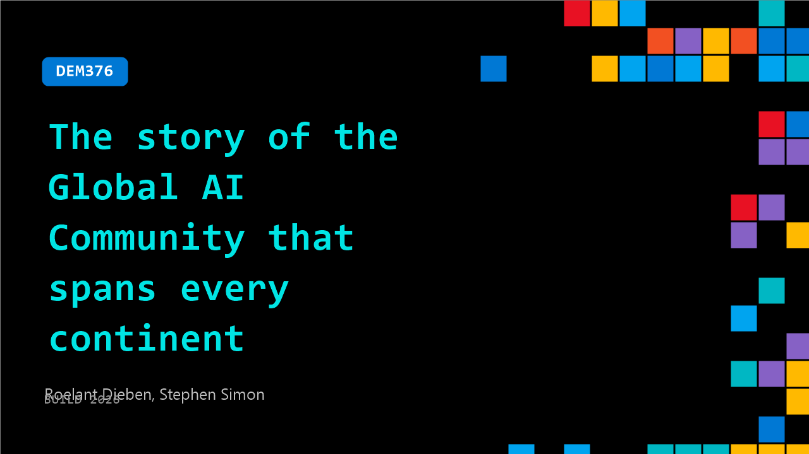

# DEM376: The story of the Global AI Community that spans every continent

**Session code:** DEM376  
**Date:** Tuesday, June 2, 2026 / 3:10 PM - 3:35 PM PDT (Duration 25 minutes)  
**Watch on-demand:** <https://build.microsoft.com/en-US/sessions/DEM376>

---

## Speakers

- **Roelant Dieben** - Cloud & AI architect, Microsoft MVP
- **Stephen Simon** - Program Manager, Global AI Community

## About the session

What starts with a few people passionate about AI becomes a worldwide movement. Global AI Community grew from nothing into thousands of members, hundreds of events, and chapter leads on every continent, all volunteer-run, all free, all real.

In this session, hear directly from chapter leads about why they joined, what they built, and what community means to them. Plus: how to find your local chapter, start your own, and become part of something bigger than your time zone.

Seating for this session is first-come, first-served. Add it to your schedule to plan your day and arrive early to secure a spot.

## AI summary

**Introduction and Overview:** The video begins with Ullans, a cloud architect and Global AI Community Board member, welcoming the audience and introducing Simon, the Global AI Community Manager based in India 00:00:00–00:00:12. They clarify that the session is not a demo or product launch, but rather a discussion about the origins and organization of the Global AI Community, its growth, and ways to participate. The opening emphasizes how the community functions globally through its chapters, nurtured by passionate volunteers and local leaders who drive engagement and foster learning through AI initiatives 00:00:20–00:00:37.

**Community Foundation and Growth:** Simon introduces the leadership team, highlighting Hank Goldman as the founder and mentioning other board members, including Sami and Ullans 00:00:44–00:01:05. They trace the community’s roots to 2017-2018, when AI was emerging but generative AI had yet to bloom. Back then, the movement began with localized meetups and boot camps that eventually expanded despite challenges like COVID-19 00:01:23–00:02:17. The presenters proudly announce milestones: over 200,000 registered members, 200 global chapters, and more than 4,600 events conducted to date 00:02:36–00:02:56. This success, they emphasize, has come organically from a “community up” model rather than a brand-driven campaign, focusing on empowering local leaders and connecting AI practitioners at every skill level.

**Local Chapters and Event Organization:** Ullans and Simon outline the importance of local chapters, noting their autonomy and deep understanding of regional needs 00:03:40–00:03:57. Chapters are city-based groups led by at least two co-organizers who manage logistics, speakers, venues, and sponsors. Every chapter is encouraged to host one in-person event quarterly, although monthly meetups are even better for fostering engagement 00:05:05–00:06:21. They acknowledge standout efforts like the Berlin chapter and describe flagship events such as “Agent Camps” (formerly Global AI Boot Camps), where participants engage in hands-on AI workshops 00:07:01–00:07:28. Other key formats include “Agent Cons” (large conferences with international speakers) and “Global AI Nights” (smaller, social learning meetups) — all designed to foster a vibrant global ecosystem.

**Participation and Support Structure:** The speakers explain multiple ways to become part of the Global AI Community 00:10:10–00:11:40. Interested individuals can join existing chapters, attend scheduled events, or start a new local chapter by completing a simple onboarding process. Chapters receive support through branding materials, templates, newsletters, and access to a YouTube channel with nearly 50,000 subscribers 00:09:37–00:10:16. The team underlines the community’s credibility, noting its nine-year history and ongoing expansion. They detail the steps to launch a chapter—finding co-organizers, connecting via Discord, getting onboarding content, and planning hybrid or in-person events—and stress that collaboration with existing chapters ensures sustainable growth 00:12:00–00:13:40.

**Future Vision and Collaboration:** As AI evolves rapidly, the presenters call for more regional leaders and chapters 00:13:50–00:15:14. They describe collaborative opportunities, such as chapters in different countries sharing speakers or resources, and emphasize that engagement through action — organizing, teaching, and building together — brings the most value. Ullans and Simon urge attendees to encourage others to start chapters or join local events, sharing how the community continuously gives back through connections, mentorship, and support in navigating fast-moving AI developments 00:15:16–00:16:00. Their message highlights empowerment and inclusivity, inviting participants to contribute irrespective of their technology stack — whether Microsoft, AWS, or Google — as Global AI is open to all enthusiasts worldwide 00:16:40–00:17:58.

**Closing and Key Takeaways:** The session concludes with practical details and encouragement. The speakers mention ongoing opportunities to meet them at the experts’ booth and a table talk session scheduled for the following morning 00:17:37–00:17:57. They also clarify the distinctions between the agent camp (small, hands-on boot camps) and agent cons (large conferences with international reach), citing recent examples like the Mountain View event that drew 400 participants from multiple tech communities 00:19:24–00:20:05. The presenters close by inviting questions, thanking attendees, and reinforcing their vision: a global, collaborative AI community that thrives on learning, sharing, and helping one another grow 00:20:49–00:20:53.

## Session tags

- **Session type:** Demo
- **Level:** (100) Foundational
- **Topic:** Developer tools & frameworks
- **Tags:** AI, Community
- **Location:** Gateway Pavilion, Level 2, Theater B
