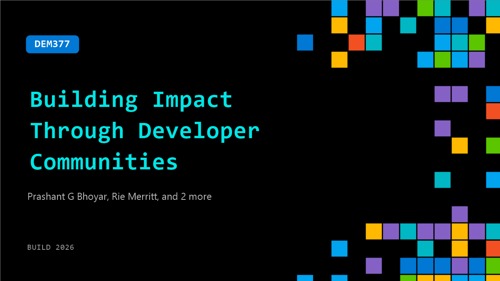

# DEM377: Building Impact Through Developer Communities

**Session code:** DEM377  
**Date:** Tuesday, June 2, 2026 / 4:30 PM - 4:55 PM PDT (Duration 25 minutes)  
**Watch on-demand:** <https://build.microsoft.com/en-US/sessions/DEM377>

---

## Speakers

- **Prashant G Bhoyar** - AI Architect - Office of CTO, Applied Information Science, Inc
- **Rie Merritt** - Principal PM Manager, Microsoft
- **Mitchel Sellers** - CEO, IowaComputerGurus, Inc.
- **Stephen Simon** - Program Manager, Global AI Community

## About the session

Join community leaders from.NET, Azure, Fabric and Global AI, to explore what it takes to build and grow tech communities. Hear their journeys, lessons learned, and how they stepped into leadership. Learn how to get involved, start a community, and connect with others who share your passion for technology.

## AI summary

**Introduction and Panel Overview:** The session opens with host Gallima Basa greeting viewers and confirming audio before introducing herself as the Azure Community Lead, explaining her work to empower communities globally (00:00:07–00:00:16). She outlines that the discussion will feature leaders representing .NET, Azure, Fabric, and Global AI communities to explore what it means to build and sustain technical communities, how to participate in them, and the leadership lessons gained along the way (00:00:22–00:00:41). The format encourages audience engagement as the conversation moves into introductions from the panelists.

**Community Leader Introductions:** Mitchell Sellers begins the introductions, sharing his journey within the .NET community since 2008 and his path into open-source and conference leadership through the .NET Foundation (00:01:05–00:01:37). Next, Prashanji Boyer from Washington, DC recounts his experience evolving from attendee to organizer, running user groups and regional Microsoft tech conferences (00:01:42–00:02:14). Rhee Merritt follows, describing her Microsoft role managing Azure Data influencer communities and events like Fabric and SQL Con, while also running a local user group in Atlanta (00:02:15–00:03:00). Each provides insight into how professional and volunteer roles merge to sustain grassroots engagement.

**Motivations Behind Leadership:** When asked about their motivation to step into leadership, Rhee candidly admits her initial drive stemmed from wanting to ensure things were done right but grew into a passion for giving back after realizing how community involvement shaped her career advancement (00:03:13–00:04:13). Prashanji credits his mentors’ encouragement and the emerging opportunity in AI-related technologies around 2017, which prompted him to create local meetups and collaborate with global groups to fill a knowledge gap (00:04:17–00:05:39). Mitchell echoes a similar sentiment, emphasizing that leadership enables professionals to mentor newcomers while reinforcing their own learning, thus continuing the community’s cycle of growth (00:05:45–00:06:34).

**How to Get Involved and Start Small:** When discussing how newcomers can join or contribute, Rhee highlights that simply attending events already makes one part of the community, and deeper involvement should start small — volunteering for tasks such as registration or communicating event details (00:06:35–00:07:58). Prashanji advises identifying a personal “sweet spot,” like helping with marketing, social media, or logistics, while Mitchell recommends networking at after-hours events and conferences where organizers and creators naturally connect (00:08:18–00:10:11). They collectively reinforce that consistent, genuine contributions in small acts build trust and open doors to greater roles over time.

**Building and Running User Groups:** The panel next turns to the topic of creating a user group. Rhee details the application process for Microsoft-recognized communities, which requires focusing at least half of sessions on Microsoft technologies, holding regular meetings, and maintaining at least two leaders for continuity (00:10:24–00:11:22). She cautions that starting from scratch is difficult and encourages beginners to first volunteer with established groups to learn about securing venues, sponsors, and speakers. The main takeaway is to grow gradually with mentorship and avoid overcommitting before understanding the full operational workload (00:11:46–00:12:41).

**Memorable Successes in Community Impact:** The leaders then share personal success stories. Prashanji recalls a participant who transitioned to an IT career after attending his local workshops, attributing his progress to hands-on exposure through community labs (00:12:58–00:14:07). Mitchell treasures seeing first-time speakers grow into confident professionals who later lead their own events or achieve MVP recognition (00:14:16–00:15:22). Rhee shares how one small act of kindness — welcoming a newcomer at a user group — transformed that attendee’s career path, illustrating the unseen power of inclusivity and personal connection (00:15:31–00:17:34).

**Lessons from Events and Closing Thoughts:** In discussing recent event lessons, Mitchell reflects on a post-pandemic in-person conference that underperformed due to travel costs, stressing the importance of understanding audience capabilities and trusting instincts when making planning decisions (00:17:56–00:19:46). Prashanji shares a pragmatic tip — charging a small event fee greatly improves attendance reliability compared to free events (00:19:54–00:20:56). Rhee concludes by describing Fabric Con’s emphasis on fostering community-driven spaces, such as lounges and networking areas free from sales pitches, reinforcing that conferences succeed when attendees feel connected, welcomed, and inspired to grow their networks (00:21:06–00:23:35). The session ends with applause for the panelists, wrapping up the theme that community, at its heart, thrives through authentic human interaction and shared learning.

## Session tags

- **Session type:** Demo
- **Level:** (100) Foundational
- **Topic:** Developer tools & frameworks
- **Tags:** Community
- **Location:** Festival Pavilion, Theater A
